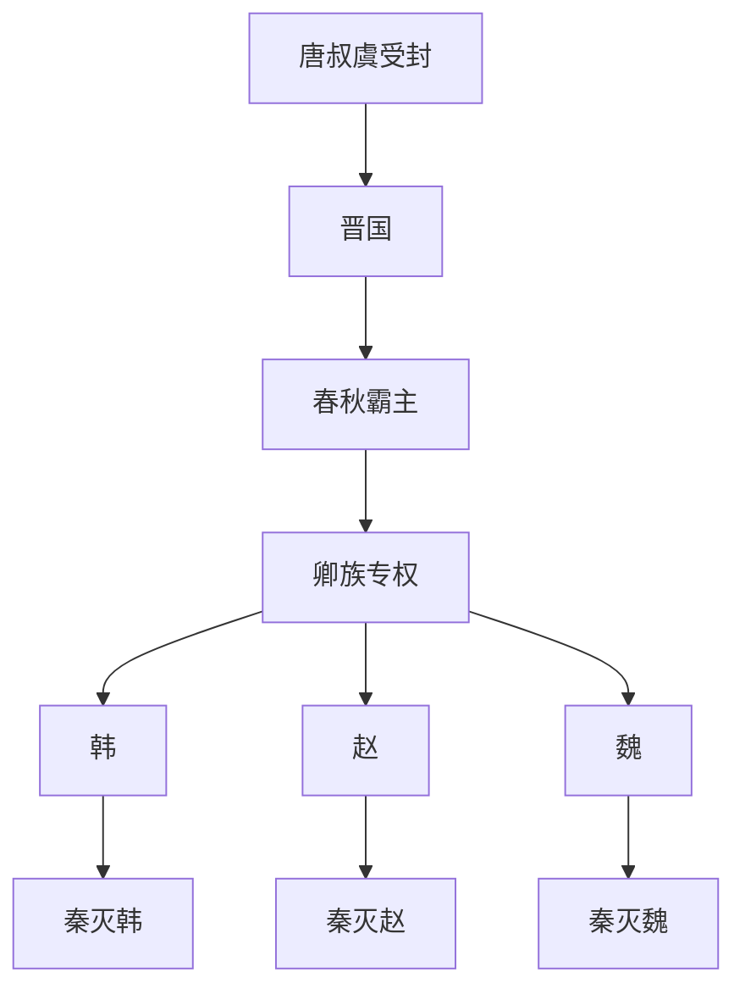

# 晋与三晋

## 时间

- 约前11世纪：唐叔虞受封，后形成晋国。
- 前632年：晋文公城濮之战后称霸。
- 前453年：韩、赵、魏三家灭智氏，三家分晋格局形成。
- 前403年：周威烈王承认韩、赵、魏为诸侯。
- 前376年：韩、赵、魏废晋静公，晋国灭亡。
- 前230年、前228年、前225年：秦先后灭韩、赵、魏。

## 别称

- 晋国
- 三晋
- 韩、赵、魏

## 概括

晋是周初姬姓大国，春秋时期凭借地理、军制和卿族体系长期压制楚国，是春秋中后期最重要的霸主国家。晋国内部卿族势力不断膨胀，最终由韩、赵、魏三家瓜分晋国，形成战国七雄中的三晋。

## 说明

- 晋的源头通常追溯到周成王封弟唐叔虞于唐，其后迁晋水一带，改称晋。
- 晋献公时期兼并周边小国，奠定强国基础，但骊姬之乱造成继承危机。
- 晋文公重耳流亡归国后整顿内政，前632年城濮之战击败楚国，成为春秋霸主。
- 晋楚长期争霸，晋国通过中原盟会体系维持霸权。
- 春秋后期，晋国国君权力衰落，范氏、中行氏、智氏、韩氏、赵氏、魏氏等卿族相互斗争。
- 前453年，韩、赵、魏联合灭智氏，晋国实际被三家控制。
- 前403年，周威烈王正式承认韩、赵、魏为诸侯，三家分晋在名义上完成。
- 前376年，韩、赵、魏废晋静公，晋国灭亡。
- 韩国居中原要冲，常受秦、魏、楚压力，前230年被秦灭。
- 赵国由晋卿赵氏发展而来，赵武灵王胡服骑射后军力强盛，前228年被秦灭，代地残余势力前222年被灭。
- 魏国初期经李悝变法、吴起练兵而强盛，战国中期以后衰落，前225年被秦灭。

## 分期与兴衰机制

| 阶段 | 主要过程 | 结构性结果 |
|---|---|---|
| 唐叔虞始封与曲沃代翼 | 晋从唐国发展而来，西周末至春秋初的曲沃小宗长期挑战翼城大宗，最终由曲沃武公取得周王承认。 | 以强宗取代旧君，形成扩张性更强的新晋国。 |
| 献公扩张与继承危机 | 晋献公兼并虞、虢等国，削弱公族；骊姬之乱又迫使重耳等公子流亡。 | 领土扩大，但公族凋零和卿大夫依赖为后来的卿权上升埋下条件。 |
| 文公霸业与晋楚争霸 | 重耳归国后整顿政军，城濮击败楚；晋通过军制、盟会和诸卿分工维持霸权。 | 国君借卿族治理大国，卿族也因此掌握军队、采邑和外交。 |
| 六卿竞争 | 国君权力下降，范、中行、智、韩、赵、魏等卿族相互兼并；前453年韩赵魏灭智氏。 | 晋的国家资源被三家瓜分，国君仅保留名义。 |
| 三晋列侯与晋亡 | 前403年周威烈王承认韩、赵、魏为诸侯，前376年三家废晋静公。 | 卿大夫夺权转化为正式诸侯体系，成为战国政治秩序标志。 |
| 韩赵魏分化 | 魏率先变法称强，赵经胡服骑射崛起，韩以申不害术治强化君权；三国又因地缘和互争难以长期联合。 | 各自成为七雄，也分别承受秦从西方东进的压力。 |

- **晋国崛起**依赖河汾盆地、对周边小国的兼并、军制扩充和吸纳流亡人才。
- **霸权代价**是把军政权分授诸卿；持续战争扩大卿族资源，使国君越来越难以收回。
- **分晋直接机制**并非一次政变，而是公族被压制、卿族兼并、灭智氏和周王册命相继发生。
- **三晋衰亡**既有彼此战争和战略纵深差异，也有秦国改革、河西争夺及各国合纵失败等外部压力。
- 韩、赵、魏的完整连续统治者分别见下列专表，不能把三国视为晋国君主世系的简单续表。

## 演变关系

## 下级笔记

- [晋国世系](/%E4%BA%BA%E6%96%87%E7%A7%91%E5%AD%A6/%E5%8E%86%E5%8F%B2/%E4%B8%9C%E4%BA%9A/%E4%B8%AD%E5%9B%BD/%E5%91%A8/%E5%85%88%E7%A7%A6%E8%AF%B8%E4%BE%AF/%E6%99%8B%26%E8%B5%B5%E9%AD%8F%E9%9F%A9/%E6%99%8B%E5%9B%BD%E4%B8%96%E7%B3%BB.md)
- [韩国世系](/%E4%BA%BA%E6%96%87%E7%A7%91%E5%AD%A6/%E5%8E%86%E5%8F%B2/%E4%B8%9C%E4%BA%9A/%E4%B8%AD%E5%9B%BD/%E5%91%A8/%E5%85%88%E7%A7%A6%E8%AF%B8%E4%BE%AF/%E6%99%8B%26%E8%B5%B5%E9%AD%8F%E9%9F%A9/%E9%9F%A9%E5%9B%BD%E4%B8%96%E7%B3%BB.md)
- [赵国世系](/%E4%BA%BA%E6%96%87%E7%A7%91%E5%AD%A6/%E5%8E%86%E5%8F%B2/%E4%B8%9C%E4%BA%9A/%E4%B8%AD%E5%9B%BD/%E5%91%A8/%E5%85%88%E7%A7%A6%E8%AF%B8%E4%BE%AF/%E6%99%8B%26%E8%B5%B5%E9%AD%8F%E9%9F%A9/%E8%B5%B5%E5%9B%BD%E4%B8%96%E7%B3%BB.md)
- [魏国世系](/%E4%BA%BA%E6%96%87%E7%A7%91%E5%AD%A6/%E5%8E%86%E5%8F%B2/%E4%B8%9C%E4%BA%9A/%E4%B8%AD%E5%9B%BD/%E5%91%A8/%E5%85%88%E7%A7%A6%E8%AF%B8%E4%BE%AF/%E6%99%8B%26%E8%B5%B5%E9%AD%8F%E9%9F%A9/%E9%AD%8F%E5%9B%BD%E4%B8%96%E7%B3%BB.md)

## 直接上级

- [先秦诸侯](/%E4%BA%BA%E6%96%87%E7%A7%91%E5%AD%A6/%E5%8E%86%E5%8F%B2/%E4%B8%9C%E4%BA%9A/%E4%B8%AD%E5%9B%BD/%E5%91%A8/%E5%85%88%E7%A7%A6%E8%AF%B8%E4%BE%AF/README.md)
