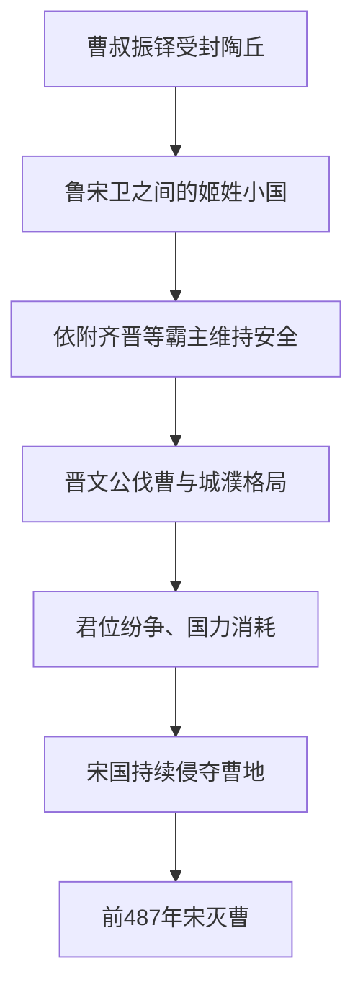

# 曹

## 时间

- 约前11世纪：周文王子曹叔振铎受封于曹。
- 前487年：宋灭曹。

## 概括

曹是周初姬姓诸侯国，位于今山东西南、河南东部一带。曹国地处中原诸侯之间，国力有限，在春秋争霸格局中多依附强国。前487年，曹被宋灭。

## 演进图

## 历史分期与关键过程

| 阶段 | 主要过程 | 结果 |
|---|---|---|
| 周初建立 | 周武王封弟曹叔振铎于陶丘一带，形成控制山东西南交通的姬姓封国。 | 宗室身份提供早期合法性，但疆域与资源规模有限。 |
| 春秋前期 | 曹与鲁、宋、卫等往来，并依靠齐、晋等霸主秩序避免被邻国吞并。 | 小国外交成为生存核心。 |
| 晋楚争霸期 | 晋文公流亡时曹共公失礼；晋军后来伐曹，曹被卷入城濮之战前后的阵营重组。 | 国都和国君受强国直接支配，自主性进一步下降。 |
| 春秋晚期 | 国内继承纷争与外部宋国扩张相互叠加，曹已无力建立稳定盟友体系。 | 领土不断受损，前487年被宋吞并。 |

## 衰亡原因

- **结构限制**：曹地夹在鲁、宋、卫等国之间，缺少向外扩张和战略退却空间。
- **安全依赖**：依附霸主可以暂时保护曹，却使其命运随晋楚、齐晋等格局变化。
- **内部消耗**：君位与贵族冲突削弱军政动员，给邻国干预提供机会。
- **邻国兼并**：宋国与曹接壤且同样面临大国压力，吞并曹地可扩大自身纵深。
- **直接终结**：宋利用曹长期衰弱发动最后进攻，前487年曹国宗庙政权结束。

## 说明

- 曹叔振铎为周文王之子、周武王之弟，周初受封于曹。
- 曹国都陶丘一带，位置接近鲁、宋、卫、郑等国。
- 春秋时期曹国常卷入晋、楚、宋等国斗争。
- 晋文公流亡期间曾经过曹，曹共公失礼，后来晋文公称霸后曹受到打击。
- 曹国长期处于大国夹缝，缺乏扩张空间。
- 前487年，宋灭曹。

## 演变关系

| 关系 | 说明 |
|---|---|
| 前一节点 | 周初姬姓封国。 |
| 并列关系 | 与鲁、宋、卫、郑等中原小国相邻。 |
| 后一节点 | 前487年被宋灭。 |

## 下级笔记

- [曹国世系](/%E4%BA%BA%E6%96%87%E7%A7%91%E5%AD%A6/%E5%8E%86%E5%8F%B2/%E4%B8%9C%E4%BA%9A/%E4%B8%AD%E5%9B%BD/%E5%91%A8/%E5%85%88%E7%A7%A6%E8%AF%B8%E4%BE%AF/%E6%9B%B9/%E6%9B%B9%E5%9B%BD%E4%B8%96%E7%B3%BB.md)

## 直接上级

- [先秦诸侯](/%E4%BA%BA%E6%96%87%E7%A7%91%E5%AD%A6/%E5%8E%86%E5%8F%B2/%E4%B8%9C%E4%BA%9A/%E4%B8%AD%E5%9B%BD/%E5%91%A8/%E5%85%88%E7%A7%A6%E8%AF%B8%E4%BE%AF/README.md)
