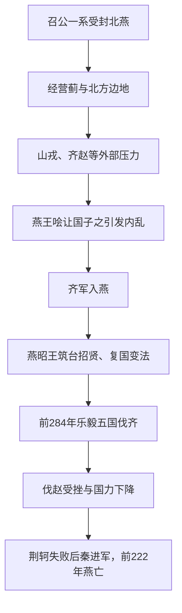

# 燕国（先秦）

## 时间

- 约前11世纪：召公奭一系受封于燕。
- 前222年：秦灭燕。

## 概括

燕是周初北方姬姓诸侯国，地处今北京、河北北部和辽西一带，是周人在北方边地的重要封国。战国时期燕昭王招贤纳士，一度强盛并参与五国伐齐，但燕国整体国力弱于秦、赵、齐等强国，最终被秦灭。

## 演进图

## 历史分期与关键过程

| 阶段 | 主要过程 | 结果 |
|---|---|---|
| 周初建立 | 召公奭一系受封于北方，燕以蓟一带为核心连接中原、辽西与北方族群。 | 边地位置赋予扩张空间，也增加交通、人口和防务成本。 |
| 春秋时期 | 文献记载相对稀疏，燕受山戎等压力，并在齐国援助及诸侯秩序中维持政权。 | 未成为春秋霸主，却逐步扩展北方基础。 |
| 让国危机 | 战国中期燕王哙让位于相子之，反对力量起兵，齐军乘乱攻燕。 | 王室秩序崩溃、人口受损，燕几近亡国。 |
| 昭王复兴 | 燕昭王重建统治、招揽乐毅等人才，并联合诸侯反齐。 | 前284年五国伐齐，燕军攻取齐国大部，达到国势高峰。 |
| 战国末衰亡 | 惠王与乐毅失和，齐人复国；燕后来攻赵失利，秦灭赵后燕直接暴露。 | 太子丹刺秦失败加速秦军进攻，前222年辽东残余被灭。 |

## 崛起与衰亡原因

- **边疆基础**：燕能向辽西、辽东扩展并吸收多区域资源，但远离中原核心、人口较疏限制持续大战能力。
- **复兴条件**：昭王以战败危机为契机招贤、整军，并利用诸国惧齐心理建立联盟。
- **高峰的局限**：伐齐胜利依赖多国联盟和齐国内部崩溃，燕难以独自永久控制齐地。
- **用人失误**：乐毅被替换后，燕失去占领和整合齐地的核心统帅，齐国迅速恢复。
- **战略误判**：战国末期攻赵削弱邻国却未增强燕的长期安全，秦灭赵后燕失去屏障。
- **直接触发**：荆轲刺秦未成，既未改变秦的实力对比，又给秦加速攻燕提供政治理由。

## 说明

- 燕国始封通常与召公奭相关，是周初经营北方的重要封国。
- 燕长期处于中原农耕区与北方诸族之间，既受周代政治秩序影响，也具有边地色彩。
- 春秋时期燕国在诸侯争霸中的存在感较弱，常受齐、山戎等外部压力。
- 战国时期，燕王哙让国于子之，引发内乱，齐国曾攻入燕国。
- 燕昭王即位后招揽乐毅、邹衍、剧辛等人，国势复振。
- 前284年，燕联合秦、韩、赵、魏攻齐，乐毅率军连下齐国多城，齐几乎亡国。
- 燕太子丹派荆轲刺秦王失败后，秦加速进攻燕国。
- 前222年，秦军灭燕。

## 演变关系

| 关系 | 说明 |
|---|---|
| 前一节点 | 周初姬姓北方封国。 |
| 并列关系 | 战国七雄之一，与赵、齐接壤并多有冲突。 |
| 后一节点 | 前222年被秦灭，故地纳入秦统一体系。 |

## 下级笔记

- [燕国世系](/%E4%BA%BA%E6%96%87%E7%A7%91%E5%AD%A6/%E5%8E%86%E5%8F%B2/%E4%B8%9C%E4%BA%9A/%E4%B8%AD%E5%9B%BD/%E5%91%A8/%E5%85%88%E7%A7%A6%E8%AF%B8%E4%BE%AF/%E7%87%95/%E7%87%95%E5%9B%BD%E4%B8%96%E7%B3%BB.md)

## 直接上级

- [先秦诸侯](/%E4%BA%BA%E6%96%87%E7%A7%91%E5%AD%A6/%E5%8E%86%E5%8F%B2/%E4%B8%9C%E4%BA%9A/%E4%B8%AD%E5%9B%BD/%E5%91%A8/%E5%85%88%E7%A7%A6%E8%AF%B8%E4%BE%AF/README.md)
