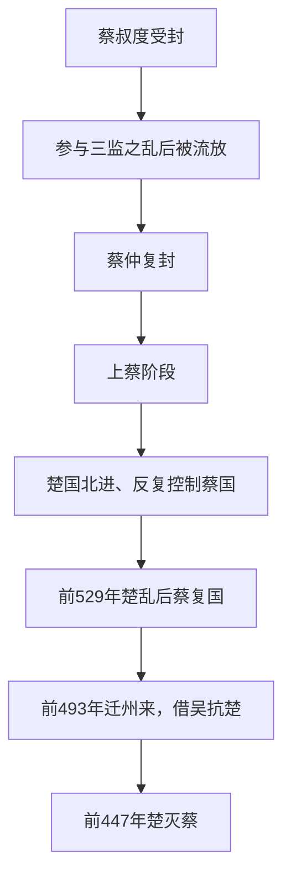

# 蔡

## 时间

- 约前11世纪：周文王子蔡叔度受封于蔡。
- 前447年：楚灭蔡。

## 概括

蔡是周初姬姓诸侯国，始封君为蔡叔度。三监之乱后，蔡叔度被流放，后来蔡仲复封，使蔡国延续。蔡国位于中原南缘，长期处于楚国北进通道上，多次迁都，最终被楚灭。

## 演进图

## 历史分期与关键过程

| 阶段 | 主要过程 | 结果 |
|---|---|---|
| 始封与中断 | 蔡叔度受封后参与三监之乱，被周公处置，最初封国秩序中断。 | 宗室身份不足以抵消反叛责任。 |
| 蔡仲复封 | 蔡叔度之子蔡仲重新获封，蔡国在上蔡一带恢复。 | 王室以换代复封保留东方姬姓屏障。 |
| 春秋夹缝 | 蔡处于中原南缘，晋楚争霸时频繁受楚军事和政治控制，也尝试借晋、吴等力量自保。 | 国君与都城安全依赖大国格局，独立性逐步下降。 |
| 灭而复国 | 楚灵王一度灭蔡；楚国内乱后，蔡与陈得到恢复。 | 复国说明地方宗族和诸侯外交仍能重建名号，但实力基础更弱。 |
| 迁都与终结 | 蔡昭侯依靠吴国、迁州来以避楚，吴衰后失去外援。 | 前447年楚彻底灭蔡，蔡地纳入楚国。 |

## 衰亡原因

- **地缘暴露**：蔡正处于楚国北上淮河—中原的通道，难以保持稳定缓冲。
- **资源有限**：疆域和兵力不足以独立抵御楚国，必须依靠晋、吴等远方强国。
- **迁都代价**：反复迁徙保存政权，却损害土地、宗庙和地方控制网络。
- **外援不稳**：晋楚争霸缓和、吴国转衰后，蔡失去可平衡楚国的力量。
- **直接灭亡**：楚在控制淮河流域的扩张中再次出兵，前447年蔡国不再获复封。

## 说明

- 蔡叔度是周文王之子、周武王之弟，周初受封于蔡。
- 三监之乱后，蔡叔度被流放，其子蔡仲因德行被周公复封于蔡。
- 蔡国地处今河南上蔡、新蔡一带，夹在中原诸侯与楚国之间。
- 春秋时期，蔡国常受楚国压力，也曾卷入晋楚争霸格局。
- 楚国多次攻蔡，蔡国被迫迁徙，形成上蔡、新蔡、州来等不同阶段。
- 前447年，楚灭蔡。

## 演变关系

| 关系 | 说明 |
|---|---|
| 前一节点 | 周初姬姓封国，三监之乱后由蔡仲复封延续。 |
| 并列关系 | 与陈、郑、楚等国关系密切，常处于楚国压力下。 |
| 后一节点 | 前447年被楚灭。 |

## 下级笔记

- [蔡国世系](/%E4%BA%BA%E6%96%87%E7%A7%91%E5%AD%A6/%E5%8E%86%E5%8F%B2/%E4%B8%9C%E4%BA%9A/%E4%B8%AD%E5%9B%BD/%E5%91%A8/%E5%85%88%E7%A7%A6%E8%AF%B8%E4%BE%AF/%E8%94%A1/%E8%94%A1%E5%9B%BD%E4%B8%96%E7%B3%BB.md)

## 直接上级

- [先秦诸侯](/%E4%BA%BA%E6%96%87%E7%A7%91%E5%AD%A6/%E5%8E%86%E5%8F%B2/%E4%B8%9C%E4%BA%9A/%E4%B8%AD%E5%9B%BD/%E5%91%A8/%E5%85%88%E7%A7%A6%E8%AF%B8%E4%BE%AF/README.md)
