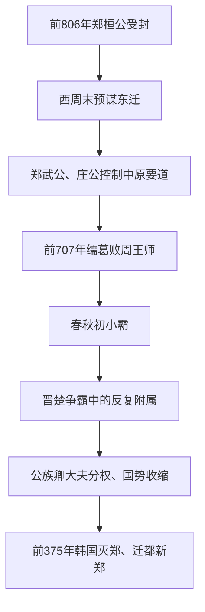

# 郑

## 时间

- 前806年：周宣王封弟姬友于郑。
- 前375年：韩国灭郑。

## 概括

郑是西周晚期姬姓诸侯国，始封君为郑桓公。平王东迁前后，郑国因辅佐王室和控制中原交通要地而迅速崛起。郑庄公时期郑国一度成为春秋初年的“小霸”，但后来受晋、楚夹击，国势逐渐衰落，最终被韩国灭亡。

## 演进图

## 历史分期与关键过程

| 阶段 | 主要过程 | 结果 |
|---|---|---|
| 西周晚期始封 | 郑桓公姬友受封并任王室司徒，利用王室职位和对西周危机的判断安排东迁。 | 建国较晚，却较早把人口、财货转移到中原。 |
| 武公、庄公扩张 | 郑兼并邻近小国、控制新郑交通，兼任王室卿士；庄公平定共叔段之乱并介入诸侯事务。 | 王室身份、地理和军事动员结合，形成春秋初“小霸”。 |
| 周郑冲突 | 周王试图削弱郑庄公权力，双方从交质走向战争；前707年郑在𦈡葛击败王师。 | 郑国达到声望高点，也加速周王室权威下滑。 |
| 晋楚夹缝 | 郑处于中原南北交通线上，晋楚争霸时屡遭围攻，被迫随力量对比改变盟属。 | 外交灵活延长生存，却造成战争频繁和自主性下降。 |
| 战国终结 | 国内公族和卿族政治削弱君权，三晋势力进入中原；韩国为取得交通和都城空间进攻郑。 | 前375年郑亡，新郑成为韩国政治中心。 |

## 崛起与衰亡原因

- **快速崛起**：王室近亲和卿士身份提供政治资源；提前东迁与控制交通要道带来人口、商业和军事优势。
- **庄公能力**：处理继承危机、联结诸侯并挑战王权，使郑的有限资源得到最大化运用。
- **地缘困境**：郑地虽富庶，却正处于晋楚争夺走廊，战争和服从成本长期累积。
- **战略纵深不足**：郑无法像晋楚一样通过大片腹地补充损失，霸权随庄公去世迅速下降。
- **内部权力分散**：公族和卿大夫竞争使战国初的制度更新迟缓。
- **直接灭亡**：韩国扩张需要新郑及周边土地，郑已无强大盟友，前375年被兼并。

## 说明

- 郑桓公姬友为周宣王之弟，受封于郑，西周末年任周王室司徒。
- 犬戎之祸前后，郑国东迁至新郑一带，占据中原交通要冲。
- 郑武公、郑庄公时期，郑国借王室卿士身份扩展影响。
- 郑庄公击败共叔段，形成“郑伯克段于鄢”的著名事件。
- 春秋初期，郑庄公在繻葛之战中击败周桓王，显示周王室权威下降。
- 郑国地处晋、楚争霸前线，常在两强之间被迫选择依附方向。
- 前375年，韩国灭郑，并以新郑为都。

## 演变关系

| 关系 | 说明 |
|---|---|
| 前一节点 | 西周晚期王室近亲封国。 |
| 并列关系 | 春秋初与周王室、宋、卫、鲁等中原诸侯关系密切；中后期处于晋楚夹缝。 |
| 后一节点 | 前375年被韩国灭，新郑成为韩国都城。 |

## 下级笔记

- [郑国世系](/%E4%BA%BA%E6%96%87%E7%A7%91%E5%AD%A6/%E5%8E%86%E5%8F%B2/%E4%B8%9C%E4%BA%9A/%E4%B8%AD%E5%9B%BD/%E5%91%A8/%E5%85%88%E7%A7%A6%E8%AF%B8%E4%BE%AF/%E9%83%91/%E9%83%91%E5%9B%BD%E4%B8%96%E7%B3%BB.md)

## 直接上级

- [先秦诸侯](/%E4%BA%BA%E6%96%87%E7%A7%91%E5%AD%A6/%E5%8E%86%E5%8F%B2/%E4%B8%9C%E4%BA%9A/%E4%B8%AD%E5%9B%BD/%E5%91%A8/%E5%85%88%E7%A7%A6%E8%AF%B8%E4%BE%AF/README.md)
