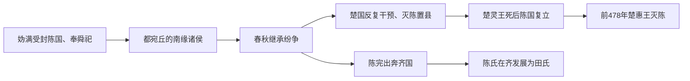

# 陈

## 时间

- 约前11世纪：周武王封妫满于陈。
- 前478年：楚灭陈。

## 概括

陈是周初封建前代圣王后裔的诸侯国，始封君妫满被称为陈胡公。陈国位于今河南淮阳一带，处在中原与楚势力之间。春秋时期陈国内乱频繁，最终被楚灭。后来田氏齐国的祖先陈完出自陈国，因此陈也与田齐源流有关。

## 演进图

## 历史分期与关键过程

| 阶段 | 主要过程 | 结果 |
|---|---|---|
| 周初建立 | 周武王封舜后裔妫满于陈，使其奉舜祀；陈都宛丘，属于安置前代圣王后裔的封国。 | 礼制合法性突出，但国家位于中原南缘。 |
| 春秋内乱 | 陈国多次发生君位与宗族冲突，陈完因政治危机出奔齐国。 | 国内凝聚力削弱，并产生后来田氏代齐的跨国分支。 |
| 楚国控制 | 楚向淮河—中原扩张，频繁介入陈国继承和外交，楚灵王一度灭陈。 | 陈从独立诸侯转为楚可废立、可恢复的缓冲政权。 |
| 复国与终灭 | 楚灵王死后陈国恢复，但人口、领地和外援均不足以重建自主。 | 前478年楚惠王再灭陈，此后不再复国。 |

## 衰亡与后续影响

- **建立优势**：奉舜祀使陈具有礼制声望，宛丘区位连接中原与淮域。
- **内部弱化**：继承争端迫使贵族外逃，也使邻国更容易以扶立、讨伐方式介入。
- **地缘压力**：陈与蔡同处楚北进通道，缺乏足以长期平衡楚国的资源和盟友。
- **复国局限**：第一次被楚灭后能够恢复名号，说明宗族和诸侯规范仍有效；但这并未恢复军政实力。
- **直接灭亡**：楚惠王为整合淮北再次吞并陈，前478年陈的国家世系结束。
- **分支遗产**：陈完后裔在齐国改称田氏并逐步掌权，陈国灭亡与田氏代齐是两条相连但不同的政治过程。

## 说明

- 周武王灭商后，封舜后裔妫满于陈，以奉舜祀。
- 陈国都宛丘，地处中原南缘，战略位置介于郑、蔡、楚等势力之间。
- 春秋时期陈国内部继承与贵族斗争频繁，削弱国力。
- 陈厉公之子陈完因陈国内乱出奔齐国，后代发展为齐国田氏。
- 楚国多次干预陈国内政，并逐步将陈纳入楚的势力范围。
- 前478年，楚灭陈。

## 演变关系

| 关系 | 说明 |
|---|---|
| 前一节点 | 舜后裔妫姓封国。 |
| 分支关系 | 陈完出奔齐，其后代成为田氏，最终取代姜齐。 |
| 后一节点 | 前478年被楚灭。 |

## 下级笔记

- [陈国世系](/%E4%BA%BA%E6%96%87%E7%A7%91%E5%AD%A6/%E5%8E%86%E5%8F%B2/%E4%B8%9C%E4%BA%9A/%E4%B8%AD%E5%9B%BD/%E5%91%A8/%E5%85%88%E7%A7%A6%E8%AF%B8%E4%BE%AF/%E9%99%88/%E9%99%88%E5%9B%BD%E4%B8%96%E7%B3%BB.md)

## 直接上级

- [先秦诸侯](/%E4%BA%BA%E6%96%87%E7%A7%91%E5%AD%A6/%E5%8E%86%E5%8F%B2/%E4%B8%9C%E4%BA%9A/%E4%B8%AD%E5%9B%BD/%E5%91%A8/%E5%85%88%E7%A7%A6%E8%AF%B8%E4%BE%AF/README.md)
