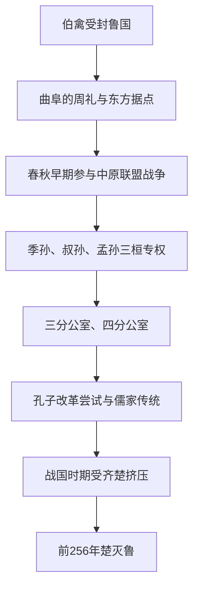

# 鲁

## 时间

- 约前11世纪：周公旦之子伯禽受封于鲁。
- 前256年：楚灭鲁。

## 概括

鲁是周初姬姓诸侯国，始封君为周公旦之子伯禽。鲁国以保存周礼著称，是周文化传统在东方的重要支点，也是孔子故国。鲁在政治军事实力上不及齐、晋、楚等大国，春秋后期受三桓专权影响，战国时被楚灭。

## 演进图

## 历史分期与关键过程

| 阶段 | 主要过程 | 政治变化 |
|---|---|---|
| 周初建立 | 周公旦之子伯禽受封于鲁，曲阜成为周王朝经营东方、整合地方人群的据点。 | 周公家族身份赋予较高礼制地位。 |
| 春秋前期 | 鲁与齐、宋、郑等频繁会盟和战争，庄公时期曾在长勺等战事抵抗齐国。 | 能参与中原政治，但长期受更强大的齐国牵制。 |
| 三桓专权 | 季孙、叔孙、孟孙三家由鲁桓公后裔发展，逐步分掌军政和邑土，并通过三分、四分公室削弱国君。 | 国家权力从公室转向卿族，地方家臣又挑战三桓。 |
| 礼制与改革 | 孔子在鲁活动并一度任官，尝试强化公室、整顿秩序；失败后周游列国。 | 政治改革有限，鲁的礼乐文献传统却产生长期文化影响。 |
| 战国衰亡 | 鲁在齐、楚竞争中疆域收缩，无法完成战国式军事和行政集中。 | 前256年楚灭鲁，国君政权终结。 |

## 兴衰与灭亡原因

- **早期优势**：周公后裔身份、曲阜农业和礼乐资源使鲁在春秋前期具有号召力。
- **外部限制**：与齐直接接壤而缺乏更大纵深，鲁难以维持霸主级军力。
- **权力碎片化**：三桓控制军队和采邑，家臣再据邑自强，公室无法形成统一财政和兵役体系。
- **改革受阻**：孔子等人的礼制改革不能解决卿族土地、军队与地方权力的物质基础。
- **文化与军政分离**：保存周礼使鲁具有后世声望，但文化地位并不自动转化为战国生存能力。
- **直接灭亡**：楚东扩时鲁已无独立抗衡和可靠盟友，前256年被楚吞并。

## 说明

- 鲁国都曲阜，位于今山东西南部，与齐国相邻。
- 鲁国因周公家族地位特殊，礼乐制度与宗法传统保存较完整。
- 春秋早期，鲁隐公、鲁桓公、鲁庄公时期与齐、宋、郑等国频繁结盟、交战。
- 鲁国后期由季孙氏、叔孙氏、孟孙氏三桓长期掌权，国君权力受限。
- 孔子出生于鲁国，鲁国成为儒家传统的重要文化空间。
- 前256年，楚灭鲁。

## 演变关系

| 关系 | 说明 |
|---|---|
| 前一节点 | 周公旦家族东方封国。 |
| 并列关系 | 与齐、宋、卫、郑、曹等中原诸侯交往频繁。 |
| 后一节点 | 前256年被楚灭。 |

## 下级笔记

- [鲁国世系](/%E4%BA%BA%E6%96%87%E7%A7%91%E5%AD%A6/%E5%8E%86%E5%8F%B2/%E4%B8%9C%E4%BA%9A/%E4%B8%AD%E5%9B%BD/%E5%91%A8/%E5%85%88%E7%A7%A6%E8%AF%B8%E4%BE%AF/%E9%B2%81/%E9%B2%81%E5%9B%BD%E4%B8%96%E7%B3%BB.md)

## 直接上级

- [先秦诸侯](/%E4%BA%BA%E6%96%87%E7%A7%91%E5%AD%A6/%E5%8E%86%E5%8F%B2/%E4%B8%9C%E4%BA%9A/%E4%B8%AD%E5%9B%BD/%E5%91%A8/%E5%85%88%E7%A7%A6%E8%AF%B8%E4%BE%AF/README.md)
