# 齐

## 时间

- 约前11世纪：姜太公受封于齐。
- 前386年：周安王承认田和为齐侯，田氏代齐完成。
- 前221年：秦灭齐，齐国灭亡。

## 别称

- 姜齐
- 田齐
- 齐国

## 概括

齐是周初重要诸侯国，最初由姜太公受封建立，地处今山东北部。春秋时期齐桓公任用管仲改革，打出“尊王攘夷”旗号，成为春秋首霸。战国时期田氏取代姜姓齐国，田齐仍为战国七雄之一，最终被秦灭。

## 演进图

```mermaid
flowchart LR
    Taigong["姜太公受封营丘"] --> Economy["渔盐、农业与商业并举"]
    Economy --> Huan["齐桓公、管仲改革称霸"]
    Huan --> TianRise["田氏以施惠、任官掌权"]
    TianRise --> TianQi["前386年田和列为诸侯，田齐建立"]
    TianQi --> Weixuan["威王、宣王强盛与稷下学宫"]
    Weixuan --> Minwang["湣王扩张、称东帝"]
    Minwang --> Coalition["前284年五国伐齐"]
    Coalition --> Restoration["田单复齐但国力受创"]
    Restoration --> Qin["前221年秦灭齐"]
```

## 历史分期与关键过程

| 阶段 | 主要过程 | 政权变化 |
|---|---|---|
| 姜齐建立 | 姜太公受封营丘，齐利用海滨渔盐、平原农业和商业整合东方。 | 功臣封国发展为山东地区强国。 |
| 桓公霸业 | 管仲改革税赋、军政和市场，齐桓公以“尊王攘夷”组织会盟。 | 齐成为春秋首霸，但霸业高度依赖君相合作。 |
| 卿族竞争与田氏上升 | 桓公死后继承危机削弱公室；田氏通过赈贷、结交民众和控制官职扩大力量。 | 姜姓国君逐渐失去实权，田氏完成内部政权转移。 |
| 田齐盛期 | 前386年田和获周王承认为诸侯；威王、宣王整顿吏治、用将，临淄和稷下学宫繁荣。 | 田齐成为七雄强国，并具有文化与经济号召力。 |
| 湣王扩张与伐齐 | 齐灭宋并向多方扩张，外交孤立；前284年燕联合秦、韩、赵、魏攻齐。 | 齐几近亡国，田单虽复国，人口、城市和军力难复旧观。 |
| 秦统一前夕 | 复国后的齐倾向避战，未有效援助韩赵魏楚燕。 | 秦灭五国后集中兵力，前221年齐王建降，齐亡。 |

## 崛起、更替与灭亡原因

- **经济基础**：沿海资源、手工业、商业和临淄城市网络，为改革和军队提供财政。
- **制度整合**：管仲改革及田齐时期的官僚、军事更新，使齐能把经济优势转化为霸权。
- **姜田更替机制**：田氏不是一次宫廷政变即取代姜齐，而是长期通过社会施惠、卿权和封邑积累完成。
- **盛极而孤**：齐湣王兼并宋国、对外用兵并短暂称帝，引发邻国共同恐惧，联盟优势转为包围。
- **复国后保守**：五国伐齐造成的结构损失使齐更重自保，却也错失联合遏秦的窗口。
- **直接灭亡**：秦先灭其余五国并阻断援助，齐在孤立中缺乏有效动员，最终不战或少战而降。

## 说明

- 姜齐是周初功臣封国，始封君一般记作太公望、姜尚、吕尚。
- 齐国濒海，盐铁、渔业、商业条件较好，较早形成富庶的区域基础。
- 齐桓公任用管仲改革，整合军政经济，以尊王攘夷为政治号召，召集诸侯会盟。
- 春秋中后期，齐国内部卿族势力增强，田氏逐步掌握国政。
- 前386年，周安王承认田和为齐侯，田氏代齐在名义上完成，齐国由姜齐转为田齐。
- 战国时期，齐威王、齐宣王时国势强盛，稷下学宫成为百家争鸣的重要中心。
- 齐湣王时期一度称东帝，但因对外扩张和外交失衡，引发五国伐齐，齐国受重创。
- 前221年，秦灭齐，完成统一六国。

## 演变关系

| 关系 | 说明 |
|---|---|
| 前一节点 | 周初姜太公受封形成姜齐。 |
| 内部更替 | 田氏逐步专权，最终取代姜姓国君，形成田齐。 |
| 后一节点 | 前221年秦灭齐，战国结束。 |

## 下级笔记

- [姜齐世系](/%E4%BA%BA%E6%96%87%E7%A7%91%E5%AD%A6/%E5%8E%86%E5%8F%B2/%E4%B8%9C%E4%BA%9A/%E4%B8%AD%E5%9B%BD/%E5%91%A8/%E5%85%88%E7%A7%A6%E8%AF%B8%E4%BE%AF/%E9%BD%90/%E5%A7%9C%E9%BD%90%E4%B8%96%E7%B3%BB.md)
- [田齐世系](/%E4%BA%BA%E6%96%87%E7%A7%91%E5%AD%A6/%E5%8E%86%E5%8F%B2/%E4%B8%9C%E4%BA%9A/%E4%B8%AD%E5%9B%BD/%E5%91%A8/%E5%85%88%E7%A7%A6%E8%AF%B8%E4%BE%AF/%E9%BD%90/%E7%94%B0%E9%BD%90%E4%B8%96%E7%B3%BB.md)

## 直接上级

- [先秦诸侯](/%E4%BA%BA%E6%96%87%E7%A7%91%E5%AD%A6/%E5%8E%86%E5%8F%B2/%E4%B8%9C%E4%BA%9A/%E4%B8%AD%E5%9B%BD/%E5%91%A8/%E5%85%88%E7%A7%A6%E8%AF%B8%E4%BE%AF/README.md)
