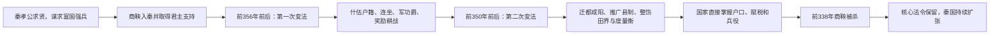

# 商鞅变法

## 时间

第一次变法始于前356年；第二次变法约在前350年前后，一说前347年。

## 概括

商鞅变法是秦国由西方诸侯转型为高度动员的中央集权军国的关键改革。商鞅以法家思想为基础，废旧贵族特权、奖励军功耕战、推行县制和户籍连坐，增强秦国财政、兵源与行政能力，为秦统一六国奠定制度基础。

## 改革过程与运行机制

| 阶段 | 主要行动 | 形成的能力 |
|---|---|---|
| 改革准备 | 秦孝公发布求贤令，商鞅以“变法强国”取得支持，并通过徙木立信等叙事建立法令信用。 | 君主成为改革的政治保护者，法令得以越过旧贵族阻力。 |
| 第一次变法 | 编民入什伍，建立告奸与连坐规则；奖励耕织，禁止私斗，以军功决定爵位和待遇。 | 家庭、田地、兵役和赏罚被纳入统一登记，国家能直接动员编户。 |
| 第二次变法 | 秦迁都咸阳，合并乡邑为县；整顿田界、赋役和家庭结构，并统一部分度量标准。 | 地方官由中央任用，征税、征兵和行政裁判进一步标准化。 |
| 制度延续 | 秦孝公死后商鞅失去保护，被政敌追究并处死，但新君没有整体废除变法。 | 改革从个人政策转化为秦国制度，成为此后兼并战争的组织基础。 |

## 成效、代价与争议

- **崛起机制**：军功爵把政治地位与战功连接，县制和户籍使土地、赋税与兵源直接进入国家体系；奖励耕战则把社会资源集中到农业生产和战争。
- **政治条件**：改革成效不只来自某条法令，也来自秦孝公长期支持、秦国对关东制度经验的吸收，以及持续对外扩张所提供的土地和爵位。
- **社会代价**：连坐、轻罪重罚、强制分户和以战功晋升强化了国家动员，也提高了基层承受的刑罚、赋役和战争压力。
- **商鞅之死**：新君即位、旧贵族积怨和商鞅自身权势共同构成政治清算背景；其死亡并不等于变法失败。
- **材料边界**：现存叙事主要见于《史记》《商君书》等传世文献，后者成书层次复杂。今天概括的“两次变法”和具体措施可能把不同时期的秦制压缩到商鞅一人名下，不宜理解为两道法令一次完成全部制度。

## 说明

- 商鞅在秦孝公支持下实施政治改革，通常分两次进行。
- 变法以法家思想和官僚政治取代春秋贵族政治。
- 商鞅变法使秦国经济发达、军事强大，是秦始皇统一中国的重要制度前提。
- 变法遭到旧贵族强烈反对。
- 秦孝公死后，商鞅被处以车裂之刑。
- 商鞅虽死，但其制度在秦国继续推行，法家思想也成为秦国占统治地位的政治思想。
- 商鞅变法常被视为中国古代影响最深的变法之一。

## 措施

| 措施 | 目的及作用 |
|---|---|
| 开阡陌、整顿田界和垦殖 | 扩大可耕地并使土地、户籍和赋役更便于国家登记；传统上常概括为“废井田、承认土地私有”，具体产权形态仍有讨论。 |
| 限制世卿世禄，按军功授爵 | 打破旧贵族仅凭血缘世袭等级的优势，建立以战功授爵和授益的晋升通道。 |
| 合并乡邑为县，编制户口，推行什伍连坐 | 扩大君主直接任命地方官的范围，提升基层控制和国家动员能力。 |
| 重农抑商，奖励耕织 | 发展农业生产，增加国家赋税和战争资源。 |
| 统一斗、桶、权、衡、丈、尺等度量衡 | 便利税收、交换和行政管理。 |
| 传统记载的“燔诗书而明法令” | 强化法令权威；该措辞及其实施范围主要见于传世叙事，需结合文本成书层次理解。 |

## 演变关系

- 前一节点：[田氏代齐](/%E4%BA%BA%E6%96%87%E7%A7%91%E5%AD%A6/%E5%8E%86%E5%8F%B2/%E4%B8%9C%E4%BA%9A/%E4%B8%AD%E5%9B%BD/%E5%91%A8/%E6%88%98%E5%9B%BD/%E7%94%B0%E6%B0%8F%E4%BB%A3%E9%BD%90.md)。
- 后一节点：[秦灭巴蜀之战](/%E4%BA%BA%E6%96%87%E7%A7%91%E5%AD%A6/%E5%8E%86%E5%8F%B2/%E4%B8%9C%E4%BA%9A/%E4%B8%AD%E5%9B%BD/%E5%91%A8/%E6%88%98%E5%9B%BD/%E7%A7%A6%E7%81%AD%E5%B7%B4%E8%9C%80%E4%B9%8B%E6%88%98.md)。
- 相关节点：[战国](/%E4%BA%BA%E6%96%87%E7%A7%91%E5%AD%A6/%E5%8E%86%E5%8F%B2/%E4%B8%9C%E4%BA%9A/%E4%B8%AD%E5%9B%BD/%E5%91%A8/%E6%88%98%E5%9B%BD/README.md)、[秦](/%E4%BA%BA%E6%96%87%E7%A7%91%E5%AD%A6/%E5%8E%86%E5%8F%B2/%E4%B8%9C%E4%BA%9A/%E4%B8%AD%E5%9B%BD/%E5%91%A8/%E5%85%88%E7%A7%A6%E8%AF%B8%E4%BE%AF/%E7%A7%A6/README.md)。
