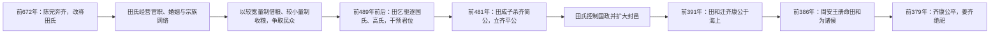

# 田氏代齐

## 时间

前672年田完入齐；前481年田成子杀齐简公；前386年田和受周天子册命为诸侯；前379年姜齐绝祀。

## 概括

田氏代齐是齐国内部卿大夫取代旧公室的典型事件。陈公子完奔齐后改为田氏，其后人逐步掌握齐国政权，最终由田和取代姜姓齐国君主，并获周天子承认，形成战国七雄之一的田齐。

## 取代过程与权力机制

| 阶段 | 具体过程 | 权力变化 |
|---|---|---|
| 入齐立足 | 陈完避陈国内乱奔齐，任工正；其后裔在齐国繁衍并改称田氏。 | 外来卿族进入齐国官僚与贵族体系，尚未挑战公室。 |
| 扩大基础 | 田氏通过掌官、联姻、赈贷和较有利的量制经营邑众，与国氏、高氏等旧卿族竞争。 | 田氏同时积累民众支持、封邑资源和政治盟友。 |
| 控制废立 | 田乞逐国氏、高氏并改立齐悼公；田成子后来杀齐简公、立齐平公。 | 齐君仍在位，但国君废立和国政已由田氏决定。 |
| 领地压倒公室 | 田氏继续兼并封邑、分配官职，直属势力逐渐超过姜齐公室。 | 实际权力转移先于正式改朝换姓。 |
| 获得名分 | 田和迁置齐康公，前386年获周王册命，仍沿用“齐”国号；齐康公死后姜齐祭祀断绝。 | 田氏把事实统治转化为被周王室承认的诸侯身份，田齐正式取代姜齐。 |

## 兴起原因与历史影响

- **结构因素**：齐国公室内部继承冲突频繁，强卿掌握封邑、官职和私属，使国君难以维持对军政资源的垄断。
- **田氏策略**：田氏没有只靠一次政变，而是长期结合经济施惠、宗族扩张、政治结盟与操控君位，逐步降低取代成本。
- **直接转折**：前481年杀简公标志田氏控制君位；前391年迁康公是实际取代；前386年册命则完成名分转换。
- **长期影响**：田齐继承齐国的国号、疆域和政治资源，后来成为战国七雄之一；这一过程与三家分晋共同显示春秋卿族政治向战国领土国家转型。
- **谱系与年代**：陈、田在先秦音近，传世文献对改氏过程和部分世代的叙述带有追溯整理色彩；前391、前386与前379分别对应废置、册命和姜齐绝祀，不应合并为同一日期。

## 说明

- 齐桓公十四年，陈国内乱，公子完避祸奔齐。
- 齐桓公欲封公子完为卿，公子完不受，只接受工正之职。
- 陈公子完为妫姓，至齐国后改为田氏，成为齐国田氏之祖。
- 前489年，齐景公死，齐国宗室国氏、高氏立公子荼。
- 田乞逐国氏、高氏，另立公子阳生为齐悼公，自立为宰相，田氏由此掌握齐政。
- 前481年，田成子杀齐简公，立齐平公，自掌政权。
- 此时田氏封邑已经大于齐国直属领土。
- 前391年，田完十世孙田和废齐康公。
- 前386年，田和自立为国君，流放齐康公于海岛。
- 前386年，周安王正式册命田和为诸侯，国号仍称齐，是为田齐。
- 前379年，齐康公死，姜太公香火断绝。
- 后世称姜姓时期齐国为“姜齐”，田氏时期齐国为“田齐”。

## 演变关系

- 前一节点：[三家分晋](/%E4%BA%BA%E6%96%87%E7%A7%91%E5%AD%A6/%E5%8E%86%E5%8F%B2/%E4%B8%9C%E4%BA%9A/%E4%B8%AD%E5%9B%BD/%E5%91%A8/%E6%88%98%E5%9B%BD/%E4%B8%89%E5%AE%B6%E5%88%86%E6%99%8B.md)。
- 后一节点：[商鞅变法](/%E4%BA%BA%E6%96%87%E7%A7%91%E5%AD%A6/%E5%8E%86%E5%8F%B2/%E4%B8%9C%E4%BA%9A/%E4%B8%AD%E5%9B%BD/%E5%91%A8/%E6%88%98%E5%9B%BD/%E5%95%86%E9%9E%85%E5%8F%98%E6%B3%95.md)。
- 相关节点：[战国](/%E4%BA%BA%E6%96%87%E7%A7%91%E5%AD%A6/%E5%8E%86%E5%8F%B2/%E4%B8%9C%E4%BA%9A/%E4%B8%AD%E5%9B%BD/%E5%91%A8/%E6%88%98%E5%9B%BD/README.md)、[齐](/%E4%BA%BA%E6%96%87%E7%A7%91%E5%AD%A6/%E5%8E%86%E5%8F%B2/%E4%B8%9C%E4%BA%9A/%E4%B8%AD%E5%9B%BD/%E5%91%A8/%E5%85%88%E7%A7%A6%E8%AF%B8%E4%BE%AF/%E9%BD%90/README.md)、[姜齐世系](/%E4%BA%BA%E6%96%87%E7%A7%91%E5%AD%A6/%E5%8E%86%E5%8F%B2/%E4%B8%9C%E4%BA%9A/%E4%B8%AD%E5%9B%BD/%E5%91%A8/%E5%85%88%E7%A7%A6%E8%AF%B8%E4%BE%AF/%E9%BD%90/%E5%A7%9C%E9%BD%90%E4%B8%96%E7%B3%BB.md)、[田齐世系](/%E4%BA%BA%E6%96%87%E7%A7%91%E5%AD%A6/%E5%8E%86%E5%8F%B2/%E4%B8%9C%E4%BA%9A/%E4%B8%AD%E5%9B%BD/%E5%91%A8/%E5%85%88%E7%A7%A6%E8%AF%B8%E4%BE%AF/%E9%BD%90/%E7%94%B0%E9%BD%90%E4%B8%96%E7%B3%BB.md)。
