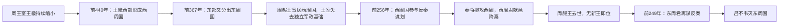

# 秦灭周之战

## 时间

前256年秦灭西周国及周王室；前249年秦灭东周国。

## 概括

秦灭周之战标志周王室政治实体终结。东周后期王畿分裂为西周国、东周国，周赧王寄居西周国。前256年秦昭襄王攻灭西周国，周赧王死后周朝无新王；前249年秦庄襄王又灭东周国，周代王畿残余政权彻底消失。

## 分裂、灭亡与政权终点

| 层次 | 前256年的变化 | 前249年的变化 |
|---|---|---|
| 周王室 | 周赧王寄居西周国；西周国降秦后赧王去世，王统中断。 | 已无在位周王，故此年不是另一位周天子的覆亡。 |
| 西周国 | 西周君献三十六邑、三万口，领土和人口并入秦的控制。 | 政权已不存在。 |
| 东周国 | 仍在巩一带延续，是与周王室、西周国不同的小政权。 | 东周君谋合诸侯反秦，秦相吕不韦将其攻灭。 |
| 历史纪年 | 通常以周王统断绝的前256年为周朝终年。 | 前249年是王畿最后一个姬姓封国被秦消灭。 |

## 灭亡原因与历史影响

- **结构因素**：周王室土地、赋税和兵力不断被诸侯及王族支系分割，已经无法维持独立的王权机构。
- **内部裂解**：西周国、东周国并非西周和东周两个朝代，而是战国时王畿内的两个小国；三者权利与领土重叠，使周王更依赖封君。
- **外部压力**：秦控制函谷关以东通道并蚕食韩、魏后，两周处于秦国前沿，缺乏可持续的诸侯援军。
- **直接触发**：西周国和东周国先后参与反秦谋划，给秦提供了军事接管的契机。
- **长期影响**：秦取得洛阳一带和周王室象征资源，诸侯兼并不再需要周天子的名义裁定；但秦直到前221年灭齐后才完成对六国的军事统一。
- **终年口径**：若以周王在位体系为准，周亡于前256年；若考察王畿残余政权，则可延伸到前249年。两种说法针对的对象不同，并不矛盾。

## 说明

- 前440年，周考王封其弟揭于王畿，是为西周桓公，形成小国西周国。
- 前367年，西周公子根在东部巩国旧地自立，赵成侯、韩庄侯以武力支持，分裂出东周国。
- 此后王畿范围内有东周国、西周国并存。
- 周赧王时期，周朝迁都西周国。
- 前256年，秦昭襄王派将军摎攻西周国。
- 西周君入秦顿首受罪，献出三十六邑、三万口；《史记》正文只称“西周君”，后世对其谥号有文公、武公等不同说法。
- 同年，西周君与周赧王相继去世；周朝没有再立新王，西周国与周王统均告终结。
- 前249年，东周君（东周靖公）为诸侯谋划伐秦。
- 秦庄襄王派相国吕不韦率兵攻灭东周国。

## 演变关系

- 前一节点：[邯郸之战](/%E4%BA%BA%E6%96%87%E7%A7%91%E5%AD%A6/%E5%8E%86%E5%8F%B2/%E4%B8%9C%E4%BA%9A/%E4%B8%AD%E5%9B%BD/%E5%91%A8/%E6%88%98%E5%9B%BD/%E9%82%AF%E9%83%B8%E4%B9%8B%E6%88%98.md)。
- 后一节点：[秦灭六国之战](/%E4%BA%BA%E6%96%87%E7%A7%91%E5%AD%A6/%E5%8E%86%E5%8F%B2/%E4%B8%9C%E4%BA%9A/%E4%B8%AD%E5%9B%BD/%E5%91%A8/%E6%88%98%E5%9B%BD/%E7%A7%A6%E7%81%AD%E5%85%AD%E5%9B%BD%E4%B9%8B%E6%88%98.md)。
- 相关节点：[周朝](/%E4%BA%BA%E6%96%87%E7%A7%91%E5%AD%A6/%E5%8E%86%E5%8F%B2/%E4%B8%9C%E4%BA%9A/%E4%B8%AD%E5%9B%BD/%E5%91%A8/README.md)、[西周国、东周国](/%E4%BA%BA%E6%96%87%E7%A7%91%E5%AD%A6/%E5%8E%86%E5%8F%B2/%E4%B8%9C%E4%BA%9A/%E4%B8%AD%E5%9B%BD/%E5%91%A8/%E8%A5%BF%E5%91%A8%E5%9B%BD%E3%80%81%E4%B8%9C%E5%91%A8%E5%9B%BD.md)、[周王室世系](/%E4%BA%BA%E6%96%87%E7%A7%91%E5%AD%A6/%E5%8E%86%E5%8F%B2/%E4%B8%9C%E4%BA%9A/%E4%B8%AD%E5%9B%BD/%E5%91%A8/%E5%91%A8%E7%8E%8B%E5%AE%A4%E4%B8%96%E7%B3%BB.md)。
