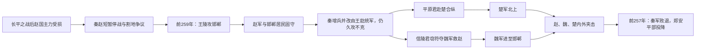

# 邯郸之战

## 时间

前259年－前257年，长平之战后。

## 概括

邯郸之战是长平之战的延续，也是秦国在商鞅变法后少有的大败。秦军围攻赵都邯郸，赵国坚守并向魏、楚求援。最终赵、魏、楚联军内外夹击秦军，解除邯郸之围，使赵国免于立即灭亡，也打断了秦乘长平之胜迅速东进的节奏。

## 围城过程与转折

| 阶段 | 战况 | 转折原因 |
|---|---|---|
| 战后再攻 | 长平后秦赵一度议和；割地与战略分歧使战争重启，秦试图在赵恢复前夺取都城。 | 秦选择乘胜攻赵，但部队疲劳、补给线延长，白起也反对仓促攻邯郸。 |
| 王陵围城 | 王陵率军进攻邯郸，多次增兵仍不能破城。 | 赵军背城而战，城市人口与守军共同承担防御。 |
| 王龁接替 | 秦昭襄王改用王龁继续围城，秦军付出大量伤亡，邯郸粮食日益匮乏。 | 围城转为消耗战，秦未能在援军到来前取得突破。 |
| 合纵救援 | 平原君促成楚国出兵；魏王起初畏秦，信陵君依靠侯嬴、如姬和朱亥取得兵符并接管晋鄙军。 | 魏、楚将援赵从外交承诺变成军事行动，改变局部兵力对比。 |
| 内外反击 | 赵军出城反击，魏、楚援军夹攻；秦军退却，郑安平所部被围降赵。 | 城内守军与外援协同，是解除围城的直接原因。 |

## 秦败原因与战争影响

- **时机不利**：长平虽重创赵军，也消耗了秦军；秦未充分休整便转入长期攻城。
- **守方动员**：邯郸是赵国都城，军民没有退路，赵国把残余资源集中于城防。
- **指挥冲突**：秦昭襄王、范雎与白起之间的判断和政治关系恶化；白起拒绝领兵后被赐死，反映秦廷内部矛盾。
- **外部压力**：魏、楚援军迫使秦同时面对城内突击与城外会战，秦国未能继续各个击破。
- **结果边界**：战役使赵国免于立即灭亡，并暂时恢复合纵信心，但赵国人口与军事基础没有从长平损失中完全恢复；秦国也未失去总体优势。
- **数字与故事**：各军兵力、伤亡数字及“窃符救赵”的人物细节主要来自传世史书和策士叙事，可用来把握事件结构，不宜当作精确军报。

## 说明

- 前259年九月，秦昭襄王在白起反对立即攻赵的背景下，命五大夫王陵率军进攻赵都邯郸；传世史书没有可统一核实的秦军总数。
- 赵国集中残余军队、城内居民与各地资源顽强抵抗，王陵久攻不下；守城军的具体编制与人数并不清楚。
- 前258年，秦多次增兵仍不能破城；传世史书记王陵所部损失数校，但无法换算为可靠的精确人数。
- 秦昭襄王命白起接替王陵，白起称病推辞，于是改令王龁为主将，继续围攻邯郸。
- 秦军死伤过半，仍不能攻下邯郸。
- 邯郸城内粮食耗尽，赵孝成王被迫向魏、楚求救。
- 前258年，平原君赵胜出使楚国，与楚考烈王订立合纵，楚国派春申君率军救赵；后世常列具体兵数，但难以核实。
- 平原君妻为魏无忌之姊，平原君多次向魏安釐王和信陵君求援。
- 魏安釐王畏惧秦国，信陵君请如姬窃出虎符，假传魏王命令并接管晋鄙所部，率魏军救赵。
- 秦相范雎举荐郑安平为将，率援军并携粮草支援王龁。
- 前257年九月，魏、楚军队先后抵达邯郸城郊，多次击败秦军。
- 前257年十一月，秦昭襄王赐死白起。
- 前257年十二月，李谈等三千赵国死士出城反击，魏、楚救军也抵达城外，三国军队内外夹击，秦军大败。
- 王龁率残部退回汾城，郑安平所部被联军包围后投降赵国；《史记》记投降者两万余人。

## 演变关系

- 前一节点：[长平之战](/%E4%BA%BA%E6%96%87%E7%A7%91%E5%AD%A6/%E5%8E%86%E5%8F%B2/%E4%B8%9C%E4%BA%9A/%E4%B8%AD%E5%9B%BD/%E5%91%A8/%E6%88%98%E5%9B%BD/%E9%95%BF%E5%B9%B3%E4%B9%8B%E6%88%98.md)。
- 后一节点：[秦灭周之战](/%E4%BA%BA%E6%96%87%E7%A7%91%E5%AD%A6/%E5%8E%86%E5%8F%B2/%E4%B8%9C%E4%BA%9A/%E4%B8%AD%E5%9B%BD/%E5%91%A8/%E6%88%98%E5%9B%BD/%E7%A7%A6%E7%81%AD%E5%91%A8%E4%B9%8B%E6%88%98.md)。
- 相关节点：[战国](/%E4%BA%BA%E6%96%87%E7%A7%91%E5%AD%A6/%E5%8E%86%E5%8F%B2/%E4%B8%9C%E4%BA%9A/%E4%B8%AD%E5%9B%BD/%E5%91%A8/%E6%88%98%E5%9B%BD/README.md)、[晋&赵魏韩](/%E4%BA%BA%E6%96%87%E7%A7%91%E5%AD%A6/%E5%8E%86%E5%8F%B2/%E4%B8%9C%E4%BA%9A/%E4%B8%AD%E5%9B%BD/%E5%91%A8/%E5%85%88%E7%A7%A6%E8%AF%B8%E4%BE%AF/%E6%99%8B%26%E8%B5%B5%E9%AD%8F%E9%9F%A9/README.md)、[楚](/%E4%BA%BA%E6%96%87%E7%A7%91%E5%AD%A6/%E5%8E%86%E5%8F%B2/%E4%B8%9C%E4%BA%9A/%E4%B8%AD%E5%9B%BD/%E5%91%A8/%E5%85%88%E7%A7%A6%E8%AF%B8%E4%BE%AF/%E6%A5%9A/README.md)。
