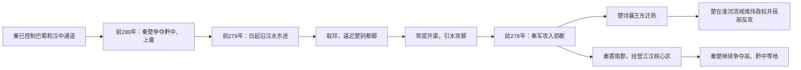

# 鄢郢之战

## 时间

前279年－前278年；前280年秦取楚黔中郡为前奏。

## 概括

鄢郢之战是秦国削弱楚国的决定性战役。白起率军沿汉水东下，攻克鄢城、郢都，楚顷襄王被迫迁都于陈。此战后楚国国力大损，难以再单独抗秦。

## 进军路线与战役阶段

| 阶段 | 具体过程 | 决定性因素 |
|---|---|---|
| 战略准备 | 秦取得巴蜀后，可从汉水和长江上游威胁楚国；前280年前后又争夺黔中、上庸。 | 楚的西部屏障受压，秦拥有水陆并进和侧后补给条件。 |
| 攻鄢 | 白起从汉水流域推进，夺取邓等要点，在鄢城附近筑堤、开渠引水。 | 水攻破坏城防并制造巨大人员损失，使秦避开长期强攻。 |
| 破郢 | 鄢失守后，秦军继续南下，于前278年攻占楚都郢及江陵一带。 | 楚都与西部腹地联系被切断，楚王无法在旧都组织有效防御。 |
| 迁都与接管 | 楚顷襄王迁都陈，秦在新占区设置南郡，并继续争夺巫、黔中。 | 秦将战场胜利转化为行政据点，楚则依靠淮河流域继续存续。 |
| 战后拉锯 | 楚收集残部、局部收复巴东城邑，秦楚后来暂时休战。 | 楚国遭到重创但并未灭亡，战争转为对长江中游与淮域的长期竞争。 |

## 秦胜、楚衰与史料争议

- **结构因素**：楚疆域广大但权力和交通整合有限，西部核心区面对秦从巴蜀、汉中推进时难以快速集中兵力。
- **作战优势**：秦军掌握汉水通道，以工程水攻和连续夺城打乱楚的防御节奏。
- **直接结果**：楚失去郢都和江汉腹地，财政、人口与政治威望均受损；迁都后战略中心被迫东移。
- **长期影响**：秦控制南郡后取得进攻楚东部与江南的前进基地，但楚仍能在陈、寿春等地延续数十年，不能把鄢郢之战等同于楚国灭亡。
- **伤亡数字**：传世文献及后世叙述常称鄢城死者数十万，具体数字无法核实；水攻本身则有地理文献和遗迹线索支持。
- **屈原年代**：传统把屈原投江与郢都失陷相联系，但其生卒年、投江年份和直接诱因均存在争议，应与战役确定纪年分开表述。

## 说明

- 前280年，秦将司马错集结蜀兵自陇西郡出兵，攻取楚国黔中郡。
- 楚顷襄王被迫割让上庸和汉江以北土地给秦国。
- 前279年，秦昭襄王与赵惠文王在渑池相会，秦赵暂时休战，以便秦全力攻楚。
- 白起率军沿汉江东下，迅速攻取汉水流域要地邓城，直抵楚国别都鄢城；具体兵数无可靠统一记载。
- 白起筑堤蓄水，开渠灌鄢；传世文献和后世叙述称死者众多，常见“数十万”之说，但具体数字无法核实。
- 前278年，秦军攻克鄢城后继续攻楚，攻陷楚国国都郢。
- 楚顷襄王被迫迁都于陈。
- 秦国占领楚国洞庭湖周围水泽地带、长江以南以及北至安陆的大片土地。
- 白起因功受封武安君。
- 传统叙事把屈原投江与郢都陷落、楚国衰败相联系；其确切年份和直接诱因仍有争议。
- 前277年，白起与蜀郡郡守张若继续夺取楚国巫郡和黔中郡。
- 次年，楚顷襄王收集残兵，传世记载称其收复巴东十五座城邑并合并为郡，以阻挡秦国；所列兵数难以核实。
- 春申君写信劝秦昭襄王，指出秦楚交战只会让韩、魏、齐壮大；经调解后，秦、楚重新结盟休战。

## 演变关系

- 前一节点：[秦灭巴蜀之战](/%E4%BA%BA%E6%96%87%E7%A7%91%E5%AD%A6/%E5%8E%86%E5%8F%B2/%E4%B8%9C%E4%BA%9A/%E4%B8%AD%E5%9B%BD/%E5%91%A8/%E6%88%98%E5%9B%BD/%E7%A7%A6%E7%81%AD%E5%B7%B4%E8%9C%80%E4%B9%8B%E6%88%98.md)。
- 后一节点：[长平之战](/%E4%BA%BA%E6%96%87%E7%A7%91%E5%AD%A6/%E5%8E%86%E5%8F%B2/%E4%B8%9C%E4%BA%9A/%E4%B8%AD%E5%9B%BD/%E5%91%A8/%E6%88%98%E5%9B%BD/%E9%95%BF%E5%B9%B3%E4%B9%8B%E6%88%98.md)。
- 相关节点：[战国](/%E4%BA%BA%E6%96%87%E7%A7%91%E5%AD%A6/%E5%8E%86%E5%8F%B2/%E4%B8%9C%E4%BA%9A/%E4%B8%AD%E5%9B%BD/%E5%91%A8/%E6%88%98%E5%9B%BD/README.md)、[楚](/%E4%BA%BA%E6%96%87%E7%A7%91%E5%AD%A6/%E5%8E%86%E5%8F%B2/%E4%B8%9C%E4%BA%9A/%E4%B8%AD%E5%9B%BD/%E5%91%A8/%E5%85%88%E7%A7%A6%E8%AF%B8%E4%BE%AF/%E6%A5%9A/README.md)、[秦](/%E4%BA%BA%E6%96%87%E7%A7%91%E5%AD%A6/%E5%8E%86%E5%8F%B2/%E4%B8%9C%E4%BA%9A/%E4%B8%AD%E5%9B%BD/%E5%91%A8/%E5%85%88%E7%A7%A6%E8%AF%B8%E4%BE%AF/%E7%A7%A6/README.md)。
