# 吴越争霸

## 时间

前506年吴攻入楚都郢，前496年阖闾伐越受伤，前494年夫差败越，前473年越灭吴。

## 概括

吴越争霸是春秋末期江淮、江浙地区强国崛起的代表事件。吴王阖闾、夫差先后北上争霸，越王勾践在失败后卧薪尝胆，最终灭吴并北上会盟，成为春秋末期最后一位霸主之一。

## 过程图

```mermaid
flowchart LR
    WuRise["阖闾整军、吴破楚都郢"] --> YueWar["前496年阖闾伐越受伤死"]
    YueWar --> Revenge["前494年夫差败越"]
    Revenge --> Submission["勾践求和、越国臣服"]
    Submission --> Recovery["越休养生息、吴北上争霸"]
    Recovery --> Huangchi["前482年夫差黄池争盟"]
    Huangchi --> Counter["越乘虚连续攻吴"]
    Counter --> End["前473年越灭吴"]
    End --> Goujian["勾践北上会盟"]
```

## 阶段、机制与影响

| 阶段 | 具体过程 | 力量变化 |
|---|---|---|
| 吴国崛起 | 阖闾任用伍子胥、孙武，前506年柏举之战攻破楚都；吴由江南强国进入中原战略格局。 | 对楚胜利扩大威望，却也使吴需同时防备越国后方。 |
| 阖闾败死 | 前496年吴主动伐越，阖闾负伤去世，夫差以复仇动员全国。 | 吴越矛盾由边境冲突转为灭国竞争。 |
| 越败臣服 | 前494年夫差击败勾践，越保留国君和核心领土，以臣服、贡纳换取生存。 | 吴取得主动，却没有消灭越的组织基础。 |
| 两国战略分化 | 勾践整顿人口、农业和军队；夫差向北攻齐、争夺黄池盟主。 | 越集中于复国，吴陷入南北两线和长距离后勤。 |
| 越国反攻 | 越趁吴精锐北上进攻，随后持续消耗吴国；伍子胥与夫差决裂也反映吴国内战略分歧。 | 吴失去恢复时间和盟友，财政、兵源逐渐枯竭。 |
| 吴亡越霸 | 前473年越灭吴，勾践北上与诸侯会盟。 | 长江下游霸权转移，但越的中原霸权持续时间有限。 |

- **吴国崛起**依靠水军、外来人才和晋楚争霸提供的机会；**吴国灭亡**则源于扩张过度、未消除越国政权和战略重点失衡。
- **越国复兴**不是“卧薪尝胆”一项个人品德造成，而是保留国家组织、恢复生产、外交隐忍和等待吴国失误共同作用。
- 西施、美人计、卧薪尝胆等细节在后世叙事中高度文学化，应与《左传》等较早材料和政治经济过程区分。
- 吴亡没有终结江南国家发展，吴越的军政与交通经验继续影响战国时期楚国向东扩张。

## 说明

- 春秋中原诸侯争霸接近尾声时，江浙地区的吴、越开始发展。
- 吴王阖闾重用孙武、伍子胥等人。
- 周敬王十四年（前506年），吴王以伍子胥为大将伐楚，攻入楚都郢。
- 伍子胥为父兄报仇，掘楚平王墓，鞭尸三百。
- 周敬王二十四年（前496年），吴挥师南进伐越。
- 越王勾践迎战，越大夫灵姑浮击中阖闾，阖闾因伤去世。
- 周敬王二十六年（前494年），吴王夫差为父报仇，兴兵败越。
- 传世文献记载勾践通过伯嚭向吴求和，以贡纳和臣服换取越国存续；西施、美人计等细节主要形成于后世文学叙事。
- 吴王夫差拒绝伍子胥联齐灭越建议，接受越国求和，转兵北上，击败齐军，成为一时小霸。
- 越王勾践卧薪尝胆，于周元王三年（前473年）灭吴，夫差自杀。
- 勾践北上与齐、晋会盟于徐，成为春秋时期最后一个霸主之一。

## 演变关系

- 前一节点：[楚庄王称霸](/%E4%BA%BA%E6%96%87%E7%A7%91%E5%AD%A6/%E5%8E%86%E5%8F%B2/%E4%B8%9C%E4%BA%9A/%E4%B8%AD%E5%9B%BD/%E5%91%A8/%E6%98%A5%E7%A7%8B/%E6%A5%9A%E5%BA%84%E7%8E%8B%E7%A7%B0%E9%9C%B8.md)。
- 后一节点：[战国](/%E4%BA%BA%E6%96%87%E7%A7%91%E5%AD%A6/%E5%8E%86%E5%8F%B2/%E4%B8%9C%E4%BA%9A/%E4%B8%AD%E5%9B%BD/%E5%91%A8/%E6%88%98%E5%9B%BD/README.md)、[三家分晋](/%E4%BA%BA%E6%96%87%E7%A7%91%E5%AD%A6/%E5%8E%86%E5%8F%B2/%E4%B8%9C%E4%BA%9A/%E4%B8%AD%E5%9B%BD/%E5%91%A8/%E6%88%98%E5%9B%BD/%E4%B8%89%E5%AE%B6%E5%88%86%E6%99%8B.md)。
- 相关节点：[春秋](/%E4%BA%BA%E6%96%87%E7%A7%91%E5%AD%A6/%E5%8E%86%E5%8F%B2/%E4%B8%9C%E4%BA%9A/%E4%B8%AD%E5%9B%BD/%E5%91%A8/%E6%98%A5%E7%A7%8B/README.md)、[吴](/%E4%BA%BA%E6%96%87%E7%A7%91%E5%AD%A6/%E5%8E%86%E5%8F%B2/%E4%B8%9C%E4%BA%9A/%E4%B8%AD%E5%9B%BD/%E5%91%A8/%E5%85%88%E7%A7%A6%E8%AF%B8%E4%BE%AF/%E5%90%B4/README.md)、[越](/%E4%BA%BA%E6%96%87%E7%A7%91%E5%AD%A6/%E5%8E%86%E5%8F%B2/%E4%B8%9C%E4%BA%9A/%E4%B8%AD%E5%9B%BD/%E5%91%A8/%E5%85%88%E7%A7%A6%E8%AF%B8%E4%BE%AF/%E8%B6%8A/README.md)。
