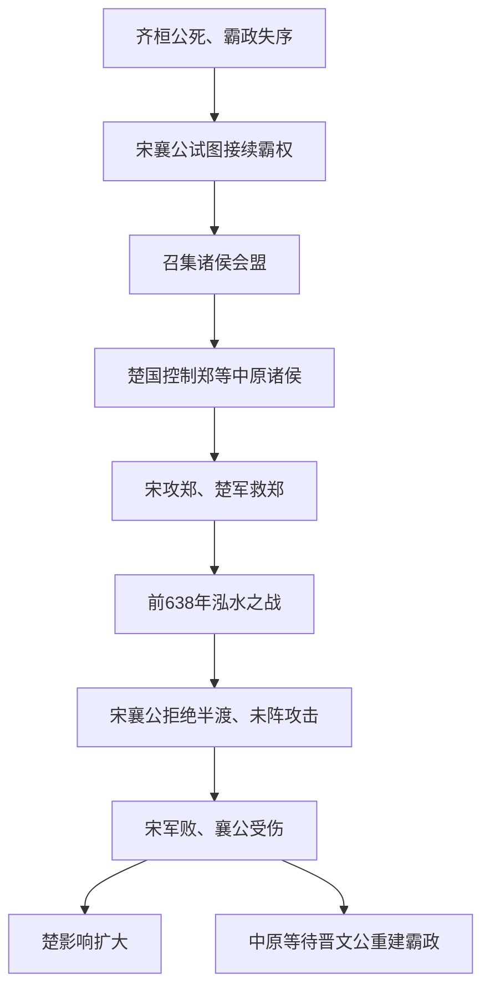

# 宋楚之争

## 时间

前638年泓水之战前后。

## 概括

宋楚之争是齐桓公霸业衰落后，宋襄公试图接续中原霸权而失败的事件。宋襄公以抵御楚国为名大会诸侯，但宋国实力不足，在泓水之战中败于楚国，显示春秋霸权已转向更强的大国竞争。

## 过程图

## 过程、败因与影响

| 环节 | 具体过程 | 结果 |
|---|---|---|
| 霸权空缺 | 齐桓公死后齐国内乱，原有会盟体系失去核心；宋襄公凭礼制地位和诸侯会议谋求接替。 | 宋获得短暂外交舞台，但缺乏齐国式经济、军力和稳定联盟。 |
| 宋楚对立 | 楚向中原扩张并影响郑等国，宋的会盟诉求与楚的实际控制发生冲突。 | 争盟最终必须通过军事力量检验。 |
| 泓水决战 | 宋攻郑后楚军来援，双方在泓水交战；宋襄公拒绝利用楚军渡河和未成列时进攻。 | 宋丧失战术机会，正面交战后军队失败，襄公受伤。 |
| 霸业终结 | 宋不能继续组织诸侯，楚成王影响扩大，但中原诸国仍未普遍接受楚为长期盟主。 | 霸权竞争转入晋楚两大国持续对抗。 |

- **结构性败因**是宋国疆域、人口和盟友不足；战场上的礼战选择只是直接因素。
- 子鱼“半渡击之”的叙事常被后世用来批评宋襄公迂腐，但春秋战争礼制、史家讽喻和真实战术情况不宜简单等同。
- 宋襄公是否应列入“五霸”历来有不同名单；应区分后世评价与其实际未能建立稳定霸权。
- 泓水之战说明春秋盟主必须同时具备王室名义、诸侯联盟和可持续军事财政，单靠礼制声望不足。

## 说明

- 南方楚国兴起，自称为王，并消灭其北方多个小国后向中原扩张。
- 宋襄公试图效法齐桓公，以抵抗楚国进攻为名大会诸侯，争取成为霸主。
- 宋国实力与威望不足，难以真正整合中原诸侯。
- 宋襄公十五年（前638年），宋、楚两军交战于泓水。
- 楚军渡河时，宋大司马子鱼建议“半渡击之”，宋襄公以不仁不义为由拒绝。
- 楚军渡河后列阵未定，子鱼再次建议攻击，宋襄公仍拒绝。
- 楚军列阵完毕后发起攻击，宋军大败。
- 宋襄公大腿中箭，次年因伤重而死。
- 楚成王因此称雄一时。

## 演变关系

- 前一节点：[齐桓公称霸](/%E4%BA%BA%E6%96%87%E7%A7%91%E5%AD%A6/%E5%8E%86%E5%8F%B2/%E4%B8%9C%E4%BA%9A/%E4%B8%AD%E5%9B%BD/%E5%91%A8/%E6%98%A5%E7%A7%8B/%E9%BD%90%E6%A1%93%E5%85%AC%E7%A7%B0%E9%9C%B8.md)。
- 后一节点：[晋文公称霸](/%E4%BA%BA%E6%96%87%E7%A7%91%E5%AD%A6/%E5%8E%86%E5%8F%B2/%E4%B8%9C%E4%BA%9A/%E4%B8%AD%E5%9B%BD/%E5%91%A8/%E6%98%A5%E7%A7%8B/%E6%99%8B%E6%96%87%E5%85%AC%E7%A7%B0%E9%9C%B8.md)。
- 相关节点：[春秋](/%E4%BA%BA%E6%96%87%E7%A7%91%E5%AD%A6/%E5%8E%86%E5%8F%B2/%E4%B8%9C%E4%BA%9A/%E4%B8%AD%E5%9B%BD/%E5%91%A8/%E6%98%A5%E7%A7%8B/README.md)、[宋](/%E4%BA%BA%E6%96%87%E7%A7%91%E5%AD%A6/%E5%8E%86%E5%8F%B2/%E4%B8%9C%E4%BA%9A/%E4%B8%AD%E5%9B%BD/%E5%91%A8/%E5%85%88%E7%A7%A6%E8%AF%B8%E4%BE%AF/%E5%AE%8B/README.md)、[楚](/%E4%BA%BA%E6%96%87%E7%A7%91%E5%AD%A6/%E5%8E%86%E5%8F%B2/%E4%B8%9C%E4%BA%9A/%E4%B8%AD%E5%9B%BD/%E5%91%A8/%E5%85%88%E7%A7%A6%E8%AF%B8%E4%BE%AF/%E6%A5%9A/README.md)。
