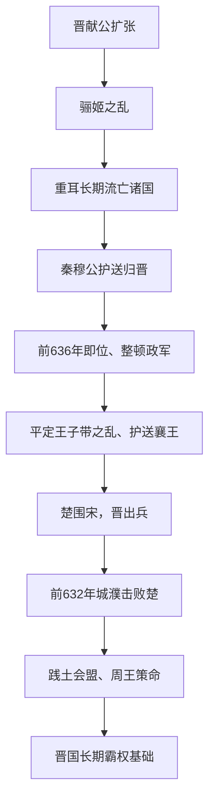

# 晋文公称霸

## 时间

前636年晋文公即位，前632年城濮之战与践土会盟确立霸主地位。

## 概括

晋文公称霸是春秋中期中原霸权转向晋国的标志。重耳流亡多年后在秦穆公帮助下回国即位，整顿政治、发展经济、整军经武，并在城濮之战击败楚军，随后会盟践土，成为中原霸主。

## 过程图

## 崛起过程与霸权机制

| 阶段 | 具体过程 | 作用 |
|---|---|---|
| 流亡与联盟 | 骊姬之乱迫使重耳流亡，先后接触狄、齐、楚、秦等国并形成追随集团。 | 流亡是危机，也为重耳积累跨国人脉和政治经验。 |
| 秦助归国 | 秦穆公出兵护送重耳回晋，文公清除政敌并任用狐偃、赵衰等旧臣。 | 外援解决即位问题，核心追随者构成新政权骨干。 |
| 国内整顿 | 晋恢复生产、赏功任能并扩充军制；同时帮助周襄王复位。 | 把实力与“勤王”合法性结合，争取中原诸侯支持。 |
| 城濮战争 | 楚围宋，晋先攻楚盟国、调整战场并在城濮决战；“退避三舍”兼有政治承诺与诱敌意义。 | 楚军失败，晋取得中原军事主动。 |
| 践土会盟 | 晋文公召集诸侯，周王给予策命。 | 霸主以周王名义组织联盟，而非取代天子称王。 |

- **称霸条件**包括晋献公留下的领土、文公追随集团、秦国支持、周王认可和宋等国对抗楚国的需求。
- **晋的优势**在于河汾资源、军制和多卿分工；同一结构后来也使卿族掌握军政，埋下分晋因素。
- 城濮胜利不是晋单独征服楚，而是围绕宋、曹、卫等国的联盟与战场选择共同形成。
- 晋文公在位时间不长，霸权能否延续取决于襄公以后制度和卿族协作，不能只归于个人魅力。

## 说明

- 晋国与周室同宗，位居北方，是春秋时期重要大国。
- 晋献公时期，晋国向四方扩张，领土与国力增强。
- 晋献公宠信爱姬，废嫡立幼，导致晋国内政大乱。
- 前636年，晋献公之子重耳在秦穆公派军护送下继承晋国君位，是为晋文公。
- 晋文公改革政治、发展经济、整军经武，取信于民。
- 晋文公安定周王室，并与秦国保持友好，形成“秦晋之好”。
- 周襄王二十年（前633年），楚军包围宋国都城商丘。
- 次年，晋文公率兵救宋，在城濮之战大败楚军。
- 城濮之战后，晋文公会盟于践土，成为中原霸主。

## 演变关系

- 前一节点：[宋楚之争](/%E4%BA%BA%E6%96%87%E7%A7%91%E5%AD%A6/%E5%8E%86%E5%8F%B2/%E4%B8%9C%E4%BA%9A/%E4%B8%AD%E5%9B%BD/%E5%91%A8/%E6%98%A5%E7%A7%8B/%E5%AE%8B%E6%A5%9A%E4%B9%8B%E4%BA%89.md)。
- 后一节点：[秦穆公独霸西戎](/%E4%BA%BA%E6%96%87%E7%A7%91%E5%AD%A6/%E5%8E%86%E5%8F%B2/%E4%B8%9C%E4%BA%9A/%E4%B8%AD%E5%9B%BD/%E5%91%A8/%E6%98%A5%E7%A7%8B/%E7%A7%A6%E7%A9%86%E5%85%AC%E7%8B%AC%E9%9C%B8%E8%A5%BF%E6%88%8E.md)。
- 相关节点：[春秋](/%E4%BA%BA%E6%96%87%E7%A7%91%E5%AD%A6/%E5%8E%86%E5%8F%B2/%E4%B8%9C%E4%BA%9A/%E4%B8%AD%E5%9B%BD/%E5%91%A8/%E6%98%A5%E7%A7%8B/README.md)、[晋&赵魏韩](/%E4%BA%BA%E6%96%87%E7%A7%91%E5%AD%A6/%E5%8E%86%E5%8F%B2/%E4%B8%9C%E4%BA%9A/%E4%B8%AD%E5%9B%BD/%E5%91%A8/%E5%85%88%E7%A7%A6%E8%AF%B8%E4%BE%AF/%E6%99%8B%26%E8%B5%B5%E9%AD%8F%E9%9F%A9/README.md)、[秦](/%E4%BA%BA%E6%96%87%E7%A7%91%E5%AD%A6/%E5%8E%86%E5%8F%B2/%E4%B8%9C%E4%BA%9A/%E4%B8%AD%E5%9B%BD/%E5%91%A8/%E5%85%88%E7%A7%A6%E8%AF%B8%E4%BE%AF/%E7%A7%A6/README.md)。
