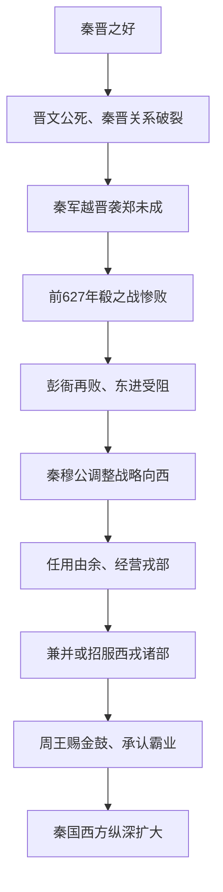

# 秦穆公独霸西戎

## 时间

前627年殽之战后至前623年秦穆公称霸西戎。

## 概括

秦穆公独霸西戎是秦国由春秋中原争霸受挫转向西方扩张的关键阶段。秦国东进被晋国阻挡后，秦穆公任用由余，兼并西戎部族，获得周天子承认，奠定秦国后续经营关中和西方的基础。

## 过程图

## 战略转向与历史影响

| 环节 | 具体过程 | 作用 |
|---|---|---|
| 东进受阻 | 晋文公死后，秦试图越过晋国袭郑，返师时在殽遭晋伏击；彭衙等战又受挫。 | 秦难以直接进入中原，秦晋联盟转为长期竞争。 |
| 军政调整 | 穆公继续任用孟明视等败将并总结战败，随后把战略重点转向关中以西。 | 保存将领和制度连续性，避免在东线持续消耗。 |
| 利用地方知识 | 由余熟悉戎人政治和地理，秦通过战争、外交、招附等多种方式扩大控制。 | 西方扩张不是单纯军事灭绝，而是整合部族、城邑与交通。 |
| 王室承认 | 传统记载称秦拓地千里、服西戎诸国，周王赐金鼓。 | 秦获得“西戎霸主”声望和更大安全纵深。 |
| 长期结果 | 秦控制更多牧地、道路和边防资源，东方虽受晋阻挡，西部后方却逐步稳固。 | 为战国时经营关中、河西及商鞅变法提供地缘基础。 |

- 秦穆公的成功来自**战略转向**，不是殽败后立即称霸；战败、整军、用人和西进构成连续过程。
- 传统文献关于“益国十二、开地千里”或吞并、归附数量有不同说法，应视为扩张规模的概括而非精确统计。
- “西戎”是中原文献的集合称呼，各部族具有不同政治目标，不能写成一个统一国家。
- 秦在西方的霸业扩大实力，却尚未突破晋国对东方通道的限制，距离战国统一仍有数百年制度演变。

## 说明

- 晋文公死后，秦晋联盟瓦解，秦穆公谋求向东方发展。
- 秦国东进受到晋国阻挡。
- 前627年秦晋殽之战，秦军全军覆没，大将孟明视被俘。
- 次年秦军在彭衙之战再败。
- 秦国虽后来有王官之战的胜利，但仍无法挑战晋国在中原的地位。
- 秦穆公转而向西发展，任用由余。
- 前623年，秦国吞并20个戎狄部族，其余20多国也相继归附秦国。
- 秦穆公独霸西戎，并获得周天子承认和金鼓赏赐。

## 演变关系

- 前一节点：[晋文公称霸](/%E4%BA%BA%E6%96%87%E7%A7%91%E5%AD%A6/%E5%8E%86%E5%8F%B2/%E4%B8%9C%E4%BA%9A/%E4%B8%AD%E5%9B%BD/%E5%91%A8/%E6%98%A5%E7%A7%8B/%E6%99%8B%E6%96%87%E5%85%AC%E7%A7%B0%E9%9C%B8.md)。
- 后一节点：[楚庄王称霸](/%E4%BA%BA%E6%96%87%E7%A7%91%E5%AD%A6/%E5%8E%86%E5%8F%B2/%E4%B8%9C%E4%BA%9A/%E4%B8%AD%E5%9B%BD/%E5%91%A8/%E6%98%A5%E7%A7%8B/%E6%A5%9A%E5%BA%84%E7%8E%8B%E7%A7%B0%E9%9C%B8.md)。
- 相关节点：[春秋](/%E4%BA%BA%E6%96%87%E7%A7%91%E5%AD%A6/%E5%8E%86%E5%8F%B2/%E4%B8%9C%E4%BA%9A/%E4%B8%AD%E5%9B%BD/%E5%91%A8/%E6%98%A5%E7%A7%8B/README.md)、[秦](/%E4%BA%BA%E6%96%87%E7%A7%91%E5%AD%A6/%E5%8E%86%E5%8F%B2/%E4%B8%9C%E4%BA%9A/%E4%B8%AD%E5%9B%BD/%E5%91%A8/%E5%85%88%E7%A7%A6%E8%AF%B8%E4%BE%AF/%E7%A7%A6/README.md)。
