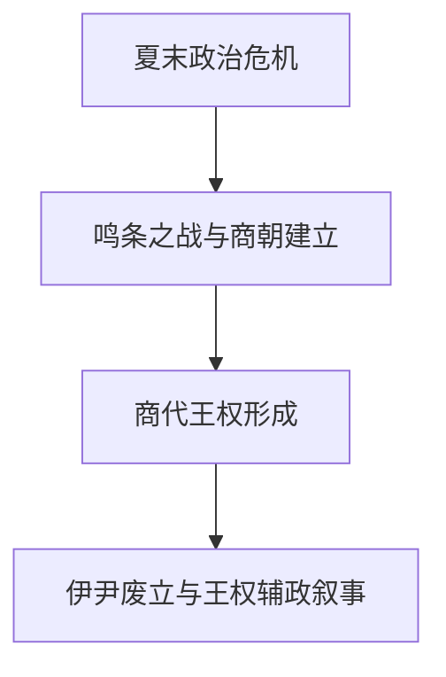

# 商代相关事件

## 概括

本目录整理商代建立与王权运行中的代表性事件。商代已有甲骨文等同时代材料，但许多早期事件仍主要见于后世文献，整理时应区分考古、甲骨材料与传统叙事。

## 演进图

## 事件导航

| 顺序 | 事件 | 概括 |
|---:|---|---|
| 1 | [鸣条之战，汤武革命](/%E4%BA%BA%E6%96%87%E7%A7%91%E5%AD%A6/%E5%8E%86%E5%8F%B2/%E4%B8%9C%E4%BA%9A/%E4%B8%AD%E5%9B%BD/%E5%95%86/%E4%BA%8B%E4%BB%B6/%E9%B8%A3%E6%9D%A1%E4%B9%8B%E6%88%98%EF%BC%8C%E6%B1%A4%E6%AD%A6%E9%9D%A9%E5%91%BD.md) | 商汤击败夏桀的传统叙事，以及后世对正当改朝换代的解释。 |
| 2 | [伊尹废立](/%E4%BA%BA%E6%96%87%E7%A7%91%E5%AD%A6/%E5%8E%86%E5%8F%B2/%E4%B8%9C%E4%BA%9A/%E4%B8%AD%E5%9B%BD/%E5%95%86/%E4%BA%8B%E4%BB%B6/%E4%BC%8A%E5%B0%B9%E5%BA%9F%E7%AB%8B.md) | 伊尹辅政、放太甲与迎回太甲的传统叙事，涉及早期王权约束问题。 |

## 相关笔记

- [商](/%E4%BA%BA%E6%96%87%E7%A7%91%E5%AD%A6/%E5%8E%86%E5%8F%B2/%E4%B8%9C%E4%BA%9A/%E4%B8%AD%E5%9B%BD/%E5%95%86/README.md)
- [夏代相关事件](/%E4%BA%BA%E6%96%87%E7%A7%91%E5%AD%A6/%E5%8E%86%E5%8F%B2/%E4%B8%9C%E4%BA%9A/%E4%B8%AD%E5%9B%BD/%E5%A4%8F/%E4%BA%8B%E4%BB%B6/README.md)
