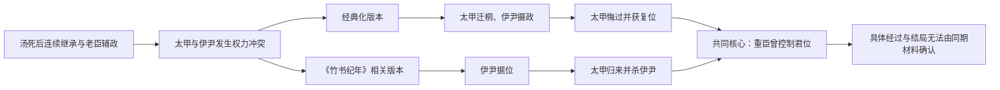

# 伊尹废立

> 导航：[商](/%E4%BA%BA%E6%96%87%E7%A7%91%E5%AD%A6/%E5%8E%86%E5%8F%B2/%E4%B8%9C%E4%BA%9A/%E4%B8%AD%E5%9B%BD/%E5%95%86/README.md) / [商世系](/%E4%BA%BA%E6%96%87%E7%A7%91%E5%AD%A6/%E5%8E%86%E5%8F%B2/%E4%B8%9C%E4%BA%9A/%E4%B8%AD%E5%9B%BD/%E5%95%86/%E4%B8%96%E7%B3%BB.md) / [夏](/%E4%BA%BA%E6%96%87%E7%A7%91%E5%AD%A6/%E5%8E%86%E5%8F%B2/%E4%B8%9C%E4%BA%9A/%E4%B8%AD%E5%9B%BD/%E5%A4%8F/README.md)

## 时间

传统商初太甲时期，绝对年代不详。现存叙述形成于事件数百年以后，且至少保存两套相互冲突的版本。

## 概括

伊尹废立是商初辅政、王权约束与继承危机的核心叙事。儒家经典化版本称太甲失德，伊尹将其迁至桐宫，摄政三年；太甲悔过后复位，君臣相得。另一套与《竹书纪年》古本引文相关的传统，则把事件写成伊尹夺权、太甲逃归并杀伊尹。两种版本的共同核心是：商初曾发生一场由重臣控制君位的严重权力冲突；谁掌握王权、冲突持续多久和结局细节无法由同期文字确认。

## 背景

- 伊尹在传世文献中是汤灭夏、整顿商初政治的重要辅臣，其出身有陪嫁奴隶、隐士、庖人等不同说法，明显带有贤臣传奇色彩。
- 汤死后，太子太丁已先亡，王位经过外丙、仲壬再传给太丁之子太甲。短期内多次继承，使老臣在祭祀、政令和王族协调中拥有很大影响。
- 商初尚无可供直接阅读的王室档案；晚商甲骨所见的祖先名号可以与部分商王世系相合，却不能验证伊尹与太甲冲突的完整过程。

## 两套主要叙事

### 经典化的“放而复之”

| 阶段 | 过程 | 叙事功能 |
|---|---|---|
| 太甲即位 | 伊尹奉汤的制度辅佐太甲，告诫新王敬天、保民、遵守祖法。 | 老臣代表开国秩序。 |
| 太甲失德 | 太甲被指不遵汤法、败坏政令。具体行为多为概括性道德评价。 | 说明血缘继承不自动保证合格统治。 |
| 迁往桐宫 | 伊尹将太甲置于汤墓附近的桐地，自己主持朝政，传统说持续三年。 | 以祖先和丧祭环境促使君主反省。 |
| 悔过复位 | 太甲改过，伊尹迎其回朝并归还政权。 | 证明辅政目的在保全王朝而非篡位。 |
| 君臣共治 | 太甲后来被塑造成能修德的君主，伊尹继续受尊崇。 | 为权臣临时废立建立道德边界。 |

### 《竹书纪年》相关的权力斗争版本

后世保存的古本《竹书纪年》引文称伊尹放逐太甲后自立，太甲七年后逃回并杀伊尹，再把伊氏田宅分给其子。今本与古本辑文、传抄层次本身也有复杂争议，因此不能把这一版本直接视为同期实录；但它表明先秦至中古学术传统中，伊尹并非始终只是无私摄政者。

## 参与者与实际权力结构

| 角色 | 权力基础 | 在事件中的作用 |
|---|---|---|
| 太甲 | 商汤嫡系孙辈、王位和王族祭祀资格 | 名义君主，也是冲突中被限制、放逐或反攻的一方。 |
| 伊尹 | 开国功勋、行政经验、对诸侯和王族的协调能力 | 掌握摄政或实际统治权，是废立行动的执行者。 |
| 商王族 | 祖先祭祀、亲族武装和继承认可 | 其支持决定伊尹能否长期执政、太甲能否复位。 |
| 方国与臣属 | 军事、贡纳和地方资源 | 文献着墨较少，但新王朝能否稳定取决于其继续服从。 |

## 转折点

1. **太丁早亡与连续继承**削弱了单一继承人的基础，使伊尹成为政权连续性的关键人物。
2. **太甲被移出政治中心**意味着辅臣不只是进谏，而是实际控制君主与政令。
3. **太甲复位或反杀伊尹**无论采用哪一版本，都显示王族最终重新取得直接统治。
4. **后世经典化**把一次危险的权力冲突改写为君臣互相成就的道德故事，为以后讨论摄政留下规范。

## 结果与长期影响

- 在主流政治传统中，伊尹与西汉霍光并称，“伊霍”成为权臣废立君主的典故。支持者认为可为宗庙社稷暂行废立，批评者则担忧权臣借此篡位。
- 事件建立了一个难以消除的张力：君位依赖血统，但君主若被判断为不合格，谁有权代表祖法和国家限制他？
- 太甲故事强化了“改过可以复位”的主题，也把商汤的开国制度塑造成衡量继承者的标准。
- 两套冲突文本提醒读者，古史不是单一版本的透明记录；政治立场、文本流传和后世伦理化都会改变事件形貌。

## 演变关系

- 前一节点：[鸣条之战，汤武革命](/%E4%BA%BA%E6%96%87%E7%A7%91%E5%AD%A6/%E5%8E%86%E5%8F%B2/%E4%B8%9C%E4%BA%9A/%E4%B8%AD%E5%9B%BD/%E5%95%86/%E4%BA%8B%E4%BB%B6/%E9%B8%A3%E6%9D%A1%E4%B9%8B%E6%88%98%EF%BC%8C%E6%B1%A4%E6%AD%A6%E9%9D%A9%E5%91%BD.md)。
- 世系位置：商汤—外丙—仲壬—太甲；太丁为汤太子但早亡，未正式在位。
- 后续影响：商初王权恢复后继续传承，但中期仍经历频繁迁都与“九世之乱”。
