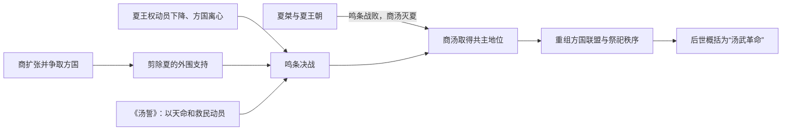

# 鸣条之战，汤武革命

> 导航：[商](/%E4%BA%BA%E6%96%87%E7%A7%91%E5%AD%A6/%E5%8E%86%E5%8F%B2/%E4%B8%9C%E4%BA%9A/%E4%B8%AD%E5%9B%BD/%E5%95%86/README.md) / [商世系](/%E4%BA%BA%E6%96%87%E7%A7%91%E5%AD%A6/%E5%8E%86%E5%8F%B2/%E4%B8%9C%E4%BA%9A/%E4%B8%AD%E5%9B%BD/%E5%95%86/%E4%B8%96%E7%B3%BB.md) / [夏](/%E4%BA%BA%E6%96%87%E7%A7%91%E5%AD%A6/%E5%8E%86%E5%8F%B2/%E4%B8%9C%E4%BA%9A/%E4%B8%AD%E5%9B%BD/%E5%A4%8F/README.md)

## 时间与地点

传统约在公元前1600年前后；鸣条的具体位置有今山西运城附近、河南西部等不同推测，缺乏能够自证战役名称的同期铭文。

## 概括

鸣条之战是商汤灭夏叙事中的决定性战役。其军事核心是商及盟友在夏的核心区域附近击溃夏桀主力；其政治核心则是汤以誓辞、天命和“救民”话语说明为何方国首领可以推翻旧共主。后世把汤伐桀与周武王伐纣并称“汤武革命”，其中“革命”原指天命发生更改、王朝统治权转移，并不等同于现代意义的社会革命。

## 战前形势

- 商经过多代扩张，已从东方方国成长为可与夏竞争的区域强权。汤控制的盟友、粮食和军事网络是发动远征的基础。
- 传统称汤先打击葛、韦、顾、昆吾等势力，逐步拆除夏的外围支持；各次战役顺序和地点不能完全确定。
- 夏桀被描绘为加重征发、压迫民众和诸侯。此类“亡国之君”叙事带有模式化加工，但联盟离心和动员困难应是决战前的重要条件。
- 汤若仅以自身利益进攻旧共主，可能引发其他方国反对，因此需要把战争说明为执行天意、惩罚失德统治。

## 参战者与目标

| 一方 | 核心力量 | 战略目标 |
|---|---|---|
| 商方 | 商汤、商族军队、伊尹与仲虺等辅臣、归附方国 | 摧毁夏军主力，取代夏的共主地位，并维持贡纳与交通网络。 |
| 夏方 | 夏桀、夏后氏军队、仍忠于夏的方国 | 保住核心区域和旧联盟，阻止商把局部优势转化为天下共主权。 |
| 观望方国 | 与夏、商都有关系的地方集团 | 根据战局和政治承诺选择归附；其倒向会放大胜负结果。 |

## 战役过程

1. **完成战略孤立**：汤在决战前清除或争取夏的外围势力，确保进军通道和补给。
2. **发布《汤誓》**：传世誓辞称夏“多罪”，商军奉天命讨伐；誓辞同时记录部众对长期征役的疑问，说明动员并非毫无阻力。
3. **向夏核心区推进**：商军与盟友逼近鸣条。具体路线无法复原，战场可能位于连接河洛与晋南的重要通道。
4. **夏军崩溃**：传统称战时有大雨，夏军战败；气象细节和阵形均无同期证据，可靠核心是夏失去决定性军事力量。
5. **桀逃亡**：桀离开核心区，结局有逃往南巢等不同记载。夏后氏没有形成有效复国中心。
6. **汤接管秩序**：商安抚或重新编组方国，在亳一带建立统治，并用祭祀和政令把军事胜利转化为长期服从。

## 决定胜负的因素

### 商方优势

- 多代形成的区域网络提供军队、粮食、交通和政治支持。
- 分阶段打击使夏在决战前失去外围屏障。
- 誓辞与道德话语降低了盟友参与“犯上”的合法性成本。
- 汤及辅臣能够在胜利后迅速接管旧秩序，而不只是劫掠后撤。

### 夏方弱点

- 对方国的控制依赖威望与利益交换，一旦征发过重或连续失利，服从关系容易瓦解。
- 商的崛起改变区域力量平衡，夏未能在其壮大前重新整合东方盟友。
- 桀个人暴虐的具体故事难以逐条证实，但政治孤立、统治失当和军事失败相互强化。
- 鸣条一败后缺乏有能力、有共识的继承者组织抵抗，导致战役失败直接升级为王朝灭亡。

## “汤武革命”的观念演变

- “汤”指商汤伐桀，“武”指周武王伐纣；二者都被解释为新统治者顺天应人、取代失德旧王。
- 《周易》“汤武革命”的经典表述产生于对王朝更替的后世总结。“革”是改变，“命”是天命，重点在统治授权转移。
- 这一理论承认君主并非只凭血统永久占有天下，但又给更替设置道德条件：必须证明旧王失德、新王得民。
- 后世起义者、改革者和正统论者不断重释这一典故，使它既可为改朝换代辩护，也可被用来限制无名战争。

## 证据与争议

- 关于汤、桀、鸣条和誓辞的叙述主要来自后出传世文献，文本之间存在差异。
- 二里头晚期中心衰退与二里岗文化扩张显示约公元前第二千纪中叶的权力网络发生重大变化，可能构成夏商转换的考古背景。
- 现有考古材料没有直接写明鸣条战役，也不能把某一遗址毁坏层自动等同于汤的军队。
- 晚商甲骨文证明商王室、占卜和祖先祭祀具有可靠同期基础，但其年代晚于商初，不能替代对早期传说的审慎辨析。

## 结果与长期影响

- 夏后氏共主权终结，商建立覆盖更广的方国与礼仪网络。
- 王朝更替第一次被系统解释为天命、民意、君德和军事胜利的共同结果。
- 这套解释后来被周人进一步发展，在牧野之战后成为论证周代正统的核心语言。
- 商的胜利没有消除内部风险；汤死后的连续继承与伊尹废立，显示新王朝仍需解决王族继承和辅臣权力。

## 演变关系

- 前一节点：[商汤灭夏](/%E4%BA%BA%E6%96%87%E7%A7%91%E5%AD%A6/%E5%8E%86%E5%8F%B2/%E4%B8%9C%E4%BA%9A/%E4%B8%AD%E5%9B%BD/%E5%A4%8F/%E4%BA%8B%E4%BB%B6/%E5%95%86%E6%B1%A4%E7%81%AD%E5%A4%8F.md)（侧重夏的衰亡与商的战略崛起）。
- 后一节点：[伊尹废立](/%E4%BA%BA%E6%96%87%E7%A7%91%E5%AD%A6/%E5%8E%86%E5%8F%B2/%E4%B8%9C%E4%BA%9A/%E4%B8%AD%E5%9B%BD/%E5%95%86/%E4%BA%8B%E4%BB%B6/%E4%BC%8A%E5%B0%B9%E5%BA%9F%E7%AB%8B.md)。
- 政权后继：[商朝](/%E4%BA%BA%E6%96%87%E7%A7%91%E5%AD%A6/%E5%8E%86%E5%8F%B2/%E4%B8%9C%E4%BA%9A/%E4%B8%AD%E5%9B%BD/%E5%95%86/README.md)。
