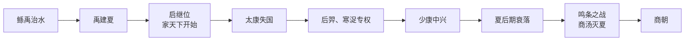

# 夏朝

> 导航：[夏](/%E4%BA%BA%E6%96%87%E7%A7%91%E5%AD%A6/%E5%8E%86%E5%8F%B2/%E4%B8%9C%E4%BA%9A/%E4%B8%AD%E5%9B%BD/%E5%A4%8F/README.md) / [夏世系](/%E4%BA%BA%E6%96%87%E7%A7%91%E5%AD%A6/%E5%8E%86%E5%8F%B2/%E4%B8%9C%E4%BA%9A/%E4%B8%AD%E5%9B%BD/%E5%A4%8F/%E4%B8%96%E7%B3%BB.md) / [九州](/%E4%BA%BA%E6%96%87%E7%A7%91%E5%AD%A6/%E5%8E%86%E5%8F%B2/%E4%B8%9C%E4%BA%9A/%E4%B8%AD%E5%9B%BD/%E5%A4%8F/%E4%B9%9D%E5%B7%9E.md) / [商](/%E4%BA%BA%E6%96%87%E7%A7%91%E5%AD%A6/%E5%8E%86%E5%8F%B2/%E4%B8%9C%E4%BA%9A/%E4%B8%AD%E5%9B%BD/%E5%95%86/README.md)

## 概括

夏朝（约前2070年—约前1600年）是中国传统史书中记载的第一个中原世袭制王朝，姒姓，夏后氏。传统说法认为夏共传十四代、十七王，最后为商汤所灭。

夏朝处在新石器时代晚期到青铜时代早期的过渡阶段。传世文献中关于夏的记载较多，但由于尚未发现可直接自证夏朝的同时期文字材料，夏的历史仍带有较强的传说与考古推定色彩。河南偃师二里头遗址常被认为与夏文化关系密切，但其与文献夏朝的对应仍需谨慎表述。

## 演进流程

## 目录结构

| 笔记 | 作用 |
|---|---|
| [夏代相关事件](/%E4%BA%BA%E6%96%87%E7%A7%91%E5%AD%A6/%E5%8E%86%E5%8F%B2/%E4%B8%9C%E4%BA%9A/%E4%B8%AD%E5%9B%BD/%E5%A4%8F/%E4%BA%8B%E4%BB%B6/README.md) | 集中导航治水、继位、失国复国与夏商更替事件。 |
| [夏世系](/%E4%BA%BA%E6%96%87%E7%A7%91%E5%AD%A6/%E5%8E%86%E5%8F%B2/%E4%B8%9C%E4%BA%9A/%E4%B8%AD%E5%9B%BD/%E5%A4%8F/%E4%B8%96%E7%B3%BB.md) | 整理先夏、夏王、无王时期和少康复国后的世系。 |
| [九州](/%E4%BA%BA%E6%96%87%E7%A7%91%E5%AD%A6/%E5%8E%86%E5%8F%B2/%E4%B8%9C%E4%BA%9A/%E4%B8%AD%E5%9B%BD/%E5%A4%8F/%E4%B9%9D%E5%B7%9E.md) | 整理《尚书·禹贡》九州及其象征意义。 |
| [鲧禹治水](/%E4%BA%BA%E6%96%87%E7%A7%91%E5%AD%A6/%E5%8E%86%E5%8F%B2/%E4%B8%9C%E4%BA%9A/%E4%B8%AD%E5%9B%BD/%E5%A4%8F/%E4%BA%8B%E4%BB%B6/%E9%B2%A7%E7%A6%B9%E6%B2%BB%E6%B0%B4.md) | 夏朝起源叙事中的治水与禹受命。 |
| [夏启继位 - 家天下开始](/%E4%BA%BA%E6%96%87%E7%A7%91%E5%AD%A6/%E5%8E%86%E5%8F%B2/%E4%B8%9C%E4%BA%9A/%E4%B8%AD%E5%9B%BD/%E5%A4%8F/%E4%BA%8B%E4%BB%B6/%E5%A4%8F%E5%90%AF%E7%BB%A7%E4%BD%8D%20-%20%E5%AE%B6%E5%A4%A9%E4%B8%8B%E5%BC%80%E5%A7%8B.md) | 从禅让到世袭的转折。 |
| [太康失国 - 少康中兴](/%E4%BA%BA%E6%96%87%E7%A7%91%E5%AD%A6/%E5%8E%86%E5%8F%B2/%E4%B8%9C%E4%BA%9A/%E4%B8%AD%E5%9B%BD/%E5%A4%8F/%E4%BA%8B%E4%BB%B6/%E5%A4%AA%E5%BA%B7%E5%A4%B1%E5%9B%BD%20-%20%E5%B0%91%E5%BA%B7%E4%B8%AD%E5%85%B4.md) | 夏早期王权中断与复兴。 |
| [商汤灭夏](/%E4%BA%BA%E6%96%87%E7%A7%91%E5%AD%A6/%E5%8E%86%E5%8F%B2/%E4%B8%9C%E4%BA%9A/%E4%B8%AD%E5%9B%BD/%E5%A4%8F/%E4%BA%8B%E4%BB%B6/%E5%95%86%E6%B1%A4%E7%81%AD%E5%A4%8F.md) | 夏商更替。 |

## 核心线索

- **从禅让到世袭**：禹传位给启，传统上被视为“家天下”的开始。
- **早期王权不稳**：太康失国、后羿和寒浞专权说明夏王权仍需面对方国和部族集团挑战。
- **少康中兴**：少康恢复夏后氏统治，是夏史叙事中的复国关键。
- **夏商更替**：夏桀时期统治失序，商汤联合方国伐夏，鸣条之战后商取代夏。
- **考古问题**：二里头文化常被纳入夏文化讨论，但“夏朝—二里头”的对应仍不是完全确证关系。

## 建立、维系与衰亡 / 转型机制

| 环节 | 主要条件与机制 | 史料边界 |
|---|---|---|
| 形成叙事 | 传世文献把禹治水、禅让转为世袭和启继位视为夏王朝形成过程，反映后世对早期王权与家族继承的解释。 | 文献成书较晚，不能把全部人物、年代和事件视为同时代记录。 |
| 考古背景 | 二里头文化显示中原在约前二千纪前期出现大型宫殿区、道路、青铜礼器和跨区域资源动员，可用于理解早期国家化。 | 二里头与文献“夏”的对应仍有讨论，笔记以“可能相关”处理。 |
| 维系机制 | 王权可能依靠聚落等级、礼仪中心、手工业控制和区域联盟整合伊洛及周边社会。 | 具体官制、疆域和世系多不能由考古材料直接确认。 |
| 结构性变化 | 二里头晚期中心格局、手工业和区域联系发生变化，二里冈文化及郑州商城体系随后快速扩张。 | “桀失德、商汤革命”属于传世政治叙事，不能替代社会与区域权力重组的解释。 |
| 转型结果 | 传统叙事以商汤灭夏结束夏代；考古层面更适合写成二里头—二里冈政治与文化中心的重组。 | 不把考古文化更替机械等同于单次军事灭国。 |

## 相关笔记

- [夏世系](/%E4%BA%BA%E6%96%87%E7%A7%91%E5%AD%A6/%E5%8E%86%E5%8F%B2/%E4%B8%9C%E4%BA%9A/%E4%B8%AD%E5%9B%BD/%E5%A4%8F/%E4%B8%96%E7%B3%BB.md)
- [九州](/%E4%BA%BA%E6%96%87%E7%A7%91%E5%AD%A6/%E5%8E%86%E5%8F%B2/%E4%B8%9C%E4%BA%9A/%E4%B8%AD%E5%9B%BD/%E5%A4%8F/%E4%B9%9D%E5%B7%9E.md)
- [鲧禹治水](/%E4%BA%BA%E6%96%87%E7%A7%91%E5%AD%A6/%E5%8E%86%E5%8F%B2/%E4%B8%9C%E4%BA%9A/%E4%B8%AD%E5%9B%BD/%E5%A4%8F/%E4%BA%8B%E4%BB%B6/%E9%B2%A7%E7%A6%B9%E6%B2%BB%E6%B0%B4.md)
- [夏启继位 - 家天下开始](/%E4%BA%BA%E6%96%87%E7%A7%91%E5%AD%A6/%E5%8E%86%E5%8F%B2/%E4%B8%9C%E4%BA%9A/%E4%B8%AD%E5%9B%BD/%E5%A4%8F/%E4%BA%8B%E4%BB%B6/%E5%A4%8F%E5%90%AF%E7%BB%A7%E4%BD%8D%20-%20%E5%AE%B6%E5%A4%A9%E4%B8%8B%E5%BC%80%E5%A7%8B.md)
- [太康失国 - 少康中兴](/%E4%BA%BA%E6%96%87%E7%A7%91%E5%AD%A6/%E5%8E%86%E5%8F%B2/%E4%B8%9C%E4%BA%9A/%E4%B8%AD%E5%9B%BD/%E5%A4%8F/%E4%BA%8B%E4%BB%B6/%E5%A4%AA%E5%BA%B7%E5%A4%B1%E5%9B%BD%20-%20%E5%B0%91%E5%BA%B7%E4%B8%AD%E5%85%B4.md)
- [商汤灭夏](/%E4%BA%BA%E6%96%87%E7%A7%91%E5%AD%A6/%E5%8E%86%E5%8F%B2/%E4%B8%9C%E4%BA%9A/%E4%B8%AD%E5%9B%BD/%E5%A4%8F/%E4%BA%8B%E4%BB%B6/%E5%95%86%E6%B1%A4%E7%81%AD%E5%A4%8F.md)
- [商朝](/%E4%BA%BA%E6%96%87%E7%A7%91%E5%AD%A6/%E5%8E%86%E5%8F%B2/%E4%B8%9C%E4%BA%9A/%E4%B8%AD%E5%9B%BD/%E5%95%86/README.md)
- [史前时期](/%E4%BA%BA%E6%96%87%E7%A7%91%E5%AD%A6/%E5%8E%86%E5%8F%B2/%E4%B8%9C%E4%BA%9A/%E4%B8%AD%E5%9B%BD/%E5%8F%B2%E5%89%8D%E6%97%B6%E6%9C%9F/README.md)

## 直接上级

- [中国](/%E4%BA%BA%E6%96%87%E7%A7%91%E5%AD%A6/%E5%8E%86%E5%8F%B2/%E4%B8%9C%E4%BA%9A/%E4%B8%AD%E5%9B%BD/README.md)
