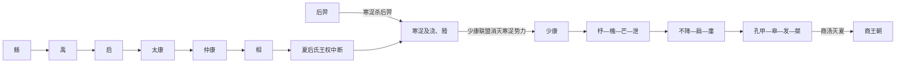

# 夏世系

> 导航：[夏](/%E4%BA%BA%E6%96%87%E7%A7%91%E5%AD%A6/%E5%8E%86%E5%8F%B2/%E4%B8%9C%E4%BA%9A/%E4%B8%AD%E5%9B%BD/%E5%A4%8F/README.md) / [夏世系](/%E4%BA%BA%E6%96%87%E7%A7%91%E5%AD%A6/%E5%8E%86%E5%8F%B2/%E4%B8%9C%E4%BA%9A/%E4%B8%AD%E5%9B%BD/%E5%A4%8F/%E4%B8%96%E7%B3%BB.md) / [九州](/%E4%BA%BA%E6%96%87%E7%A7%91%E5%AD%A6/%E5%8E%86%E5%8F%B2/%E4%B8%9C%E4%BA%9A/%E4%B8%AD%E5%9B%BD/%E5%A4%8F/%E4%B9%9D%E5%B7%9E.md) / [商](/%E4%BA%BA%E6%96%87%E7%A7%91%E5%AD%A6/%E5%8E%86%E5%8F%B2/%E4%B8%9C%E4%BA%9A/%E4%B8%AD%E5%9B%BD/%E5%95%86/README.md)

## 概括

夏世系主要来自后世传世文献，绝对年代存在不同说法。为避免把传说年代误作定论，本表以传统王次、亲属关系和关键事件为主；具体纪年只作参考，不作为确证年代。

表中“禹”出现两次，是同一人物按两个角色分列：“先夏”表示治水、受禅和早期首领叙事，“1”表示传统王表把他列为夏后氏第一位王；此分列不表示存在两个禹。

## 世系主线

## 证据边界

- 禹至桀的王次主要由《史记·夏本纪》《竹书纪年》及更早传世材料整理而来，不同文献对个别名称、年数和事件有差异。
- 夏代尚无被学界一致确认、能够自称夏王并连续记年的同期文字。二里头文化可为早期国家形成提供考古背景，但不能直接替表中各王确定墓葬、都城和在位年。
- 后羿、寒浞时期在表中标为“无王”，是为了显示传统夏王统中断及实际权力转移；这不是说当时不存在其他地方统治者。
- 传统共列禹以后十六王、连禹为十七王。本表完整列出这一通行顺序，同时明确其属于传统世系而非已获同期纪年逐项证明的名单。

## 世系表

| 顺序 | 姓名 | 父 | 庙号 / 谥号 | 年号 | 在位时间 | 生卒时间 | 与前任关系 | 关键事件 / 备注 / 说明 |
|---:|---|---|---|---|---|---|---|---|
| 先夏 | 鲧 | 不详 | 不详 | 无 | 未正式为夏王 | 不详 | 禹父 | 受命治水，采用堵塞方式未成。 |
| 先夏 | 禹 | 鲧 | 不详 | 无 | 传统先夏首领；后为夏王 | 不详 | 鲧子 | 治水成功，受舜禅让；以夏为号。 |
| 1 | 禹 | 鲧 | 不详 | 无 | 传统在位年代不一 | 不详 | 开国君主 | 大禹治水，讨伐三苗，建立夏后氏统治。 |
| 2 | 启 | 禹 | 不详 | 无 | 传统在位年代不一 | 不详 | 禹子 | 取代伯益继位，世袭王位开始。 |
| 3 | 太康 | 启 | 不详 | 无 | 传统在位年代不一 | 不详 | 启子 | 失国，被后羿控制。 |
| 4 | 仲康 | 启 | 不详 | 无 | 传统在位年代不一 | 不详 | 太康弟 | 后羿摄政时期的夏王。 |
| 5 | 相 | 仲康 | 不详 | 无 | 传统在位年代不一 | 不详 | 仲康子 | 后羿废相，夏王权中断。 |
| 无王 | 后羿 | 不详 | 不详 | 无 | 夏王权中断时期 | 不详 | 有穷氏首领 | 夺取夏政权，后被寒浞杀。 |
| 无王 | 寒浞 | 不详 | 不详 | 无 | 夏王权中断时期 | 不详 | 后羿臣属 | 杀后羿夺权，长期控制夏地。 |
| 6 | 少康 | 相 | 不详 | 无 | 传统在位年代不一 | 不详 | 相子 | 少康中兴，恢复夏后氏统治。 |
| 7 | 杼 | 少康 | 不详 | 无 | 传统在位年代不一 | 不详 | 少康子 | 传说继续讨伐寒浞余部和东夷。 |
| 8 | 槐 | 杼 | 不详 | 无 | 传统在位年代不一 | 不详 | 杼子 | 夏后氏统治相对稳定。 |
| 9 | 芒 | 槐 | 不详 | 无 | 传统在位年代不一 | 不详 | 槐子 | 商族上甲微灭有易氏的传说常置于此期。 |
| 10 | 泄 | 芒 | 不详 | 无 | 传统在位年代不一 | 不详 | 芒子 | 夏后期王。 |
| 11 | 不降 | 泄 | 不详 | 无 | 传统在位年代不一 | 不详 | 泄子 | 年老时传位于弟扃。 |
| 12 | 扃 | 泄 | 不详 | 无 | 传统在位年代不一 | 不详 | 不降弟 | 继不降为王。 |
| 13 | 廑 | 扃 | 不详 | 无 | 传统在位年代不一 | 不详 | 扃子 | 在位较短。 |
| 14 | 孔甲 | 不降 | 不详 | 无 | 传统在位年代不一 | 不详 | 不降子 | 文献中常被视为夏衰落的转折。 |
| 15 | 皋 | 孔甲 | 不详 | 无 | 传统在位年代不一 | 不详 | 孔甲子 | 夏后期王。 |
| 16 | 发 | 皋 | 不详 | 无 | 传统在位年代不一 | 不详 | 皋子 | 夏后期王。 |
| 17 | 桀（履癸） | 发 | 不详 | 无 | 传统在位年代不一 | 不详 | 发子 | 夏末王；败于鸣条之战，夏亡。 |

## 演变关系

- 前一阶段：[史前时期](/%E4%BA%BA%E6%96%87%E7%A7%91%E5%AD%A6/%E5%8E%86%E5%8F%B2/%E4%B8%9C%E4%BA%9A/%E4%B8%AD%E5%9B%BD/%E5%8F%B2%E5%89%8D%E6%97%B6%E6%9C%9F/README.md)。
- 核心事件：[鲧禹治水](/%E4%BA%BA%E6%96%87%E7%A7%91%E5%AD%A6/%E5%8E%86%E5%8F%B2/%E4%B8%9C%E4%BA%9A/%E4%B8%AD%E5%9B%BD/%E5%A4%8F/%E4%BA%8B%E4%BB%B6/%E9%B2%A7%E7%A6%B9%E6%B2%BB%E6%B0%B4.md)、[夏启继位 - 家天下开始](/%E4%BA%BA%E6%96%87%E7%A7%91%E5%AD%A6/%E5%8E%86%E5%8F%B2/%E4%B8%9C%E4%BA%9A/%E4%B8%AD%E5%9B%BD/%E5%A4%8F/%E4%BA%8B%E4%BB%B6/%E5%A4%8F%E5%90%AF%E7%BB%A7%E4%BD%8D%20-%20%E5%AE%B6%E5%A4%A9%E4%B8%8B%E5%BC%80%E5%A7%8B.md)、[太康失国 - 少康中兴](/%E4%BA%BA%E6%96%87%E7%A7%91%E5%AD%A6/%E5%8E%86%E5%8F%B2/%E4%B8%9C%E4%BA%9A/%E4%B8%AD%E5%9B%BD/%E5%A4%8F/%E4%BA%8B%E4%BB%B6/%E5%A4%AA%E5%BA%B7%E5%A4%B1%E5%9B%BD%20-%20%E5%B0%91%E5%BA%B7%E4%B8%AD%E5%85%B4.md)。
- 后一阶段：[商朝](/%E4%BA%BA%E6%96%87%E7%A7%91%E5%AD%A6/%E5%8E%86%E5%8F%B2/%E4%B8%9C%E4%BA%9A/%E4%B8%AD%E5%9B%BD/%E5%95%86/README.md)。
