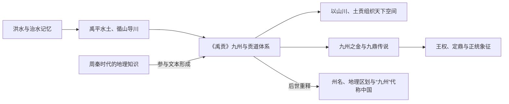

# 九州

> 导航：[夏](/%E4%BA%BA%E6%96%87%E7%A7%91%E5%AD%A6/%E5%8E%86%E5%8F%B2/%E4%B8%9C%E4%BA%9A/%E4%B8%AD%E5%9B%BD/%E5%A4%8F/README.md) / [夏世系](/%E4%BA%BA%E6%96%87%E7%A7%91%E5%AD%A6/%E5%8E%86%E5%8F%B2/%E4%B8%9C%E4%BA%9A/%E4%B8%AD%E5%9B%BD/%E5%A4%8F/%E4%B8%96%E7%B3%BB.md) / [九州](/%E4%BA%BA%E6%96%87%E7%A7%91%E5%AD%A6/%E5%8E%86%E5%8F%B2/%E4%B8%9C%E4%BA%9A/%E4%B8%AD%E5%9B%BD/%E5%A4%8F/%E4%B9%9D%E5%B7%9E.md) / [商](/%E4%BA%BA%E6%96%87%E7%A7%91%E5%AD%A6/%E5%8E%86%E5%8F%B2/%E4%B8%9C%E4%BA%9A/%E4%B8%AD%E5%9B%BD/%E5%95%86/README.md)

## 概括

九州是《尚书·禹贡》中关于大禹治水后划分天下的地理叙事，通常包括冀、兖、青、徐、扬、荆、豫、梁、雍九州。九州不一定等同于夏朝实际行政区划，更适合作为早期天下观、贡赋交通和政治象征来理解。

《禹贡》现存文本体现周秦时代对山川、土壤、物产和贡道的系统认识，所述范围远大于考古所能确认的夏王权直接控制区。因此，“禹分九州”应先理解为后世把多区域空间纳入统一秩序的经典叙事，不能据此绘制一张夏朝九省行政图。

## 观念形成与后世演变

## 图示

## 九州表

| 九州 | 《禹贡》线索 | 大致范围 |
|---|---|---|
| 冀州 | 夹右碣石入于河，三面距河 | 今山西、河北及辽宁西部一带 |
| 兖州 | 浮于济、漯，达于河 | 今山东西部、河北东南角 |
| 青州 | 浮于汶，达于济 | 今泰山以东的山东半岛 |
| 徐州 | 浮于淮、泗，达于河 | 今淮河以北的江苏、安徽及山东南部 |
| 扬州 | 沿于江、海，达于淮、泗 | 今淮河以南的江苏、安徽、浙江、江西一带 |
| 荆州 | 浮于江、沱、潜、汉，逾于洛，至于南河 | 今湖北、湖南及江西西北端一带 |
| 豫州 | 浮于洛，达于河 | 今河南、湖北北部、陕西东南、山东西南角 |
| 梁州 | 浮于潜，逾于沔，入于渭，乱于河 | 今四川及陕西、甘肃南端 |
| 雍州 | 浮于积石，至于龙门西河，会于渭、汭 | 今陕西、甘肃、宁夏、青海东北部 |

## 象征意义

- **天下秩序**：九州表达的是以中原为中心组织天下的地理想象。
- **贡赋交通**：《禹贡》叙述常把山川、贡道、水路联系在一起。
- **九鼎象征**：传说禹收九州之金铸九鼎，九鼎成为国家权力和王朝正统的象征。
- **“定鼎”含义**：后来“定鼎”常引申为建立政权或确定都城。

## 相关笔记

- [夏朝](/%E4%BA%BA%E6%96%87%E7%A7%91%E5%AD%A6/%E5%8E%86%E5%8F%B2/%E4%B8%9C%E4%BA%9A/%E4%B8%AD%E5%9B%BD/%E5%A4%8F/README.md)
- [鲧禹治水](/%E4%BA%BA%E6%96%87%E7%A7%91%E5%AD%A6/%E5%8E%86%E5%8F%B2/%E4%B8%9C%E4%BA%9A/%E4%B8%AD%E5%9B%BD/%E5%A4%8F/%E4%BA%8B%E4%BB%B6/%E9%B2%A7%E7%A6%B9%E6%B2%BB%E6%B0%B4.md)
