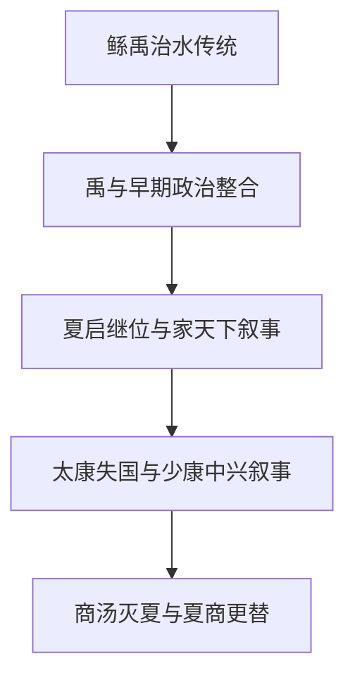

# 夏代相关事件

## 概括

本目录整理传统文献和后世叙事中的夏代关键事件。夏代早期历史的文献形成较晚，考古文化与传世王朝叙事不能简单一一对应；笔记应区分传说、传统记载与可考材料。

## 演进图

## 事件导航

| 顺序 | 事件 | 概括 |
|---:|---|---|
| 1 | [鲧禹治水](/%E4%BA%BA%E6%96%87%E7%A7%91%E5%AD%A6/%E5%8E%86%E5%8F%B2/%E4%B8%9C%E4%BA%9A/%E4%B8%AD%E5%9B%BD/%E5%A4%8F/%E4%BA%8B%E4%BB%B6/%E9%B2%A7%E7%A6%B9%E6%B2%BB%E6%B0%B4.md) | 传统洪水治理、禹的政治声望与早期国家形成叙事。 |
| 2 | [夏启继位—家天下开始](/%E4%BA%BA%E6%96%87%E7%A7%91%E5%AD%A6/%E5%8E%86%E5%8F%B2/%E4%B8%9C%E4%BA%9A/%E4%B8%AD%E5%9B%BD/%E5%A4%8F/%E4%BA%8B%E4%BB%B6/%E5%A4%8F%E5%90%AF%E7%BB%A7%E4%BD%8D%20-%20%E5%AE%B6%E5%A4%A9%E4%B8%8B%E5%BC%80%E5%A7%8B.md) | 从禅让叙事转向世袭王权的传统解释。 |
| 3 | [太康失国—少康中兴](/%E4%BA%BA%E6%96%87%E7%A7%91%E5%AD%A6/%E5%8E%86%E5%8F%B2/%E4%B8%9C%E4%BA%9A/%E4%B8%AD%E5%9B%BD/%E5%A4%8F/%E4%BA%8B%E4%BB%B6/%E5%A4%AA%E5%BA%B7%E5%A4%B1%E5%9B%BD%20-%20%E5%B0%91%E5%BA%B7%E4%B8%AD%E5%85%B4.md) | 夏代内部失国、流亡与恢复统治的传统叙事。 |
| 4 | [商汤灭夏](/%E4%BA%BA%E6%96%87%E7%A7%91%E5%AD%A6/%E5%8E%86%E5%8F%B2/%E4%B8%9C%E4%BA%9A/%E4%B8%AD%E5%9B%BD/%E5%A4%8F/%E4%BA%8B%E4%BB%B6/%E5%95%86%E6%B1%A4%E7%81%AD%E5%A4%8F.md) | 夏商更替与汤武革命观念的早期范例。 |

## 相关笔记

- [夏](/%E4%BA%BA%E6%96%87%E7%A7%91%E5%AD%A6/%E5%8E%86%E5%8F%B2/%E4%B8%9C%E4%BA%9A/%E4%B8%AD%E5%9B%BD/%E5%A4%8F/README.md)
- [商代相关事件](/%E4%BA%BA%E6%96%87%E7%A7%91%E5%AD%A6/%E5%8E%86%E5%8F%B2/%E4%B8%9C%E4%BA%9A/%E4%B8%AD%E5%9B%BD/%E5%95%86/%E4%BA%8B%E4%BB%B6/README.md)
