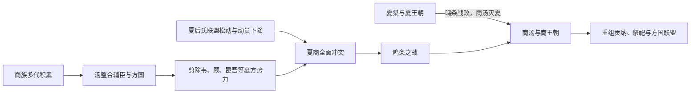

# 商汤灭夏

> 导航：[夏](/%E4%BA%BA%E6%96%87%E7%A7%91%E5%AD%A6/%E5%8E%86%E5%8F%B2/%E4%B8%9C%E4%BA%9A/%E4%B8%AD%E5%9B%BD/%E5%A4%8F/README.md) / [夏世系](/%E4%BA%BA%E6%96%87%E7%A7%91%E5%AD%A6/%E5%8E%86%E5%8F%B2/%E4%B8%9C%E4%BA%9A/%E4%B8%AD%E5%9B%BD/%E5%A4%8F/%E4%B8%96%E7%B3%BB.md) / [商](/%E4%BA%BA%E6%96%87%E7%A7%91%E5%AD%A6/%E5%8E%86%E5%8F%B2/%E4%B8%9C%E4%BA%9A/%E4%B8%AD%E5%9B%BD/%E5%95%86/README.md)

## 时间

传统约在公元前第二千纪前期末段，常约称公元前1600年前后；夏商分界的绝对年代、鸣条地点与各次战争次序均有争议。

## 概括

商汤灭夏在传世史书中是第一次完整的王朝更替叙事。它不是“桀失德、汤一战取胜”所能解释：商族经过多代经营形成区域实力，汤通过征服邻近方国、吸纳盟友和构造讨伐合法性逐步孤立夏；夏后氏则面临联盟松动、资源动员下降和连续用兵。鸣条战败是直接终点，随后桀失去核心地区，汤建立新的共主秩序。

## 建立背景：商的长期崛起

- 先商世系把契、相土、王亥、上甲微等祖先与迁徙、畜牧、交换和对外战争联系起来，反映商族兴起被记忆为多代积累，而非汤个人突然扩张。
- 商所在的东方与中原交通网络能够连接农产品、牲畜、手工业品和军事资源。到汤时，商已具备号召附属方国和连续作战的能力。
- 伊尹、仲虺等辅臣在文献中承担谋划、动员和发布政治宣言的角色；人物细节多经后世塑造，但说明商的胜利需要行政与联盟组织。
- 夏末的“桀暴虐”主要来自胜利者及周代以后的道德叙事。它能反映后世对失国原因的理解，却不能代替对实际权力结构的分析。

## 过程与重要事件

| 阶段 | 事件 | 作用 |
|---|---|---|
| 商势扩张 | 汤整合商族内部，吸纳伊尹、仲虺等辅佐者，并与周边方国建立关系。 | 形成稳定的指挥与物资网络。 |
| 试探与声望竞争 | 葛伯故事把汤写成救助耕作者、惩罚不义者；其历史细节难证。 | 为商的扩张赋予“救民”而非掠夺的解释。 |
| 剪除夏羽翼 | 传世文献称汤先后打击韦、顾、昆吾等与夏关系密切的势力。具体顺序有异。 | 破坏夏的东方屏障并扩大商的盟友圈。 |
| 与夏决裂 | “汤囚夏台”传说称桀曾拘押汤，汤获释后继续准备；是否实有其事无法确证。 | 在叙事上表明君臣或方国关系彻底破裂。 |
| 发布誓辞 | 《汤誓》以“有夏多罪”“天命殛之”动员军队，并回应民众对劳役的疑虑。 | 把征服解释为执行天命和解除暴政。 |
| 鸣条决战 | 商与盟军在鸣条击败夏军。战场通常推测在今豫西、晋南一带，不同说法并存。 | 夏失去主力与核心区，是王朝灭亡的直接触发。 |
| 追击与接管 | 桀出逃，传统或称死于南巢；汤安抚归附方国，在亳一带建立统治中心。 | 军事胜利转化为贡纳、祭祀和政治秩序。 |

## 夏衰亡的多层原因

### 结构因素

- 夏王权更像依靠亲族和方国承认的联盟共主，控制范围与征发能力可能并不均一；外围强族壮大后，共主很难仅凭名位维持服从。
- 早期国家的交通、粮食、青铜生产和军事资源集中在若干区域中心，一旦商控制关键网络，夏便难以恢复优势。
- 继承与地方关系长期存在脆弱性，从太康失国传统到夏末方国离心，后世记忆持续强调这一点。

### 外部压力

- 商的崛起不是普通边患，而是另一个能组织祭祀、军队和方国联盟的区域中心对旧共主发起替代。
- 汤通过分阶段战争消灭或争取夏的盟友，使夏在决战前已遭战略孤立。

### 统治失误与叙事

- 文献中的桀被描述为重役、嗜乐、任用佞臣和压迫诸侯。这些故事有“亡国之君”模式化色彩，但可能折射征发过重与联盟矛盾。
- 将灭亡完全归因于君主私德会遮蔽资源、军事和方国政治；反之，也不能忽视统治选择会加速既有危机。

### 直接触发

鸣条战败使夏军主力、交通节点和盟友信心同时崩溃。桀逃亡后没有出现能够重新集结夏后氏力量的继承中心，王朝因而结束。

## 考古与文献的边界

- 二里头文化晚期出现中心衰退，随后二里岗文化及郑州商城、偃师商城所代表的网络迅速扩展，常被用来讨论夏商转换。
- 这种物质文化变化可以证明约公元前第二千纪中叶前后发生了区域权力重组，却没有同期铭文写出“夏”“桀”“汤”或“鸣条之战”来确认传世细节。
- 安阳晚商甲骨文能够证明商王室及其祖先祭祀传统，但距汤时代仍有数百年；它不能单独解决夏的历史性和商初年表。
- 因而最稳妥的写法，是把传世王朝叙事与考古所见的都邑、生产和交流网络变化并列比较，而不强行一一对应。

## 结果与长期影响

- 汤取得天下共主地位，商王室通过祭祀祖先、控制青铜礼器生产和维系方国关系延续统治。
- “有德者兴、失德者亡”的解释为后来的周人提供先例，周灭商时进一步发展为天命可以转移的理论。
- 后世把汤伐桀与武王伐纣并称“汤武革命”，使武力推翻失德君主获得经典依据。
- 商初仍需处理继承与辅政问题，伊尹放太甲的故事显示新王朝的制度并未因一次胜利立即稳固。

## 演变关系

- 前一节点：夏后期王权和方国联盟衰弱。
- 后一节点：[商朝](/%E4%BA%BA%E6%96%87%E7%A7%91%E5%AD%A6/%E5%8E%86%E5%8F%B2/%E4%B8%9C%E4%BA%9A/%E4%B8%AD%E5%9B%BD/%E5%95%86/README.md)。
- 相关事件：[鸣条之战，汤武革命](/%E4%BA%BA%E6%96%87%E7%A7%91%E5%AD%A6/%E5%8E%86%E5%8F%B2/%E4%B8%9C%E4%BA%9A/%E4%B8%AD%E5%9B%BD/%E5%95%86/%E4%BA%8B%E4%BB%B6/%E9%B8%A3%E6%9D%A1%E4%B9%8B%E6%88%98%EF%BC%8C%E6%B1%A4%E6%AD%A6%E9%9D%A9%E5%91%BD.md)。
