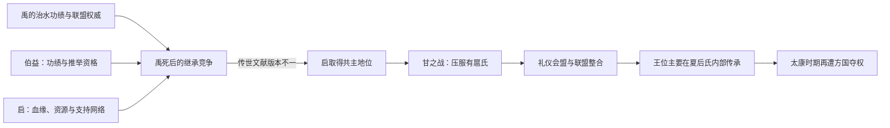

# 夏启继位 - 家天下开始

> 导航：[夏](/%E4%BA%BA%E6%96%87%E7%A7%91%E5%AD%A6/%E5%8E%86%E5%8F%B2/%E4%B8%9C%E4%BA%9A/%E4%B8%AD%E5%9B%BD/%E5%A4%8F/README.md) / [夏世系](/%E4%BA%BA%E6%96%87%E7%A7%91%E5%AD%A6/%E5%8E%86%E5%8F%B2/%E4%B8%9C%E4%BA%9A/%E4%B8%AD%E5%9B%BD/%E5%A4%8F/%E4%B8%96%E7%B3%BB.md) / [商](/%E4%BA%BA%E6%96%87%E7%A7%91%E5%AD%A6/%E5%8E%86%E5%8F%B2/%E4%B8%9C%E4%BA%9A/%E4%B8%AD%E5%9B%BD/%E5%95%86/README.md)

## 时间

传统夏初，绝对年代不详；事件主要见于周秦至汉代传世文献，无法据现有考古材料精确纪年。

## 概括

夏启继位常被概括为“公天下”转向“家天下”。这不是一次有完整同期记录的制度颁布，而是后世用来解释首领权力如何由联盟推举、功绩竞争逐渐转向父系王族世袭的起源叙事。禹死后，伯益与启的继承资格、诸侯归附和军事竞争构成事件核心；启最终控制联盟，王位从此主要在夏后氏家族内部传递。

## 背景：继承规则尚未定型

- 禅让叙事强调尧、舜、禹凭德行和功绩取得共主地位，但候选人通常也掌握部族、亲属和政治网络，不能理解为现代意义的公开选举。
- 禹长期治水形成个人威望，其子启则可能继承夏后氏的资源、武装与支持者。伯益在传说中协助治水并受禹推荐，也具有功绩和资历。
- 不同文献对禹是否真心传益、启是否杀益、益是否曾实际即位有明显分歧，反映后世对“禅让”与“世袭”合法性的不同解释。

## 主要过程

| 阶段 | 参与者 | 过程与争议 |
|---|---|---|
| 安排继承 | 禹、皋陶、伯益、启 | 传统说禹先拟传皋陶，皋陶早亡后推举伯益；也有解释认为禹推益只是保留禅让名义，同时为启积累权力。 |
| 禹死后的竞争 | 伯益、启、诸侯与部族首领 | 《史记》系统称益避让，诸侯转而归启；另一些传说称益曾即位，后来被启攻杀。哪一版本更接近早期记忆无法确定。 |
| 启取得共主地位 | 启及其支持者 | 启依靠血缘继承、父辈威望和现实武力赢得联盟主导权，继承不再只由前任推举来说明。 |
| 有扈氏反对 | 启、有扈氏 | 《尚书·甘誓》把有扈氏写成违抗天命和政令者，启在甘地誓师并战胜对方；战役年代、地点及与继承争议的直接关系均不确定。 |
| 联盟整合 | 启、各方首领 | 后世有钧台会盟、宴享诸侯等叙事，象征启以礼仪与军事共同确认新秩序。 |
| 家族世袭延续 | 太康等夏后氏成员 | 启死后由子辈继承，父子、兄弟之间的王位传递成为常态，但早期王权仍会受到强大方国挑战。 |

## 关键转折

1. **资格来源改变**：伯益代表“前任推举与个人功绩”，启则把父子血缘、既有资源与诸侯支持合并为更强的继承主张。
2. **军事胜利确认权力**：无论甘之战是否直接由继承争议触发，传统都用它说明启必须压服不承认新秩序的方国。
3. **礼仪使武力制度化**：会盟、宴享和誓辞把一次胜利解释为天命与共同秩序，而非单纯家族夺权。
4. **世袭并非立即稳固**：启之后不久即出现太康失国，说明早期王权仍依赖方国联盟，家族继承原则不等于中央权力已经成熟。

## 形成“家天下”的机制

- **结构因素**：农业剩余、礼仪资源和武装逐渐集中于首领家族，使职位能够与家产、宗族和祭祀权一并传承。
- **政治因素**：禹的声望可被启转化为家族资本；诸侯可能更愿支持熟悉且掌握现实资源的继承人。
- **军事因素**：对反对者的战争使世袭原则获得强制保障。
- **叙事因素**：后世儒家、法家和史家分别把事件解释为道德退化、制度演进或权力竞争，因此细节不能完全互证。

## 结果与长期影响

- 启成为传统夏王表的第二位王，夏后氏王位此后以父子、兄弟继承为主。
- “大道之行也，天下为公”与“大道既隐，天下为家”的对照，使启继位成为政治思想中讨论公权、私属和王朝国家起源的标志。
- 事件说明世袭国家并非由一条规则突然诞生，而是在功绩威望、宗族资源、军事压服和礼仪合法化的长期互动中形成。
- 其后的太康失国表明，新秩序仍很脆弱，强大方国首领可以控制或替代夏王。

## 演变关系

- 前一节点：[鲧禹治水](/%E4%BA%BA%E6%96%87%E7%A7%91%E5%AD%A6/%E5%8E%86%E5%8F%B2/%E4%B8%9C%E4%BA%9A/%E4%B8%AD%E5%9B%BD/%E5%A4%8F/%E4%BA%8B%E4%BB%B6/%E9%B2%A7%E7%A6%B9%E6%B2%BB%E6%B0%B4.md)。
- 后一节点：[太康失国 - 少康中兴](/%E4%BA%BA%E6%96%87%E7%A7%91%E5%AD%A6/%E5%8E%86%E5%8F%B2/%E4%B8%9C%E4%BA%9A/%E4%B8%AD%E5%9B%BD/%E5%A4%8F/%E4%BA%8B%E4%BB%B6/%E5%A4%AA%E5%BA%B7%E5%A4%B1%E5%9B%BD%20-%20%E5%B0%91%E5%BA%B7%E4%B8%AD%E5%85%B4.md)。
