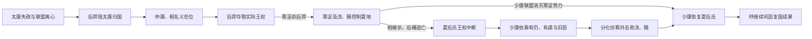

# 太康失国 - 少康中兴

> 导航：[夏](/%E4%BA%BA%E6%96%87%E7%A7%91%E5%AD%A6/%E5%8E%86%E5%8F%B2/%E4%B8%9C%E4%BA%9A/%E4%B8%AD%E5%9B%BD/%E5%A4%8F/README.md) / [夏世系](/%E4%BA%BA%E6%96%87%E7%A7%91%E5%AD%A6/%E5%8E%86%E5%8F%B2/%E4%B8%9C%E4%BA%9A/%E4%B8%AD%E5%9B%BD/%E5%A4%8F/%E4%B8%96%E7%B3%BB.md) / [商](/%E4%BA%BA%E6%96%87%E7%A7%91%E5%AD%A6/%E5%8E%86%E5%8F%B2/%E4%B8%9C%E4%BA%9A/%E4%B8%AD%E5%9B%BD/%E5%95%86/README.md)

## 时间

传统夏初至夏中期，绝对年代不详。故事由《左传》《楚辞》《史记》《竹书纪年》等不同时代材料拼合而成，人物次序较稳定，具体年数和细节存在异说。

## 概括

太康失国到少康中兴，是夏后氏王权被有穷氏后羿、寒浞集团连续控制，最终由少康联盟恢复的复国叙事。它揭示的并非一个中央集权王朝短暂“政变”，而是早期共主依赖方国、亲族和军事联盟：夏王一旦失去核心支持，强族首领便可阻断继承；少康也必须靠血缘合法性、旧臣网络、婚姻与封地重新组织力量。

## 传统叙事的阶段

| 阶段 | 主要人物与集团 | 具体过程 |
|---|---|---|
| 太康失国 | 太康、有穷氏后羿 | 太康被写成沉湎游猎、远离政务；后羿据守河洛、阻止其返回。传统以君主失德解释联盟离心。 |
| 名义王权受制 | 仲康、相、后羿 | 仲康和相仍列夏王世系，但后羿掌握实际军事权力。后羿最终废黜或驱逐相，夏后氏统治中断。 |
| 寒浞夺权 | 后羿、寒浞 | 后羿重用寒浞而疏远旧臣；寒浞联合亲信杀后羿，接收其势力，并以儿子浇、豷控制要地。 |
| 夏后氏遭清剿 | 相、后缗、寒浞集团 | 寒浞方面攻破支持相的斟灌、斟寻等势力，相被杀。相妻后缗据说从墙洞逃回有仍氏，遗腹子少康因此存活。 |
| 少康积累资源 | 少康、有仍氏、有虞氏 | 少康先在有仍氏成长，后避追捕投奔有虞氏；有虞氏给予土地、民众和婚姻支持，使其获得稳定根据地。 |
| 联络旧臣与反攻 | 少康、伯靡、女艾、季杼等 | 少康与夏后氏旧臣、仍忠于夏的方国协调行动；传统说女艾侦察浇，季杼对付豷，伯靡组织残余力量。 |
| 恢复夏后氏 | 少康联盟、寒浞集团 | 浇、豷及寒浞势力先后被击败，少康重建夏后氏共主地位；其子杼继续清除余部、巩固东方关系。 |

## 转折点

1. **后羿阻归**：太康失去进入核心区域和召集诸侯的能力，显示共主权威仍依赖实际控制。
2. **寒浞杀后羿**：夺权集团内部再次更替，说明后羿并未建立稳定继承秩序。
3. **后缗保存血脉**：少康的出生让夏后氏仍有可被旧臣识别的合法继承人，这是复国叙事的血缘枢纽。
4. **有虞氏授予根据地**：少康从流亡者变为拥有土地、人口和婚姻联盟的政治首领，复国才具备现实条件。
5. **联盟分工反攻**：传统把侦察、策反、军事进攻与旧臣响应结合，强调复国不是少康个人决斗，而是联盟重组。

## 失国与复国的原因

### 夏后氏失国

- **结构因素**：早期王权对方国军事力量和交通节点控制有限，尚不能稳定约束强族首领。
- **统治因素**：太康失政是后世道德化解释；即使不把游猎故事完全当作事实，王室动员能力下降和支持网络破裂仍是核心。
- **外部压力**：有穷氏擅长弓射并掌握武装，能够利用夏室继承脆弱期夺取河洛。
- **直接触发**：后羿阻止太康回国，随后控制仲康、相并最终中断夏后氏王权。

### 少康复国

- **合法性资源**：少康作为相之子的身份，使分散旧臣有共同拥立对象。
- **生存与根据地**：有仍氏保护其成长，有虞氏提供田邑、民众和婚姻关系。
- **联盟策略**：旧臣伯靡以及多个方国共同响应，削弱寒浞集团的孤立据点。
- **对手内耗**：后羿与寒浞之间的暴力更替破坏了夺权政权的稳定性与忠诚网络。

## 结果与长期影响

- 少康被传统王表列为夏第六王，夏后氏恢复后延续至桀。
- “少康中兴”成为后世称颂流亡宗室恢复旧统的典型，常用来说明血缘正统、忠臣和地方联盟的结合。
- 故事保留了早期政治的多中心特征：王、方国、母族、婚姻盟友和军事首领之间并非简单君臣关系。
- 由于缺乏同期文字，完整人物行动与战役不能由考古直接验证；应把它作为有历史记忆可能性的传世政治叙事，而非精确可复原的纪年。

## 演变关系

- 前一节点：[夏启继位 - 家天下开始](/%E4%BA%BA%E6%96%87%E7%A7%91%E5%AD%A6/%E5%8E%86%E5%8F%B2/%E4%B8%9C%E4%BA%9A/%E4%B8%AD%E5%9B%BD/%E5%A4%8F/%E4%BA%8B%E4%BB%B6/%E5%A4%8F%E5%90%AF%E7%BB%A7%E4%BD%8D%20-%20%E5%AE%B6%E5%A4%A9%E4%B8%8B%E5%BC%80%E5%A7%8B.md)。
- 后一节点：少康及杼巩固夏后氏，王统进入中后期。
