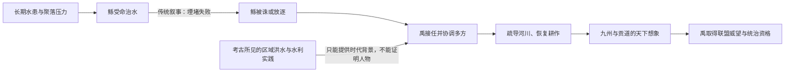

# 鲧禹治水

> 导航：[夏](/%E4%BA%BA%E6%96%87%E7%A7%91%E5%AD%A6/%E5%8E%86%E5%8F%B2/%E4%B8%9C%E4%BA%9A/%E4%B8%AD%E5%9B%BD/%E5%A4%8F/README.md) / [夏世系](/%E4%BA%BA%E6%96%87%E7%A7%91%E5%AD%A6/%E5%8E%86%E5%8F%B2/%E4%B8%9C%E4%BA%9A/%E4%B8%AD%E5%9B%BD/%E5%A4%8F/%E4%B8%96%E7%B3%BB.md) / [商](/%E4%BA%BA%E6%96%87%E7%A7%91%E5%AD%A6/%E5%8E%86%E5%8F%B2/%E4%B8%9C%E4%BA%9A/%E4%B8%AD%E5%9B%BD/%E5%95%86/README.md)

## 时间

传说时代；若与龙山晚期至二里头时期的社会转型比较，大致相当于公元前第三千纪末至前第二千纪初，但人物、事迹和绝对年代均无法由考古材料直接确认。

## 概括

鲧禹治水是夏后氏起源叙事的核心：鲧治水失败，禹继承任务，通过疏导河川、整合人力与划定山川贡道而成功，继而取得跨部族威望和统治资格。这一故事不能直接当作一次洪灾的现场记录；它更可能保存了黄河流域长期水患、聚落迁移、水利协作和早期政治整合的集体记忆，又经西周至战国文献不断重述，成为“以公共功绩取得天下”的政治典范。

## 传统叙事的过程

| 阶段 | 主要参与者 | 传统叙事 | 政治含义 |
|---|---|---|---|
| 洪水危机 | 尧、各部族首领 | 洪水长期泛滥，破坏聚落与耕地，各方需要共同应对。 | 跨地域灾害为扩大联盟协调权提供理由。 |
| 鲧受命 | 鲧、尧或舜 | 鲧以堙堵、筑障等方式治水，历时多年而未成功，最后被处死或放逐。 | 失败被解释为技术路线与德行均不合格。 |
| 禹接任 | 禹、舜、伯益、后稷等 | 禹察看山川，疏通河道，协调农业与迁徙；“三过家门而不入”等细节强调勤勉。 | 治水不只是工程，也是组织劳役、粮食和部族合作的过程。 |
| 九州与贡道 | 禹、各地首领 | 山川被整理为九州、五服和贡赋水路，洪水归道，土地可耕。 | 把自然空间转换为可叙述、可往来、可进贡的天下秩序。 |
| 获得统治权 | 禹、舜、诸侯 | 禹因功受舜禅让，成为天下共主，并被后世视为夏的建立者。 | 公共功绩、天意和诸侯归附共同构成王权合法性。 |

## 证据层次与争议

- **传世文献层**：《尚书》《诗经》《国语》《孟子》《史记》等保存了不同版本，但现存篇章的成书、编定或传抄年代普遍晚于故事所述时代。各书对鲧的死因、禹的受命方式、治水技术和继承次序并不完全一致。
- **早期文字层**：西周晚期青铜器铭文和先秦文献已经出现禹平水土、划定山川的观念，说明这一记忆在周代已经具有重要政治与礼仪地位；它仍不能反推每个细节都发生于夏初。
- **考古背景层**：龙山晚期至二里头时期确有聚落重组、城址兴衰、河道变迁和区域中心形成。各地也有不同规模的堤坝、沟渠和水利工程，但这些材料反映多区域、长时段实践，不能简单归于一位治水英雄。
- **洪水假说**：积石峡约公元前1920年前后的溃决洪水曾被提出为传说的可能背景；其年代、影响范围以及与禹、夏之间的联系仍有争论。一次上游洪水并不能单独证明持续数代的“大洪水”、禹本人或夏王朝。
- **二里头问题**：二里头的都邑、道路、宫殿区和青铜礼器显示早期国家复杂化，但“二里头文化等同夏文化”仍是解释之一，而非已有自名文字确认的定论。

## 转折点与结果

1. 鲧的失败把灾害应对从单纯工程问题转化为统治者是否有能力、是否合乎秩序的道德判断。
2. 禹的成功被叙述为技术、勤劳和联盟组织三者结合，使他从治水负责人上升为共主候选人。
3. 治水完成后的九州、贡道与农业恢复，把“控制水土”连接到“治理天下”。
4. 禹受禅使功绩型合法性达到顶点；启继位后，王权又转向家族内部传承，构成下一场继承争议。

## 长期影响

- 禹成为勤政、克己和公共工程的典型，历代治河政治常借用其象征。
- “水土平定—九州形成—贡赋建立”的次序，为后世解释统一国家的空间秩序提供模型。
- 该叙事把王朝建立与灾害治理结合，说明早期国家形成不仅依靠战争，也依靠协调劳役、农业和跨区域交换的能力。
- 在历史书写中应同时保留其文化意义与证据限制，避免把神话、后世政治理论和考古文化机械拼成一条已被证实的编年史。

## 演变关系

- 前一节点：尧舜禹时代的禅让叙事。
- 后一节点：[夏启继位 - 家天下开始](/%E4%BA%BA%E6%96%87%E7%A7%91%E5%AD%A6/%E5%8E%86%E5%8F%B2/%E4%B8%9C%E4%BA%9A/%E4%B8%AD%E5%9B%BD/%E5%A4%8F/%E4%BA%8B%E4%BB%B6/%E5%A4%8F%E5%90%AF%E7%BB%A7%E4%BD%8D%20-%20%E5%AE%B6%E5%A4%A9%E4%B8%8B%E5%BC%80%E5%A7%8B.md)。
- 相关概念：[九州](/%E4%BA%BA%E6%96%87%E7%A7%91%E5%AD%A6/%E5%8E%86%E5%8F%B2/%E4%B8%9C%E4%BA%9A/%E4%B8%AD%E5%9B%BD/%E5%A4%8F/%E4%B9%9D%E5%B7%9E.md)。
