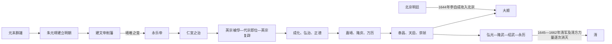

# 明皇帝世系

## 概括

明朝皇帝出自朱氏。全国性统治从明太祖朱元璋开始，到1644年崇祯帝朱由检自缢、北京失守为止；其后南明多个宗室政权延续明朝法统至1662年。表中把追尊祖先、未即位太子、复位皇帝和并立南明君主分别标示，避免与实际在位次序混淆。

## 世系与兴亡主线

## 继承机制与关键异常

- 太祖以嫡长子朱标为太子，朱标早死后改立皇太孙朱允炆。建文帝削藩触发燕王朱棣起兵，1402年攻入南京；这不是正常父子继承，而是宗室内战后的夺位。
- 永乐以后大体形成皇太子继承，但幼帝、皇子稀少和旁支入继仍造成危机。土木堡之变后朱祁镇被俘，弟朱祁钰在北京即位；1457年英宗政变复位，故朱祁镇在表中有两段在位。
- 武宗无子，近支朱厚熜以堂弟身份继位。大礼议争论他应继嗣孝宗还是尊生父，实质是旁支皇帝如何进入正统谱系及谁控制礼制解释权。
- 万历长期储位争议使太子朱常洛迟立；光宗在位一月去世，熹宗无子，弟朱由检继位。短期连续更替加剧宫廷、宦官和官僚冲突。
- 明代虽废丞相，实际政务依赖内阁票拟、司礼监批红和六部执行。皇帝怠政不等于国家完全停摆，但内阁、宦官和言官缺乏稳定的最终协调机制。
- 崇祯死后无明确可用太子，南京拥福王，福建拥唐王，两广又有绍武、永历并立；[南明](/%E4%BA%BA%E6%96%87%E7%A7%91%E5%AD%A6/%E5%8E%86%E5%8F%B2/%E4%B8%9C%E4%BA%9A/%E4%B8%AD%E5%9B%BD/%E6%98%8E/%E5%8D%97%E6%98%8E.md)的顺序是主要法统主张，不代表各地始终服从同一中央。
- 朱慈烺是否在1644年实际即帝位、所用“义兴”年号及其结局均有争议，因此只作争议节点，不计入公认明帝次序。

## 王朝崛起、鼎盛与衰亡原因

### 崛起与制度化

- 朱元璋从红巾军环境中建立独立集团，先据江南财赋，击败陈友谅、张士诚后北伐元廷，避免在多线同时决战。
- 洪武朝重建户籍、里甲、卫所和州县，废丞相以强化皇权；严刑和政治清洗同时造成官僚不安全。
- 永乐迁都北京、经营北边并利用运河供给，郑和航海与朝贡网络扩大国际联系；仁宣时期缩减部分动员，政局较稳。
- 白银流通、江南商业和一条鞭法等推动财政货币化，明中后期经济文化仍有强大活力，不能简单写成万历以后全面停滞。

### 结构压力

- 北边军费、辽东防务和北京漕运长期依赖全国财政，卫所军户逃亡后需募兵和加饷替代。
- 税收征解分散、宗室俸禄和地方隐田使中央难把商业财富稳定转为军费；白银供给与灾荒又造成税负波动。
- 废相后皇帝是中枢最终协调点，内阁没有独立法定决策权；皇帝与官僚长期冲突时，政策容易拖延。
- 女真—后金在东北形成统一军事国家，陕西等地又因小冰期背景下灾荒、军饷欠发和土地问题爆发民变，明面临内外两线。
- 官僚党争不是唯一亡国原因，但用人反复、将领更换和信息互不信任削弱危机管理。

### 直接灭亡过程

1. 万历末年以来辽东战争加税加饷，萨尔浒失败后明军长期转入防守。
2. 天启、崇祯时期陕西民变发展为李自成、张献忠等大规模军政集团；招抚与围剿反复。
3. 1642年松锦之战后明在辽东的主力和关键将领损失，清军入塞能力增强。
4. 崇祯频繁更换督师、将领，中央财力和士气枯竭；瘟疫、灾荒又重创北方城市与军队。
5. 1644年李自成军快速进入山西、北京，京营无力防守，崇祯自缢；全国性明廷终结。
6. 吴三桂与清军合作击败大顺，清摄政王多尔衮入北京。南明各政权因军事集团竞争、财政和战略分裂被逐次击破，1662年永历帝被杀。

## 追尊祖先

| 顺序 | 姓名 | 庙号 | 谥号 | 年号 | 在位时间 | 生卒时间 | 与后继关系 | 关键事件 / 备注 / 说明 |
|---:|---|---|---|---|---|---|---|---|
| 1 | 朱百六 | 明德祖 | 玄皇帝 | 无 | 无 | 不详 | 朱元璋先祖 | 朱元璋追尊。 |
| 2 | 朱四九 | 明懿祖 | 恒皇帝 | 无 | 无 | 不详 | 德祖后裔 | 朱元璋追尊。 |
| 3 | 朱初一 | 明熙祖 | 裕皇帝 | 无 | 无 | 不详 | 懿祖后裔 | 朱元璋追尊。 |
| 4 | 朱世珍 | 明仁祖 | 淳皇帝 | 无 | 无 | 1281年-1344年 | 朱元璋父 | 朱元璋追尊。 |

## 明朝

| 顺序 | 姓名 | 庙号 | 谥号 | 年号 | 在位时间 | 生卒时间 | 与前任关系 | 关键事件 / 备注 / 说明 |
|---:|---|---|---|---|---|---|---|---|
| 1 | **朱元璋** | 明太祖 | 开天行道肇纪立极大圣至神仁文义武俊德成功高皇帝 | 洪武 | 1368年-1398年 | 1328年-1398年 | 建国者 | 洪武之治；设锦衣卫，制定《大明律》，废中书省和丞相；击败陈友谅、张士诚。1356年占集庆并改名应天府；**1368年于南京称帝，明朝建立，同年攻占元大都，元廷撤出中原。** 1388年深入漠北进攻北元，天下大体初定。 |
| - | 朱标 | 明兴宗 | 和天敬道宪懿勤敏淳文度武明仁慈孝康皇帝 | 无 | 未即位 | 1355年-1392年 | 太祖太子 | 建文帝追尊。 |
| 2 | 朱允炆 | 明惠宗 | 嗣天章道诚懿渊功观文扬武克仁笃孝让皇帝；恭闵惠皇帝 | 建文 | 1398年-1402年 | 1377年-不详 | 太祖孙；朱标子 | 建文改制，削藩；靖难之变后下落不明。 |
| 3 | **朱棣** | 明太宗；明成祖 | 启天弘道高明肇运圣武神功纯仁至孝文皇帝 | 永乐 | 1402年-1424年 | 1360年-1424年 | 太祖子；建文帝叔 | 靖难之变夺位；永乐盛世；编修《永乐大典》；郑和下西洋；迁都北京。 |
| 4 | 朱高炽 | 明仁宗 | 敬天体道纯诚至德弘文钦武章圣达孝昭皇帝 | 洪熙 | 1424年-1425年 | 1378年-1425年 | 成祖子 | 在位短，重视休养生息，与宣宗时期合称仁宣之治。 |
| 5 | 朱瞻基 | 明宣宗 | 宪天崇道英明神圣钦文昭武宽仁纯孝章皇帝 | 宣德 | 1425年-1435年 | 1399年-1435年 | 仁宗子 | 仁宣之治，明前期政治相对稳定。 |
| 6 | 朱祁镇 | 明英宗 | 法天立道仁明诚敬昭文宪武至德广孝睿皇帝 | 正统、天顺 | 1435年-1449年；1457年-1464年 | 1427年-1464年 | 宣宗子 | 土木堡之变被瓦剌俘获；夺门之变后复位。 |
| 7 | 朱祁钰 | 明代宗 | 恭仁康定景皇帝；符天建道恭仁康定隆文布武显德崇孝景皇帝 | 景泰 | 1449年-1457年 | 1428年-1457年 | 英宗弟 | 土木堡之变后即位，于谦组织北京保卫战；夺门之变后被废。 |
| 8 | 朱见深 | 明宪宗 | 继天凝道诚明仁敬崇文肃武宏德圣孝纯皇帝 | 成化 | 1464年-1487年 | 1447年-1487年 | 英宗子 | 成化朝宦官与特务政治影响上升。 |
| 9 | 朱祐樘 | 明孝宗 | 建天明道纯诚中正圣文神武至仁大德敬皇帝 | 弘治 | 1487年-1505年 | 1470年-1505年 | 宪宗子 | 弘治中兴，政治较为清明。 |
| 10 | 朱厚照 | 明武宗 | 承天达道英肃睿哲昭德显功弘文思孝毅皇帝 | 正德 | 1505年-1521年 | 1491年-1521年 | 孝宗子 | 宦官刘瑾专权，宁王之乱被平定。 |
| - | 朱祐杬 | 明睿宗 | 知天守道洪德渊仁宽穆纯圣恭简敬文献皇帝 | 无 | 未即位 | 1476年-1519年 | 世宗父 | 嘉靖帝追尊，引发大礼议。 |
| 11 | 朱厚熜 | 明世宗 | 钦天履道英毅神圣宣文广武洪仁大孝肃皇帝 | 嘉靖 | 1521年-1567年 | 1507年-1567年 | 武宗堂弟；睿宗子 | 大礼议；嘉靖中后期倭寇、北虏和严嵩专权等问题突出。 |
| 12 | 朱载垕 | 明穆宗 | 契天隆道渊懿宽仁显文光武纯德弘孝庄皇帝 | 隆庆 | 1567年-1572年 | 1537年-1572年 | 世宗子 | 隆庆开关，俺答封贡，边境和贸易政策调整。 |
| 13 | **朱翊钧** | 明神宗 | 范天合道哲肃敦简光文章武安仁止孝显皇帝 | 万历 | 1572年-1620年 | 1563年-1620年 | 穆宗子 | 张居正改革；万历三大征；后期长期怠政，党争和财政问题加重。 |
| 14 | 朱常洛 | 明光宗 | 崇天契道英睿恭纯宪文景武渊仁懿孝贞皇帝 | 泰昌 | 1620年 | 1582年-1620年 | 神宗子 | 在位一月，红丸案。 |
| 15 | 朱由校 | 明熹宗 | 达天阐道敦孝笃友章文襄武靖穆庄勤悊皇帝 | 天启 | 1620年-1627年 | 1605年-1627年 | 光宗子 | 魏忠贤乱政，东林党争激化。 |
| 16 | **朱由检** | 明思宗；明毅宗；明怀宗 | 庄烈愍皇帝；绍天绎道刚明恪俭揆文奋武敦仁懋孝烈皇帝 | 崇祯 | 1627年-1644年 | 1611年-1644年 | 熹宗弟 | 铲除阉党，勤于政事且生活节俭，但内有农民起义、外有清军压力。**1644年，李自成攻入北京，建国大顺；明思宗自缢，明朝全国性统治结束。吴三桂引清兵入关，一片石战役后清军入北京；南方拥立福王，进入南明阶段。** |
| - | 朱慈烺 | 无 | 悼皇帝 | 义兴 | 1644年 | 1629年-不详 | 崇祯帝太子 | 是否实际即位和结局存在争议，原表保留。 |

## 南明

| 顺序 | 姓名 | 庙号 | 谥号 | 年号 | 在位时间 | 生卒时间 | 与前任关系 | 关键事件 / 备注 / 说明 |
|---:|---|---|---|---|---|---|---|---|
| 1 | 朱由崧 | 明安宗 | 奉天遵道宽和静穆修文布武温恭仁孝简皇帝 | 弘光 | 1644年-1645年 | 1607年-1646年 | 福王；明神宗孙 | 永历帝追尊。1644年于南京即皇帝位；1645年清军占领南京后被俘，后被杀。 |
| 2 | 朱聿键 | 明绍宗 | 配天至道弘毅肃穆思文烈武敏仁广孝襄皇帝 | 隆武 | 1645年-1646年 | 1602年-1646年 | 唐王；明太祖九世孙 | 永历帝追尊。活动于福建，清军入闽后被俘死。 |
| 3 | 朱聿𨮁 | 无 | 无 | 绍武 | 1646年-1647年 | 1605年-1647年 | 唐王宗室 | 广州短暂称帝，与永历政权并立，很快败亡。 |
| 4 | **朱由榔** | 明昭宗 | 应天推道敏毅恭俭经文纬武体仁克孝匡皇帝 | 永历 | 1646年-1662年 | 1623年-1662年 | 桂王；明神宗孙 | 1661年清军攻入云南，永历帝逃亡缅甸；1662年被吴三桂杀死，南明亡。 |

## 演变关系

- 前一节点：[元](/%E4%BA%BA%E6%96%87%E7%A7%91%E5%AD%A6/%E5%8E%86%E5%8F%B2/%E4%B8%9C%E4%BA%9A/%E4%B8%AD%E5%9B%BD/%E5%85%83/README.md)。
- 后一节点：清朝入主中原；[南明](/%E4%BA%BA%E6%96%87%E7%A7%91%E5%AD%A6/%E5%8E%86%E5%8F%B2/%E4%B8%9C%E4%BA%9A/%E4%B8%AD%E5%9B%BD/%E6%98%8E/%E5%8D%97%E6%98%8E.md)和明郑继续抗清。
- 相关节点：[明末势力](/%E4%BA%BA%E6%96%87%E7%A7%91%E5%AD%A6/%E5%8E%86%E5%8F%B2/%E4%B8%9C%E4%BA%9A/%E4%B8%AD%E5%9B%BD/%E6%98%8E/%E6%98%8E%E6%9C%AB%E5%8A%BF%E5%8A%9B.md)。
