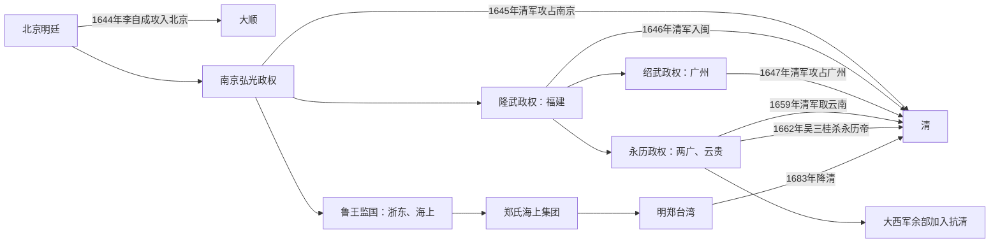

# 南明

## 时间

1644年弘光政权建立至1662年永历帝被杀。鲁王监国、绍武政权等与主要帝系有时间重叠；郑氏继续奉明正朔至1683年，但不是另一个公认南明皇帝朝廷。

## 概括

南明不是一个始终统一、按顺序迁都的中央政府，而是北京明廷覆亡后，明宗室、文官、地方军阀、原农民军余部和郑氏海上集团在不同地区建立的多个抗清权力中心。弘光、隆武、绍武、永历是主要称帝政权，鲁王朱以海以监国名义并立。它们共享延续明朝法统的目标，却在拥立资格、军队、财源和战略上长期竞争。

南明曾凭借长江、东南海路、两广云贵纵深及李定国、郑成功等军事力量多次恢复局面，但不能形成统一军令和稳定财政。1645—1661年清军与降清明将逐步夺取南京、福建、广东、西南；1662年永历帝被吴三桂处死，宗室皇帝政权结束。郑氏仍以明朝名义据台湾抗清，至1683年降清。

## 政权演变

## 主要国家元首与并立主张

| 次序 / 类型 | 姓名 | 身份与年号 | 行使最高名义权力 | 核心地区 | 结局与说明 |
|---|---|---|---|---|---|
| 1 | **朱由崧** | 福王；弘光帝 | 1644年-1645年 | 南京、江淮及江南名义辖区 | 南京被清军占领后被俘，次年遇害；永历朝追尊安宗。 |
| 并立监国 | 朱以海 | 鲁王监国 | 1645年-1653年间以监国名义活动 | 浙东、舟山及东南海上 | 未称皇帝，与隆武政权互不统属；后依郑氏，放弃监国名义的具体时间与实际效力应区分，1662年去世。 |
| 2 | **朱聿键** | 唐王；隆武帝 | 1645年-1646年 | 福建及东南部分地区 | 依靠郑芝龙集团；清军入闽后被俘或战死，永历朝追尊绍宗。 |
| 并立短朝 | 朱聿𨮁 | 唐王宗室；绍武帝 | 1646年末-1647年初 | 广州附近 | 与永历政权争夺两广正统，存在约一个多月，广州被清军攻陷后自尽或遇害。 |
| 3 | **朱由榔** | 桂王；永历帝 | 1646年-1662年 | 两广、贵州、云南，后流亡缅甸 | 依靠地方文臣、孙可望与李定国等大西军余部；被缅甸交给吴三桂后在昆明被杀，永历朝为持续最久的南明帝廷。 |
| 争议传说 | 朱本铉 / 朱亶塉等说法 | 所谓“定武帝” | 传说1646年以后 | 陕西、夔东等说法不一 | 相关记载晚出且互相冲突，是否真实存在及身份均有重大争议，不列入公认君主次序。 |

详细庙号、谥号、亲属与年号见[明皇帝世系](/%E4%BA%BA%E6%96%87%E7%A7%91%E5%AD%A6/%E5%8E%86%E5%8F%B2/%E4%B8%9C%E4%BA%9A/%E4%B8%AD%E5%9B%BD/%E6%98%8E/%E4%B8%96%E7%B3%BB.md)。

## 实际权力结构

| 政权 | 文官与中枢 | 主要军事集团 | 实际权力特征 |
|---|---|---|---|
| 弘光 | 马士英、史可法等；东林—复社旧臣与其他官僚争论拥立、用人 | 江北四镇、高杰、黄得功、刘良佐、刘泽清等 | 南京有完整六部名义，却无统一财政和军令；江北将领各据防区，朝廷难控制。 |
| 鲁王监国 | 张国维、张煌言等 | 方国安、王之仁、郑彩及海上武装等先后参与 | 陆上据点丢失后转为海上流动政权，与郑氏关系既合作又受制。 |
| 隆武 | 黄道周等文臣 | 郑芝龙掌福建兵船与财源，郑成功亦在其系统 | 皇帝有积极出征意愿，实际军队与海贸资源高度依赖郑氏；郑芝龙降清后防线迅速崩溃。 |
| 绍武 | 苏观生等 | 广州地方兵 | 建立仓促，资源少，与永历内斗时清军突袭，几乎无完整中央化过程。 |
| 永历前期 | 瞿式耜、何腾蛟、堵胤锡等 | 地方明军、何腾蛟部及多支军阀 | 朝廷随战局迁徙，官号与实际辖区经常脱节。 |
| 永历中后期 | 永历帝与文臣集团 | 孙可望、李定国、刘文秀等大西军余部；郑成功为东南盟友 | 孙可望一度掌军政并要求封王，李定国后成为主要支柱；皇帝法统与将领军力相互依赖。 |

## 建立背景

- 1644年崇祯帝死、太子下落不明，南方没有公认储君；按血缘远近、政治立场和军队支持可拥立不同宗室。
- 南京保留六部、勋贵、漕运和江南税源，理论上可迅速重建，但江北防军与中央财政已经分裂。
- 清入北京后沿用明官制、招降明将并宣布为崇祯复仇，争取官绅归附，南明无法只凭“华夷”口号自动获得全体支持。
- 李自成、张献忠政权及其余部分别与南明、清军冲突或合作，明末战争不是简单两方对决。
- 东南海贸、郑氏水军和云贵山地提供长期抵抗条件，也让各区域集团拥有独立财源而不愿完全受中央节制。

## 分阶段过程与重要事件

### 1. 弘光政权迅速覆亡（1644—1645）

南京官员在潞王、福王等人选间争论后拥立朱由崧。朝廷未能统一江北四镇，史可法督师扬州也缺乏可直接调动的全国军队。1645年清军南下，扬州陷落后渡江，南京官员开城，弘光帝出逃被俘。江南多地随后发生抵抗与清军镇压，战争并未因南京投降立即结束。

### 2. 东南多中心并立（1645—1647）

鲁王朱以海在绍兴监国，唐王朱聿键在福州称帝。双方争夺正统、辖区和将领，未能合并。隆武帝依赖郑芝龙海陆力量；1646年郑芝龙降清、清军进入福建，隆武政权覆亡。广州同时出现绍武和永历两个帝号，双方内战削弱防务，清军突袭广州，绍武朝迅速结束。

### 3. 永历西退与局部反攻（1647—1656）

永历朝在广东、广西、贵州之间迁徙。清军推进时，瞿式耜守桂林、何腾蛟等经营湖广。原大西军孙可望、李定国、刘文秀等进入云贵后奉永历号，提供最有组织的军队。1652年李定国在桂林、衡州方向连获胜利，清定南王孔有德自杀、敬谨亲王尼堪战死，南明一度收复大片地区。

### 4. 军事集团内斗与西南失守（1656—1659）

孙可望与李定国争夺军政主导权，孙可望进攻李定国失败后降清，并泄露西南部署。清廷随后由吴三桂、洪承畴等组织多路进攻。1659年昆明失守，永历帝逃入缅甸；李定国仍在边境维持，但再无稳定中央和大规模税源。

### 5. 永历帝被杀与郑氏延续（1660—1683）

1661年清军进入缅甸施压，缅甸政权在“咒水之难”等内乱后把永历帝交出。1662年吴三桂在昆明处死朱由榔及其子，南明皇帝法统失去现实承载者。同年郑成功取得台湾不久去世；郑经、郑克塽继续使用永历年号和明朝旗号，1683年澎湖战败后降清。

## 曾经维系与反攻的条件

- 长江、浙闽海岸、两广和云贵提供多层地理屏障，清军需要适应水战、山地和漫长补给。
- 江南商业、东南海贸和郑氏航运能提供银、粮、船与火器。
- 明朝近三百年官僚和文化法统仍具有号召力，遗臣、士绅和地方民众以不同方式参与。
- 李定国等大西军余部带来完整军队和西南基地，使永历朝从流亡朝廷恢复为区域政权。
- 清军也需应付大顺、大西余部和各地抵抗，早期尚不能一次集中所有力量。

## 衰落与灭亡原因

### 结构因素

- 没有公认储君，多个宗室同时获拥立，合法性无法自动转化为统一军令。
- 朝廷缺少直属常备军，江北四镇、郑氏、孙可望、李定国等控制实际兵饷，皇帝常受保护者限制。
- 财政基地不断迁移，官职和封爵大量用于换取忠诚，中央难建立稳定税制、补给和考核。
- 南方地形利守，也把各集团分隔为南京、浙东、福建、两广、云贵和海上多个战区。

### 内部因素

- 弘光朝拥立与党争、隆武与鲁监国竞争、绍武与永历内战直接消耗危机中的资源。
- 将领之间争饷、争地和争正统，孙可望—李定国内战尤其破坏西南最后的战略优势。
- 文官与军将对北伐、守土、海上和西退路线意见不一，皇帝缺乏强制协调能力。

### 外部压力

- 清廷可动员满洲八旗、蒙古、汉军与降清明军，使用原明州县、漕运和士绅网络供给。
- 清军逐步适应江南水网和西南地形，并以封王、原官留任等招降政策瓦解南明集团。
- 大顺、大西旧部加入南明虽增强军力，也带来既有派系和合法性矛盾；清廷能利用这些裂缝。
- 缅甸、海上贸易和邻近政权以自身安全为先，无法为流亡皇帝提供无限保护。

### 直接终结

1659年昆明失守后，永历朝失去最后稳定领土和财政。孙可望降清提供军事情报，清军控制中缅边境；缅甸在压力下交出永历帝。1662年皇帝被杀，使各路无法再围绕同一宗室法统重建中央。郑氏仍延续明正朔，但其国家结构和继承中心已转到台湾，最终于1683年被清水师击败。

## 结果与长期影响

- 清朝完成对长江以南和西南的大体征服，并吸收大量明官、将领与地方制度。
- 郑氏海上政权推动台湾进入更大规模汉人移民、军屯和跨海贸易阶段，其与南明的关系兼有臣属名义和高度自主。
- 遗民文学、史书和地方记忆围绕“正统、降与不降、文臣与武将”形成长期争论。
- 南明失败不能只归于党争，也不能只归于清军强大；继承碎片化、军财分离、区域地理和对手制度吸纳共同作用。

## 演变关系

- 前一节点：[明](/%E4%BA%BA%E6%96%87%E7%A7%91%E5%AD%A6/%E5%8E%86%E5%8F%B2/%E4%B8%9C%E4%BA%9A/%E4%B8%AD%E5%9B%BD/%E6%98%8E/README.md)及[明末势力](/%E4%BA%BA%E6%96%87%E7%A7%91%E5%AD%A6/%E5%8E%86%E5%8F%B2/%E4%B8%9C%E4%BA%9A/%E4%B8%AD%E5%9B%BD/%E6%98%8E/%E6%98%8E%E6%9C%AB%E5%8A%BF%E5%8A%9B.md)。
- 世系专表：[明皇帝世系](/%E4%BA%BA%E6%96%87%E7%A7%91%E5%AD%A6/%E5%8E%86%E5%8F%B2/%E4%B8%9C%E4%BA%9A/%E4%B8%AD%E5%9B%BD/%E6%98%8E/%E4%B8%96%E7%B3%BB.md)。
- 并列与后续：清、大顺、大西余部及明郑；清朝于1683年取台湾后，主要公开奉明抗清政权结束。
