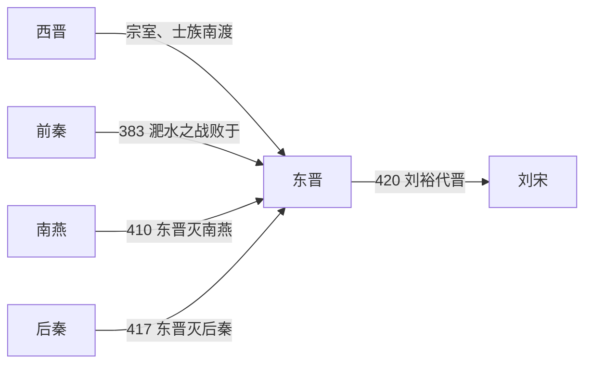

# 东晋

> 导航：[晋](/%E4%BA%BA%E6%96%87%E7%A7%91%E5%AD%A6/%E5%8E%86%E5%8F%B2/%E4%B8%9C%E4%BA%9A/%E4%B8%AD%E5%9B%BD/%E6%99%8B/README.md) / [西晋](/%E4%BA%BA%E6%96%87%E7%A7%91%E5%AD%A6/%E5%8E%86%E5%8F%B2/%E4%B8%9C%E4%BA%9A/%E4%B8%AD%E5%9B%BD/%E6%99%8B/%E8%A5%BF%E6%99%8B.md) / [东晋](/%E4%BA%BA%E6%96%87%E7%A7%91%E5%AD%A6/%E5%8E%86%E5%8F%B2/%E4%B8%9C%E4%BA%9A/%E4%B8%AD%E5%9B%BD/%E6%99%8B/%E4%B8%9C%E6%99%8B.md) / [八王之乱](/%E4%BA%BA%E6%96%87%E7%A7%91%E5%AD%A6/%E5%8E%86%E5%8F%B2/%E4%B8%9C%E4%BA%9A/%E4%B8%AD%E5%9B%BD/%E6%99%8B/%E5%85%AB%E7%8E%8B%E4%B9%8B%E4%B9%B1.md) / [晋君主世系](/%E4%BA%BA%E6%96%87%E7%A7%91%E5%AD%A6/%E5%8E%86%E5%8F%B2/%E4%B8%9C%E4%BA%9A/%E4%B8%AD%E5%9B%BD/%E6%99%8B/%E4%B8%96%E7%B3%BB.md) / [十六国](/%E4%BA%BA%E6%96%87%E7%A7%91%E5%AD%A6/%E5%8E%86%E5%8F%B2/%E4%B8%9C%E4%BA%9A/%E4%B8%AD%E5%9B%BD/%E6%99%8B/%E5%8D%81%E5%85%AD%E5%9B%BD/README.md)

## 时间

317年—420年。

## 别称

- 晋室南渡后政权
- 建康晋
- 两晋后期

## 概括

东晋由司马睿在建康建立，是西晋灭亡后晋室南渡的延续政权。它以江南为根基，依靠北方南迁士族和江南本地大族维持统治，长期与北方[十六国](/%E4%BA%BA%E6%96%87%E7%A7%91%E5%AD%A6/%E5%8E%86%E5%8F%B2/%E4%B8%9C%E4%BA%9A/%E4%B8%AD%E5%9B%BD/%E6%99%8B/%E5%8D%81%E5%85%AD%E5%9B%BD/README.md)对峙。东晋多次北伐，383年在淝水之战中击败前秦，使南方政权得以延续。晚期刘裕掌握军政大权，420年刘裕代晋建立南朝宋，东晋灭亡。

## 历史演进图

## 建立背景与政权重建

西晋末年，司马睿已受命经营江东；洛阳、长安相继陷落后，他凭借琅琊王室身份、王导对侨姓与吴姓士族的协调，以及王敦控制的军事力量，在建康重建晋廷。东晋的“崛起”不是重新征服全国，而是把流亡皇室、北方侨民和江南地方社会结合成可持续的南方政权。侨置州郡安置南来人口，门阀分享中央职位，长江天险与江淮防线共同构成安全基础。

## 分阶段发展

| 阶段 | 过程 | 关键转折 |
|---|---|---|
| 草创与门阀共治（317年—329年） | 司马睿称帝，王导调和士族，王敦之乱和苏峻之乱先后冲击建康。 | 明帝平王敦余部、陶侃等平苏峻，使朝廷免于瓦解。 |
| 军府扩张与北伐（330年—383年） | 庾氏、桓温等掌军权；桓温灭成汉并三次北伐，皇权受到军府制约。 | 371年桓温废司马奕，显示权臣已能决定帝位。 |
| 淝水胜利后的再分裂（383年—402年） | 北府兵击退前秦；东晋收复部分淮北、河南地区，但王恭之乱、孙恩起事又暴露内部矛盾。 | 淝水胜利保存南方政权，却未转化为稳定的中央集权。 |
| 桓玄篡位与刘裕掌权（403年—420年） | 桓玄建楚，刘裕以北府兵起兵复晋；其后平卢循、灭南燕和后秦。 | 刘裕控制军政与皇位继承，420年受禅建宋。 |

## 鼎盛条件与衰亡原因

- **稳定与鼎盛条件**：长江防线、江南农业发展和南迁人口提供兵员与税源；侨姓、吴姓士族的妥协减少初期阻力；北府兵形成后，东晋获得较可靠的机动力量。383年淝水胜利是国防与政治声望的高点。
- **结构因素**：皇帝缺乏独立军队，地方军府和高门长期分享甚至控制权力；侨置体系、士族特权与地方豪强使中央直接动员能力有限。
- **外部压力**：北方政权持续争夺淮河、荆襄和巴蜀边界；长期北伐耗费粮运，也给掌兵将领积累私人权力的机会。
- **直接触发**：桓玄篡位后，北府集团成为复晋核心；刘裕在平乱和北伐中垄断军政，先后废立晋帝，最终于420年迫司马德文禅位。

完整皇帝顺序见[晋君主世系](/%E4%BA%BA%E6%96%87%E7%A7%91%E5%AD%A6/%E5%8E%86%E5%8F%B2/%E4%B8%9C%E4%BA%9A/%E4%B8%AD%E5%9B%BD/%E6%99%8B/%E4%B8%96%E7%B3%BB.md#%E4%B8%9C%E6%99%8B%E7%9A%87%E5%B8%9D)。

## 说明

- **建立**：317年，司马睿在王导、王敦等士族支持下于建康称晋王，次年称帝，史称东晋。
- **王与马，共天下**：东晋初年皇权依赖琅琊王氏等门阀士族，政治上呈现皇室与士族共治特征。
- **江南根基**：北方人口南迁，带来劳动力、技术和文化资源，推动江南开发。
- **内乱与权臣**：王敦之乱、苏峻之乱、桓温专权、桓玄篡位等事件反复冲击皇权。
- **北伐**：祖逖、庾亮、殷浩、桓温、刘裕等先后北伐，目标是恢复中原，但多因内部牵制、补给困难或权力斗争受限。
- **淝水之战**：383年，前秦苻坚南侵，东晋在谢安、谢石、谢玄等主持下获胜，前秦瓦解，北方再次分裂。
- **刘裕崛起**：刘裕先后平定桓玄，灭南燕、后秦，掌握东晋军政实权。
- **灭亡**：420年，刘裕受禅称帝，建立南朝宋，东晋灭亡，南北朝格局正式展开。

## 统治结构

| 层面 | 主要特征 | 影响 |
|---|---|---|
| 皇帝 | 名义最高统治者 | 多数时期受士族、权臣或军府制约。 |
| 门阀士族 | 王、谢、庾、桓等大族长期掌握要职 | 形成典型门阀政治，维系统治也限制皇权。 |
| 军府与权臣 | 王敦、桓温、桓玄、刘裕等依军事力量干政 | 东晋后期政权更替的直接推动力量。 |
| 侨姓与吴姓 | 北方南迁士族与江南本地大族并存 | 影响江南政治整合和地方治理。 |
| 北府兵 | 东晋后期重要军事力量 | 淝水之战和刘裕崛起均与北府兵关系密切。 |

## 演变关系

- 前一节点：[西晋](/%E4%BA%BA%E6%96%87%E7%A7%91%E5%AD%A6/%E5%8E%86%E5%8F%B2/%E4%B8%9C%E4%BA%9A/%E4%B8%AD%E5%9B%BD/%E6%99%8B/%E8%A5%BF%E6%99%8B.md)。
- 并行北方格局：[十六国](/%E4%BA%BA%E6%96%87%E7%A7%91%E5%AD%A6/%E5%8E%86%E5%8F%B2/%E4%B8%9C%E4%BA%9A/%E4%B8%AD%E5%9B%BD/%E6%99%8B/%E5%8D%81%E5%85%AD%E5%9B%BD/README.md)。
- 关键战役：[十六国/淝水之战前](/%E4%BA%BA%E6%96%87%E7%A7%91%E5%AD%A6/%E5%8E%86%E5%8F%B2/%E4%B8%9C%E4%BA%9A/%E4%B8%AD%E5%9B%BD/%E6%99%8B/%E5%8D%81%E5%85%AD%E5%9B%BD/%E6%B7%9D%E6%B0%B4%E4%B9%8B%E6%88%98%E5%89%8D.md) 与 [十六国/淝水之战后](/%E4%BA%BA%E6%96%87%E7%A7%91%E5%AD%A6/%E5%8E%86%E5%8F%B2/%E4%B8%9C%E4%BA%9A/%E4%B8%AD%E5%9B%BD/%E6%99%8B/%E5%8D%81%E5%85%AD%E5%9B%BD/%E6%B7%9D%E6%B0%B4%E4%B9%8B%E6%88%98%E5%90%8E.md)。
- 后一节点：南朝宋。
