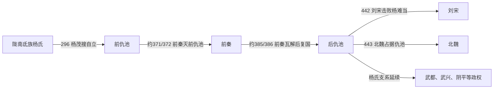

# 仇池

> 导航：[晋](/%E4%BA%BA%E6%96%87%E7%A7%91%E5%AD%A6/%E5%8E%86%E5%8F%B2/%E4%B8%9C%E4%BA%9A/%E4%B8%AD%E5%9B%BD/%E6%99%8B/README.md) / [十六国](/%E4%BA%BA%E6%96%87%E7%A7%91%E5%AD%A6/%E5%8E%86%E5%8F%B2/%E4%B8%9C%E4%BA%9A/%E4%B8%AD%E5%9B%BD/%E6%99%8B/%E5%8D%81%E5%85%AD%E5%9B%BD/README.md) / [政权索引](/%E4%BA%BA%E6%96%87%E7%A7%91%E5%AD%A6/%E5%8E%86%E5%8F%B2/%E4%B8%9C%E4%BA%9A/%E4%B8%AD%E5%9B%BD/%E6%99%8B/%E5%8D%81%E5%85%AD%E5%9B%BD/%E6%94%BF%E6%9D%83/README.md) / [淝水之战前](/%E4%BA%BA%E6%96%87%E7%A7%91%E5%AD%A6/%E5%8E%86%E5%8F%B2/%E4%B8%9C%E4%BA%9A/%E4%B8%AD%E5%9B%BD/%E6%99%8B/%E5%8D%81%E5%85%AD%E5%9B%BD/%E6%B7%9D%E6%B0%B4%E4%B9%8B%E6%88%98%E5%89%8D.md) / [淝水之战后](/%E4%BA%BA%E6%96%87%E7%A7%91%E5%AD%A6/%E5%8E%86%E5%8F%B2/%E4%B8%9C%E4%BA%9A/%E4%B8%AD%E5%9B%BD/%E6%99%8B/%E5%8D%81%E5%85%AD%E5%9B%BD/%E6%B7%9D%E6%B0%B4%E4%B9%8B%E6%88%98%E5%90%8E.md)

## 时间

296年—443年为前、后仇池主段；后续武都、武兴、阴平延续至南北朝。

## 别称

- 杨氏仇池
- 氐杨仇池

## 概括

仇池是氐族杨氏在陇南、仇池山一带建立的地方政权，长期处于东晋、前秦、后秦、北魏、南朝之间。它不属于传统十六国，但常作为这一时期的重要割据政权列入。

## 历史演进图

## 建立、治理与兴衰

仇池山地位于关中、陇右与巴蜀之间，谷地狭窄却易守难攻。杨氏凭氐族部众、宗族网络和山城据点建立地方政权，对内采用首领分兵与中原式将军、刺史、王号并用的结构；对外则根据形势接受西晋、东晋、前秦、后秦、刘宋或北魏的册封。多重臣属不是简单“反复无常”，而是小国在强邻之间维持自治的生存机制。

| 阶段 | 过程与重要事件 |
|---|---|
| 前仇池建立（296年—371年） | 杨茂搜据仇池自立，难敌、毅、初等相继承；政权控制武都、下辨等山地交通线，在晋与北方强国之间称臣。 |
| 前秦统治（约371/372年—385/386年） | 杨纂与杨统内争，前秦出兵控制仇池并迁徙部分部众，前仇池作为独立政权终结；不同纪年换算有一至两年差异。 |
| 后仇池复兴（385年—425年） | 前秦瓦解后杨定复国；杨盛长期在位，通过向东晋、后秦等受封维持相对稳定。 |
| 杨难当扩张与覆亡（425年—443年） | 杨难当废杨保宗掌权，一度向汉中扩张并称大秦王；442年败于刘宋后奔北魏，杨保炽留守，443年仇池又被北魏占据。 |

- **稳定条件**：险要山地、氐族宗族和地方人口的黏合，以及南北强权难以长期驻军。
- **结构因素**：杨氏支系众多，废立与内争易引来外部干预；土地、人口有限，扩张汉中后补给线过长。
- **外部压力**：关中的前秦、后秦、北魏与巴蜀方向的东晋、刘宋交替争夺陇南。
- **直接灭亡过程**：杨难当对刘宋用兵失败，442年放弃仇池投北魏；杨保炽的过渡统治未能阻止北魏在443年占领山城。杨氏随后在武都、武兴、阴平等地继续建政，不能与296年—443年的主段简单合并。

前仇池早期人物的姓名、亲属关系和在位起讫在《晋书》《宋书》《魏书》的追述间有差异，例如杨茂搜亦见作“杨戊搜”。表中年代采用常见约数；无法互证者标为“不详”或保留阶段性说明。

## 说明

- 杨氏仇池位于陇南、仇池山一带，处在关中、陇右、巴蜀之间。
- 其政权延续时间长，阶段复杂，常在东晋、前秦、后秦、北魏、南朝之间称臣或周旋。
- 本页只记录与十六国时代关系最密切的前仇池、后仇池主线；后续武都、武兴、阴平等延续政权可另行展开。

## 世系表

| 顺序 | 姓名 | 庙号 | 谥号 / 称号 | 年号 | 在位时间 | 生卒时间 | 与前任关系 | 关键事件 / 备注 / 说明 |
|---:|---|---|---|---|---|---|---|---|
| 氐胡 | 杨腾 | 无 | 无 | 无 | 184年—210年 | 不详 | 杨氏早期首领 | 仇池杨氏前身。 |
| 氐胡 | 杨驹 | 无 | 无 | 无 | 210年—230年 | 不详 | 杨腾后继者 | 杨氏早期首领。 |
| 氐胡 | 杨千万 | 无 | 无 | 无 | 230年—263年 | 不详 | 杨氏首领 | 杨氏早期首领。 |
| 氐胡 | 杨飞龙 | 无 | 无 | 无 | 263年—296年 | 不详 | 杨氏首领 | 杨氏早期首领。 |
| 1 | 杨茂搜 | 无 | 无 | 无 | 296年—317年 | 不详—317年 | 前仇池开创者 | 建立前仇池格局。 |
| 2 | 杨难敌 | 无 | 无 | 无 | 317年—335年 | 不详—335年 | 杨茂搜子 | 据仇池。 |
| 3 | 杨毅 | 无 | 无 | 无 | 335年—337年 | 不详—337年 | 杨难敌族人 | 短暂在位。 |
| 4 | 杨初 | 无 | 无 | 无 | 337年—357年 | 不详—357年 | 杨毅族人 | 据仇池。 |
| 5 | 杨国 | 无 | 无 | 无 | 357年 | 不详—357年 | 杨初子 | 短暂在位。 |
| 6 | 杨俊 | 无 | 无 | 无 | 357年—361年 | 不详—361年 | 杨国族人 | 据仇池。 |
| 7 | 杨世 | 无 | 无 | 无 | 361年—370年 | 不详—370年 | 杨俊子 | 前秦压力下衰落。 |
| 8 | 杨统 | 无 | 无 | 无 | 370年 | 不详—370年 | 杨世子 | 短暂在位。 |
| 9 | 杨纂 | 无 | 无 | 无 | 370年—372年 | 不详—372年 | 杨氏宗族 | 前仇池结束。 |
| 10 | 杨定 | 无 | 武王 | 无 | 386年—395年 | 不详—395年 | 后仇池开创者 | 前秦瓦解后复兴仇池。 |
| 11 | 杨盛 | 无 | 惠文王 | 无 | 395年—425年 | 不详—425年 | 杨定族人 | 后仇池较稳定时期。 |
| 12 | 杨玄 | 无 | 孝昭王 | 无 | 425年—429年 | 不详—429年 | 杨盛子 | 据仇池。 |
| 13 | 杨保宗 | 无 | 武都王（北魏封） | 无 | 429年 | 生年不详—443年 | 杨玄子 | 429年即位后被叔父杨难当废黜；439年投北魏并受封，443年因谋叛嫌疑被杀。 |
| 14 | 杨难当 | 无 | 武都王 / 南秦王 / 大秦王 | 建义 | 429年—442年 | 生年不详—465年 | 杨保宗叔 | 废杨保宗自立；436年称大秦王，后复称武都王；442年被刘宋击败，奔北魏。 |
| 15 | 杨保炽 | 无 | 无 | 无 | 442年—443年 | 不详 | 杨氏宗族 | 后仇池末期君主。 |

## 演变关系

- 地理位置：陇南、仇池山一带。
- 并行关系：与前秦、后秦、东晋、北魏、南朝长期周旋。

## 相关笔记

- [政权索引](/%E4%BA%BA%E6%96%87%E7%A7%91%E5%AD%A6/%E5%8E%86%E5%8F%B2/%E4%B8%9C%E4%BA%9A/%E4%B8%AD%E5%9B%BD/%E6%99%8B/%E5%8D%81%E5%85%AD%E5%9B%BD/%E6%94%BF%E6%9D%83/README.md)
- [十六国](/%E4%BA%BA%E6%96%87%E7%A7%91%E5%AD%A6/%E5%8E%86%E5%8F%B2/%E4%B8%9C%E4%BA%9A/%E4%B8%AD%E5%9B%BD/%E6%99%8B/%E5%8D%81%E5%85%AD%E5%9B%BD/README.md)
- [十六国时空图](/%E4%BA%BA%E6%96%87%E7%A7%91%E5%AD%A6/%E5%8E%86%E5%8F%B2/%E4%B8%9C%E4%BA%9A/%E4%B8%AD%E5%9B%BD/%E6%99%8B/%E5%8D%81%E5%85%AD%E5%9B%BD/%E5%8D%81%E5%85%AD%E5%9B%BD%E6%97%B6%E7%A9%BA%E5%9B%BE.md)
- [淝水之战前](/%E4%BA%BA%E6%96%87%E7%A7%91%E5%AD%A6/%E5%8E%86%E5%8F%B2/%E4%B8%9C%E4%BA%9A/%E4%B8%AD%E5%9B%BD/%E6%99%8B/%E5%8D%81%E5%85%AD%E5%9B%BD/%E6%B7%9D%E6%B0%B4%E4%B9%8B%E6%88%98%E5%89%8D.md)
- [淝水之战后](/%E4%BA%BA%E6%96%87%E7%A7%91%E5%AD%A6/%E5%8E%86%E5%8F%B2/%E4%B8%9C%E4%BA%9A/%E4%B8%AD%E5%9B%BD/%E6%99%8B/%E5%8D%81%E5%85%AD%E5%9B%BD/%E6%B7%9D%E6%B0%B4%E4%B9%8B%E6%88%98%E5%90%8E.md)
