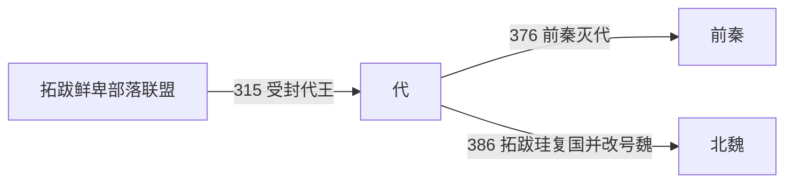

# 代

> 导航：[晋](/%E4%BA%BA%E6%96%87%E7%A7%91%E5%AD%A6/%E5%8E%86%E5%8F%B2/%E4%B8%9C%E4%BA%9A/%E4%B8%AD%E5%9B%BD/%E6%99%8B/README.md) / [十六国](/%E4%BA%BA%E6%96%87%E7%A7%91%E5%AD%A6/%E5%8E%86%E5%8F%B2/%E4%B8%9C%E4%BA%9A/%E4%B8%AD%E5%9B%BD/%E6%99%8B/%E5%8D%81%E5%85%AD%E5%9B%BD/README.md) / [政权索引](/%E4%BA%BA%E6%96%87%E7%A7%91%E5%AD%A6/%E5%8E%86%E5%8F%B2/%E4%B8%9C%E4%BA%9A/%E4%B8%AD%E5%9B%BD/%E6%99%8B/%E5%8D%81%E5%85%AD%E5%9B%BD/%E6%94%BF%E6%9D%83/README.md) / [淝水之战前](/%E4%BA%BA%E6%96%87%E7%A7%91%E5%AD%A6/%E5%8E%86%E5%8F%B2/%E4%B8%9C%E4%BA%9A/%E4%B8%AD%E5%9B%BD/%E6%99%8B/%E5%8D%81%E5%85%AD%E5%9B%BD/%E6%B7%9D%E6%B0%B4%E4%B9%8B%E6%88%98%E5%89%8D.md) / [淝水之战后](/%E4%BA%BA%E6%96%87%E7%A7%91%E5%AD%A6/%E5%8E%86%E5%8F%B2/%E4%B8%9C%E4%BA%9A/%E4%B8%AD%E5%9B%BD/%E6%99%8B/%E5%8D%81%E5%85%AD%E5%9B%BD/%E6%B7%9D%E6%B0%B4%E4%B9%8B%E6%88%98%E5%90%8E.md)

## 时间

315年—376年；386年复国后转为北魏。

## 别称

- 拓跋代
- 代国

## 概括

代是拓跋鲜卑建立的北方政权，376年被前秦灭。淝水之战后拓跋珪复国，后改称魏，发展为北魏。

## 历史演进图

## 建立、治理与兴衰

拓跋部在盛乐一带经营数十年，与西晋并州集团结盟后获得“代公”“代王”等中原政治名号。代国的形成是部落联盟向领土国家过渡的过程：早期首领仍依赖宗族会议和各部骑兵，拓跋什翼犍时则设置百官、制定法律、筑城并发展农业，逐步扩大对定居人口的直接治理。

| 阶段 | 过程与重要事件 |
|---|---|
| 受封与内争（315年—338年） | 拓跋猗卢受封代王后遇刺；普根、郁律、贺傉、纥那、翳槐之间多次短暂继承和复位，显示部落贵族仍有决定首领的力量。 |
| 国家化（338年—376年） | 什翼犍即位，建元“建国”，以盛乐为中心置官、立法、筑城，维持与东晋、前燕及北方诸部的关系。 |
| 前秦征服（376年） | 前秦分兵进攻，代国内部又发生宗族叛乱；什翼犍死亡，部众被拆分安置，代国灭亡。 |
| 复国转型（386年以后） | 淝水战后前秦瓦解，拓跋珪召集旧部复称代王，同年改国号魏；398年称帝，发展为北魏。 |

- **鼎盛条件**：草原骑兵、盛乐周边农牧资源、与晋朝结盟所得名号和物资，以及什翼犍的制度建设。
- **结构因素**：继承依赖宗族与部落支持，中央官制尚未完全取代首领联盟；王族内争容易引发部众分裂。
- **外部压力**：前秦完成北方大部统一后可集中兵力，代国缺乏可依托的强大盟友。
- **直接触发**：376年前秦进军与代国宗室叛乱相互叠加，什翼犍身死，国家组织被打散。早期君主年代和亲属关系在《魏书》等追述中存在差异，表中对无名婴主及两次复位者分别注明。

## 说明

- 258年，拓跋力微徙居盛乐，召集诸部，确立大酋长地位。
- 永嘉之乱后，晋并州刺史刘琨表请封拓跋猗卢为代公，后进封代王。
- 338年，拓跋什翼犍即代王位，置百官、制法律，部落联盟逐渐转为国家。
- 340年，定都云中盛乐城，后又筑盛乐新城，并发展农业。
- 376年，代国被前秦苻坚所灭。
- 386年，拓跋珪重建代国，同年改国号为“魏”，史称北魏。

## 世系表

| 顺序 | 姓名 | 庙号 | 谥号 / 称号 | 年号 | 在位时间 | 生卒时间 | 与前任关系 | 关键事件 / 备注 / 说明 |
|---:|---|---|---|---|---|---|---|---|
| 1 | 拓跋猗卢 | 无 | 穆皇帝（北魏追谥） | 无 | 315年—316年为代王 | 不详—316年 | 开国代王 | 受西晋封代王，建立代国名号。 |
| 2 | 拓跋普根 | 无 | 无 | 无 | 316年 | 不详—316年 | 拓跋猗卢子 | 短暂继位。 |
| 3 | 拓跋普根之子 | 无 | 无 | 无 | 316年 | 316年 | 拓跋普根遗腹子 | 出生后不久夭折。 |
| 4 | 拓跋郁律 | 无 | 平文皇帝（北魏追谥） | 无 | 316年—321年 | 不详—321年 | 拓跋猗卢族子 | 恢复部众势力。 |
| 5 | 拓跋贺傉 | 无 | 惠皇帝（北魏追谥） | 无 | 321年—325年 | 不详—325年 | 拓跋郁律子 | 代国首领。 |
| 6 | 拓跋纥那 | 无 | 炀皇帝（北魏追谥） | 无 | 325年—329年；335年—337年 | 不详 | 拓跋氏宗室 | 两次在位。 |
| 7 | 拓跋翳槐 | 无 | 烈皇帝（北魏追谥） | 无 | 329年—335年；337年—338年 | 不详—338年 | 拓跋氏宗室 | 两次在位。 |
| 8 | 拓跋什翼犍 | 高祖 | 昭成皇帝（北魏追谥） | 建国 | 338年—376年 | 320年—376年 | 拓跋郁律子 | 置百官、制法律，376年被前秦灭。 |
| 9 | 拓跋珪 | 太祖 / 烈祖 | 道武皇帝 / 宣武皇帝 | 登国、皇始、天兴、天赐 | 386年—398年代王、魏王；398年—409年北魏皇帝 | 371年—409年 | 拓跋什翼犍孙 | 386年复代，后改魏，建立北魏。 |

## 演变关系

- 前一节点：拓跋鲜卑部落联盟。
- 后一节点：[前秦](/%E4%BA%BA%E6%96%87%E7%A7%91%E5%AD%A6/%E5%8E%86%E5%8F%B2/%E4%B8%9C%E4%BA%9A/%E4%B8%AD%E5%9B%BD/%E6%99%8B/%E5%8D%81%E5%85%AD%E5%9B%BD/%E6%94%BF%E6%9D%83/%E5%89%8D%E7%A7%A6.md)灭代；后由拓跋珪复国并发展为北魏。

## 相关笔记

- [政权索引](/%E4%BA%BA%E6%96%87%E7%A7%91%E5%AD%A6/%E5%8E%86%E5%8F%B2/%E4%B8%9C%E4%BA%9A/%E4%B8%AD%E5%9B%BD/%E6%99%8B/%E5%8D%81%E5%85%AD%E5%9B%BD/%E6%94%BF%E6%9D%83/README.md)
- [十六国](/%E4%BA%BA%E6%96%87%E7%A7%91%E5%AD%A6/%E5%8E%86%E5%8F%B2/%E4%B8%9C%E4%BA%9A/%E4%B8%AD%E5%9B%BD/%E6%99%8B/%E5%8D%81%E5%85%AD%E5%9B%BD/README.md)
- [十六国时空图](/%E4%BA%BA%E6%96%87%E7%A7%91%E5%AD%A6/%E5%8E%86%E5%8F%B2/%E4%B8%9C%E4%BA%9A/%E4%B8%AD%E5%9B%BD/%E6%99%8B/%E5%8D%81%E5%85%AD%E5%9B%BD/%E5%8D%81%E5%85%AD%E5%9B%BD%E6%97%B6%E7%A9%BA%E5%9B%BE.md)
- [淝水之战前](/%E4%BA%BA%E6%96%87%E7%A7%91%E5%AD%A6/%E5%8E%86%E5%8F%B2/%E4%B8%9C%E4%BA%9A/%E4%B8%AD%E5%9B%BD/%E6%99%8B/%E5%8D%81%E5%85%AD%E5%9B%BD/%E6%B7%9D%E6%B0%B4%E4%B9%8B%E6%88%98%E5%89%8D.md)
- [淝水之战后](/%E4%BA%BA%E6%96%87%E7%A7%91%E5%AD%A6/%E5%8E%86%E5%8F%B2/%E4%B8%9C%E4%BA%9A/%E4%B8%AD%E5%9B%BD/%E6%99%8B/%E5%8D%81%E5%85%AD%E5%9B%BD/%E6%B7%9D%E6%B0%B4%E4%B9%8B%E6%88%98%E5%90%8E.md)
