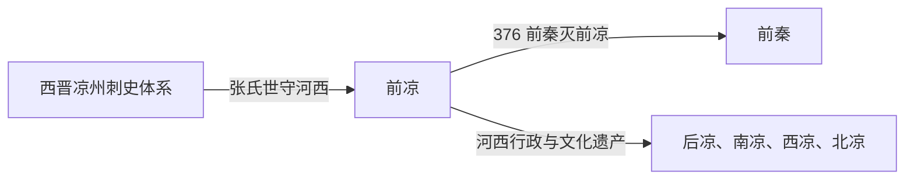

# 前凉

> 导航：[晋](/%E4%BA%BA%E6%96%87%E7%A7%91%E5%AD%A6/%E5%8E%86%E5%8F%B2/%E4%B8%9C%E4%BA%9A/%E4%B8%AD%E5%9B%BD/%E6%99%8B/README.md) / [十六国](/%E4%BA%BA%E6%96%87%E7%A7%91%E5%AD%A6/%E5%8E%86%E5%8F%B2/%E4%B8%9C%E4%BA%9A/%E4%B8%AD%E5%9B%BD/%E6%99%8B/%E5%8D%81%E5%85%AD%E5%9B%BD/README.md) / [政权索引](/%E4%BA%BA%E6%96%87%E7%A7%91%E5%AD%A6/%E5%8E%86%E5%8F%B2/%E4%B8%9C%E4%BA%9A/%E4%B8%AD%E5%9B%BD/%E6%99%8B/%E5%8D%81%E5%85%AD%E5%9B%BD/%E6%94%BF%E6%9D%83/README.md) / [淝水之战前](/%E4%BA%BA%E6%96%87%E7%A7%91%E5%AD%A6/%E5%8E%86%E5%8F%B2/%E4%B8%9C%E4%BA%9A/%E4%B8%AD%E5%9B%BD/%E6%99%8B/%E5%8D%81%E5%85%AD%E5%9B%BD/%E6%B7%9D%E6%B0%B4%E4%B9%8B%E6%88%98%E5%89%8D.md) / [淝水之战后](/%E4%BA%BA%E6%96%87%E7%A7%91%E5%AD%A6/%E5%8E%86%E5%8F%B2/%E4%B8%9C%E4%BA%9A/%E4%B8%AD%E5%9B%BD/%E6%99%8B/%E5%8D%81%E5%85%AD%E5%9B%BD/%E6%B7%9D%E6%B0%B4%E4%B9%8B%E6%88%98%E5%90%8E.md)

## 时间

314年—376年。

## 别称

- 张凉

## 概括

前凉由汉族张氏据凉州发展而成，长期以姑臧为中心控制河西走廊。它在西晋灭亡后仍一度奉晋正朔，后逐渐独立，376年被前秦灭。

## 历史演进图

## 建立、治理与兴衰

张轨于301年出任凉州刺史，在西晋内乱中整顿河西治安、招纳中原流民并维持通往西域的交通。西晋灭亡后，张氏仍长期奉晋正朔并接受晋朝爵号，却在事实上世袭军政；因此前凉究竟从301年、314年还是张茂改元后的320年算独立，史学分期并不完全一致。本页正文以314年张寔袭位为主段，表中保留奠基者张轨和亡后复国者张大豫。

| 阶段 | 过程与重要事件 |
|---|---|
| 地方奠基（301年—320年） | 张轨、张寔经营姑臧，接纳流民、兴办学校、恢复铸币和农桑；继续使用晋愍帝建兴年号。 |
| 扩张强盛（320年—346年） | 张茂改元，张骏控制河西走廊并向西域、陇右拓展，345年称凉王。 |
| 宫廷动荡（346年—355年） | 张重华抵御后赵；其死后幼主、张祚和权臣反复废立，张祚称帝又被杀。 |
| 受制与灭亡（355年—376年） | 张玄靓、张天锡恢复对东晋名义臣属，但国力下降；376年前秦大军进入河西，张天锡出降。 |

前凉以姑臧为行政中心，沿用刺史府、郡县和中原礼法，同时依靠河西豪族、屯田和商路税收。它保存典籍、学校与佛教交流，使河西在中原战乱时期仍保持较强的文化连续性。

- **鼎盛条件**：河西走廊的绿洲农业和贸易、远离中原主战场、张氏早期较稳定的世袭与流民人才。
- **结构因素**：王室继承和权臣政治在张重华死后失控；有限人口难以同时防守陇右与西域通道。
- **外部压力**：后赵、前秦先后从关中西进，前凉对东晋的名义臣属无法换来直接援军。
- **直接触发**：前秦376年完成多路动员，张天锡出战失利后姑臧孤立，遂投降；张大豫386年的复国尝试仅是短暂余波。

## 说明

- 301年，张轨被西晋任为凉州刺史。
- 314年，张轨死，张寔袭位；西晋灭亡后仍据凉州，并使用晋建兴年号。
- 320年，张茂改元永元，前凉成为独立政权。
- 345年，张骏称凉王，以凉州为国号。
- 376年，前秦苻坚攻凉，张天锡投降，前凉灭亡。

## 世系表

| 顺序 | 姓名 | 庙号 | 谥号 / 称号 | 年号 | 在位时间 | 生卒时间 | 与前任关系 | 关键事件 / 备注 / 说明 |
|---:|---|---|---|---|---|---|---|---|
| 1 | 张轨 | 太祖 | 武王 / 西平郡武公 | 无 | 301年—314年 | 255年—314年 | 开创者 | 晋凉州刺史，奠定张氏据凉州基础。 |
| 2 | 张寔 | 高祖 | 昭王 / 西平郡元公 | 无 | 314年—320年 | 271年—320年 | 张轨子 | 袭据凉州，西晋灭后仍奉晋年号。 |
| 3 | 张茂 | 太宗 | 成王 / 成烈王 / 西平郡成公 | 永元 | 320年—324年 | 277年—324年 | 张轨子，张寔弟 | 改元永元，独立性增强。 |
| 4 | 张骏 | 世祖 | 文王 / 西平郡忠成公 | 太元等 | 324年—346年 | 307年—346年 | 张寔子 | 称凉王，前凉强盛。 |
| 5 | 张重华 | 世宗 | 桓王 / 西平郡敬烈公 | 永乐 | 346年—353年 | 327年—353年 | 张骏子 | 抵御后赵、前秦压力。 |
| 6 | 张曜灵 | 无 | 西平郡哀公 | 无 | 353年 | 344年—355年 | 张重华子 | 年幼即位，被张祚废。 |
| 7 | 张祚 | 无 | 威王 | 和平 | 353年—355年 | 不详—355年 | 张骏庶长子 | 称帝，后被杀。 |
| 8 | 张玄靓 | 无 | 冲王 / 西平郡敬悼公 | 升平等 | 355年—363年 | 350年—363年 | 张重华子 | 去帝号，政权受权臣控制。 |
| 9 | 张天锡 | 无 | 西平郡悼公 | 太清 | 363年—376年 | 346年—406年 | 张骏子 | 376年降前秦，前凉亡。 |
| 复国 | 张大豫 | 无 | 无 | 凤凰 | 386年—387年 | 生年不详—387年 | 张天锡世子 | 前凉灭亡十年后在河西起兵，未恢复姑臧主政权；旋为后凉击败。 |

## 演变关系

- 后一节点：[前秦](/%E4%BA%BA%E6%96%87%E7%A7%91%E5%AD%A6/%E5%8E%86%E5%8F%B2/%E4%B8%9C%E4%BA%9A/%E4%B8%AD%E5%9B%BD/%E6%99%8B/%E5%8D%81%E5%85%AD%E5%9B%BD/%E6%94%BF%E6%9D%83/%E5%89%8D%E7%A7%A6.md)。
- 河西后续：[后凉](/%E4%BA%BA%E6%96%87%E7%A7%91%E5%AD%A6/%E5%8E%86%E5%8F%B2/%E4%B8%9C%E4%BA%9A/%E4%B8%AD%E5%9B%BD/%E6%99%8B/%E5%8D%81%E5%85%AD%E5%9B%BD/%E6%94%BF%E6%9D%83/%E5%90%8E%E5%87%89.md)、[南凉](/%E4%BA%BA%E6%96%87%E7%A7%91%E5%AD%A6/%E5%8E%86%E5%8F%B2/%E4%B8%9C%E4%BA%9A/%E4%B8%AD%E5%9B%BD/%E6%99%8B/%E5%8D%81%E5%85%AD%E5%9B%BD/%E6%94%BF%E6%9D%83/%E5%8D%97%E5%87%89.md)、[西凉](/%E4%BA%BA%E6%96%87%E7%A7%91%E5%AD%A6/%E5%8E%86%E5%8F%B2/%E4%B8%9C%E4%BA%9A/%E4%B8%AD%E5%9B%BD/%E6%99%8B/%E5%8D%81%E5%85%AD%E5%9B%BD/%E6%94%BF%E6%9D%83/%E8%A5%BF%E5%87%89.md)、[北凉](/%E4%BA%BA%E6%96%87%E7%A7%91%E5%AD%A6/%E5%8E%86%E5%8F%B2/%E4%B8%9C%E4%BA%9A/%E4%B8%AD%E5%9B%BD/%E6%99%8B/%E5%8D%81%E5%85%AD%E5%9B%BD/%E6%94%BF%E6%9D%83/%E5%8C%97%E5%87%89.md)。

## 相关笔记

- [政权索引](/%E4%BA%BA%E6%96%87%E7%A7%91%E5%AD%A6/%E5%8E%86%E5%8F%B2/%E4%B8%9C%E4%BA%9A/%E4%B8%AD%E5%9B%BD/%E6%99%8B/%E5%8D%81%E5%85%AD%E5%9B%BD/%E6%94%BF%E6%9D%83/README.md)
- [十六国](/%E4%BA%BA%E6%96%87%E7%A7%91%E5%AD%A6/%E5%8E%86%E5%8F%B2/%E4%B8%9C%E4%BA%9A/%E4%B8%AD%E5%9B%BD/%E6%99%8B/%E5%8D%81%E5%85%AD%E5%9B%BD/README.md)
- [十六国时空图](/%E4%BA%BA%E6%96%87%E7%A7%91%E5%AD%A6/%E5%8E%86%E5%8F%B2/%E4%B8%9C%E4%BA%9A/%E4%B8%AD%E5%9B%BD/%E6%99%8B/%E5%8D%81%E5%85%AD%E5%9B%BD/%E5%8D%81%E5%85%AD%E5%9B%BD%E6%97%B6%E7%A9%BA%E5%9B%BE.md)
- [淝水之战前](/%E4%BA%BA%E6%96%87%E7%A7%91%E5%AD%A6/%E5%8E%86%E5%8F%B2/%E4%B8%9C%E4%BA%9A/%E4%B8%AD%E5%9B%BD/%E6%99%8B/%E5%8D%81%E5%85%AD%E5%9B%BD/%E6%B7%9D%E6%B0%B4%E4%B9%8B%E6%88%98%E5%89%8D.md)
- [淝水之战后](/%E4%BA%BA%E6%96%87%E7%A7%91%E5%AD%A6/%E5%8E%86%E5%8F%B2/%E4%B8%9C%E4%BA%9A/%E4%B8%AD%E5%9B%BD/%E6%99%8B/%E5%8D%81%E5%85%AD%E5%9B%BD/%E6%B7%9D%E6%B0%B4%E4%B9%8B%E6%88%98%E5%90%8E.md)
