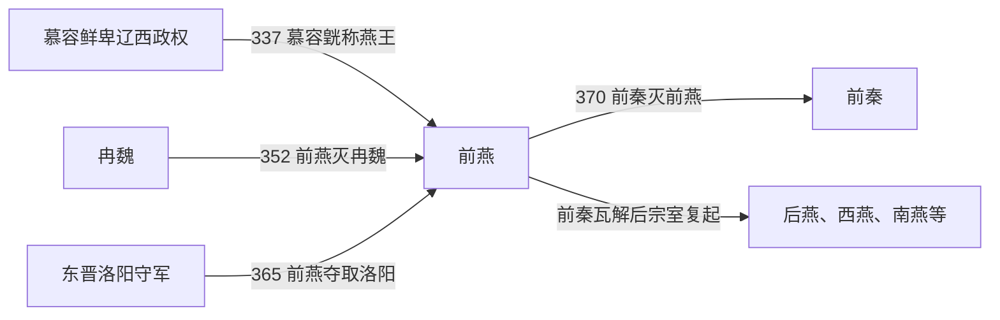

# 前燕

> 导航：[晋](/%E4%BA%BA%E6%96%87%E7%A7%91%E5%AD%A6/%E5%8E%86%E5%8F%B2/%E4%B8%9C%E4%BA%9A/%E4%B8%AD%E5%9B%BD/%E6%99%8B/README.md) / [十六国](/%E4%BA%BA%E6%96%87%E7%A7%91%E5%AD%A6/%E5%8E%86%E5%8F%B2/%E4%B8%9C%E4%BA%9A/%E4%B8%AD%E5%9B%BD/%E6%99%8B/%E5%8D%81%E5%85%AD%E5%9B%BD/README.md) / [政权索引](/%E4%BA%BA%E6%96%87%E7%A7%91%E5%AD%A6/%E5%8E%86%E5%8F%B2/%E4%B8%9C%E4%BA%9A/%E4%B8%AD%E5%9B%BD/%E6%99%8B/%E5%8D%81%E5%85%AD%E5%9B%BD/%E6%94%BF%E6%9D%83/README.md) / [淝水之战前](/%E4%BA%BA%E6%96%87%E7%A7%91%E5%AD%A6/%E5%8E%86%E5%8F%B2/%E4%B8%9C%E4%BA%9A/%E4%B8%AD%E5%9B%BD/%E6%99%8B/%E5%8D%81%E5%85%AD%E5%9B%BD/%E6%B7%9D%E6%B0%B4%E4%B9%8B%E6%88%98%E5%89%8D.md) / [淝水之战后](/%E4%BA%BA%E6%96%87%E7%A7%91%E5%AD%A6/%E5%8E%86%E5%8F%B2/%E4%B8%9C%E4%BA%9A/%E4%B8%AD%E5%9B%BD/%E6%99%8B/%E5%8D%81%E5%85%AD%E5%9B%BD/%E6%B7%9D%E6%B0%B4%E4%B9%8B%E6%88%98%E5%90%8E.md)

## 时间

337年—370年。

## 别称

- 慕容燕

## 概括

前燕由鲜卑慕容氏建立，从辽西、辽东逐步进入中原。它灭冉魏后据有河北、河南一带，370年被前秦灭。

## 历史演进图

## 建立、治理与兴衰

慕容廆、慕容皝长期经营辽西和辽东，吸纳中原流民、设置侨郡并任用汉人谋臣，使慕容部从鲜卑军事集团转化为兼具农耕财政和骑兵力量的政权。337年慕容皝称燕王是正式建国节点；慕容儁灭冉魏后称帝，统治中心由龙城转移到蓟、再到邺，完成从东北区域政权向中原帝国的转型。

| 阶段 | 过程与重要事件 |
|---|---|
| 辽西建国（337年—348年） | 慕容皝击败宇文部、段部等竞争者，342年击退后赵进攻并经营龙城。 |
| 入主中原（348年—360年） | 慕容儁南下，352年擒杀冉闵、占领邺城后称帝；迁都蓟，357年又迁邺。 |
| 扩张高峰（360年—369年） | 慕容暐幼年即位，慕容恪辅政；365年夺洛阳，疆域扩至黄河南北。 |
| 权力失衡与灭亡（369年—370年） | 慕容恪死后慕容评主政，慕容垂受排挤投前秦；370年王猛率秦军破燕主力、进占邺城。 |

前燕采用皇帝—尚书百官—州郡县的中原式框架，同时以慕容宗室和鲜卑部众控制精锐军队；迁都与侨民安置扩大了税源，但也增加了辽西旧部、河北士族和新占州郡之间的协调难度。

- **鼎盛条件**：辽西长期经营、骑兵优势、流民人才与农业资源、后赵和冉魏相继崩溃。
- **结构因素**：幼主继位后辅政机制依赖个别宗室；慕容评与慕容垂冲突，削弱最高统帅层。
- **外部压力**：东晋在河南争夺，前秦经改革后兵力、财力上升。
- **直接触发**：369年枋头之战后前燕为求前秦援助许割虎牢以西，继而失信；前秦以此出兵，燕军战败，慕容暐出逃被俘，前燕灭亡。

## 说明

- 337年，慕容皝自称燕王。
- 342年，前燕击败后赵大军，并建都龙城。
- 352年，慕容儁灭冉魏称帝，迁都蓟；357年迁都邺。
- 365年，前燕攻克洛阳，从东晋手中取得中原重镇。
- 370年，慕容暐出逃被前秦军俘获，前燕灭亡。

## 世系表

| 顺序 | 姓名 | 庙号 | 谥号 / 称号 | 年号 | 在位时间 | 生卒时间 | 与前任关系 | 关键事件 / 备注 / 说明 |
|---:|---|---|---|---|---|---|---|---|
| 追尊 | 慕容廆 | 高祖 | 武宣皇帝 / 燕武宣王 | 无 | 未正式称帝 | 269年—333年 | 慕容氏奠基者 | 经营辽西，前燕追尊。 |
| 1 | 慕容皝 | 太祖 | 文明皇帝 / 燕文明王 | 无 | 337年—348年称燕王 | 297年—348年 | 慕容廆子 | 337年自称燕王，是前燕正式建国者；帝号为后世追尊。 |
| 2 | 慕容儁 | 烈祖 | 景明皇帝 | 元玺、光寿 | 348年—360年 | 319年—360年 | 慕容皝子 | 先继燕王，352年灭冉魏后称帝，迁都蓟，后迁邺。 |
| 3 | 慕容暐 | 无 | 幽皇帝 | 建熙 | 360年—370年 | 350年—384年 | 慕容儁子 | 370年前秦攻邺，慕容暐被俘，前燕亡。 |

## 演变关系

- 前一节点：[冉魏](/%E4%BA%BA%E6%96%87%E7%A7%91%E5%AD%A6/%E5%8E%86%E5%8F%B2/%E4%B8%9C%E4%BA%9A/%E4%B8%AD%E5%9B%BD/%E6%99%8B/%E5%8D%81%E5%85%AD%E5%9B%BD/%E6%94%BF%E6%9D%83/%E5%86%89%E9%AD%8F.md)。
- 后一节点：[前秦](/%E4%BA%BA%E6%96%87%E7%A7%91%E5%AD%A6/%E5%8E%86%E5%8F%B2/%E4%B8%9C%E4%BA%9A/%E4%B8%AD%E5%9B%BD/%E6%99%8B/%E5%8D%81%E5%85%AD%E5%9B%BD/%E6%94%BF%E6%9D%83/%E5%89%8D%E7%A7%A6.md)。
- 后续燕系：[后燕](/%E4%BA%BA%E6%96%87%E7%A7%91%E5%AD%A6/%E5%8E%86%E5%8F%B2/%E4%B8%9C%E4%BA%9A/%E4%B8%AD%E5%9B%BD/%E6%99%8B/%E5%8D%81%E5%85%AD%E5%9B%BD/%E6%94%BF%E6%9D%83/%E5%90%8E%E7%87%95.md)、[西燕](/%E4%BA%BA%E6%96%87%E7%A7%91%E5%AD%A6/%E5%8E%86%E5%8F%B2/%E4%B8%9C%E4%BA%9A/%E4%B8%AD%E5%9B%BD/%E6%99%8B/%E5%8D%81%E5%85%AD%E5%9B%BD/%E6%94%BF%E6%9D%83/%E8%A5%BF%E7%87%95.md)、[南燕](/%E4%BA%BA%E6%96%87%E7%A7%91%E5%AD%A6/%E5%8E%86%E5%8F%B2/%E4%B8%9C%E4%BA%9A/%E4%B8%AD%E5%9B%BD/%E6%99%8B/%E5%8D%81%E5%85%AD%E5%9B%BD/%E6%94%BF%E6%9D%83/%E5%8D%97%E7%87%95.md)、[北燕](/%E4%BA%BA%E6%96%87%E7%A7%91%E5%AD%A6/%E5%8E%86%E5%8F%B2/%E4%B8%9C%E4%BA%9A/%E4%B8%AD%E5%9B%BD/%E6%99%8B/%E5%8D%81%E5%85%AD%E5%9B%BD/%E6%94%BF%E6%9D%83/%E5%8C%97%E7%87%95.md)。

## 相关笔记

- [政权索引](/%E4%BA%BA%E6%96%87%E7%A7%91%E5%AD%A6/%E5%8E%86%E5%8F%B2/%E4%B8%9C%E4%BA%9A/%E4%B8%AD%E5%9B%BD/%E6%99%8B/%E5%8D%81%E5%85%AD%E5%9B%BD/%E6%94%BF%E6%9D%83/README.md)
- [十六国](/%E4%BA%BA%E6%96%87%E7%A7%91%E5%AD%A6/%E5%8E%86%E5%8F%B2/%E4%B8%9C%E4%BA%9A/%E4%B8%AD%E5%9B%BD/%E6%99%8B/%E5%8D%81%E5%85%AD%E5%9B%BD/README.md)
- [十六国时空图](/%E4%BA%BA%E6%96%87%E7%A7%91%E5%AD%A6/%E5%8E%86%E5%8F%B2/%E4%B8%9C%E4%BA%9A/%E4%B8%AD%E5%9B%BD/%E6%99%8B/%E5%8D%81%E5%85%AD%E5%9B%BD/%E5%8D%81%E5%85%AD%E5%9B%BD%E6%97%B6%E7%A9%BA%E5%9B%BE.md)
- [淝水之战前](/%E4%BA%BA%E6%96%87%E7%A7%91%E5%AD%A6/%E5%8E%86%E5%8F%B2/%E4%B8%9C%E4%BA%9A/%E4%B8%AD%E5%9B%BD/%E6%99%8B/%E5%8D%81%E5%85%AD%E5%9B%BD/%E6%B7%9D%E6%B0%B4%E4%B9%8B%E6%88%98%E5%89%8D.md)
- [淝水之战后](/%E4%BA%BA%E6%96%87%E7%A7%91%E5%AD%A6/%E5%8E%86%E5%8F%B2/%E4%B8%9C%E4%BA%9A/%E4%B8%AD%E5%9B%BD/%E6%99%8B/%E5%8D%81%E5%85%AD%E5%9B%BD/%E6%B7%9D%E6%B0%B4%E4%B9%8B%E6%88%98%E5%90%8E.md)
