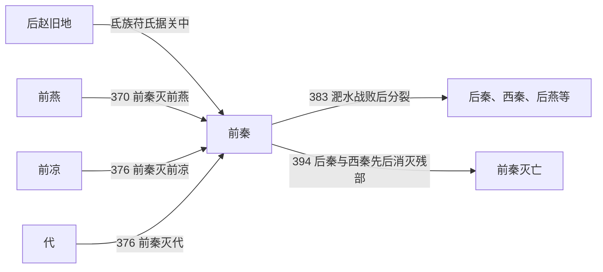

# 前秦

> 导航：[晋](/%E4%BA%BA%E6%96%87%E7%A7%91%E5%AD%A6/%E5%8E%86%E5%8F%B2/%E4%B8%9C%E4%BA%9A/%E4%B8%AD%E5%9B%BD/%E6%99%8B/README.md) / [十六国](/%E4%BA%BA%E6%96%87%E7%A7%91%E5%AD%A6/%E5%8E%86%E5%8F%B2/%E4%B8%9C%E4%BA%9A/%E4%B8%AD%E5%9B%BD/%E6%99%8B/%E5%8D%81%E5%85%AD%E5%9B%BD/README.md) / [政权索引](/%E4%BA%BA%E6%96%87%E7%A7%91%E5%AD%A6/%E5%8E%86%E5%8F%B2/%E4%B8%9C%E4%BA%9A/%E4%B8%AD%E5%9B%BD/%E6%99%8B/%E5%8D%81%E5%85%AD%E5%9B%BD/%E6%94%BF%E6%9D%83/README.md) / [淝水之战前](/%E4%BA%BA%E6%96%87%E7%A7%91%E5%AD%A6/%E5%8E%86%E5%8F%B2/%E4%B8%9C%E4%BA%9A/%E4%B8%AD%E5%9B%BD/%E6%99%8B/%E5%8D%81%E5%85%AD%E5%9B%BD/%E6%B7%9D%E6%B0%B4%E4%B9%8B%E6%88%98%E5%89%8D.md) / [淝水之战后](/%E4%BA%BA%E6%96%87%E7%A7%91%E5%AD%A6/%E5%8E%86%E5%8F%B2/%E4%B8%9C%E4%BA%9A/%E4%B8%AD%E5%9B%BD/%E6%99%8B/%E5%8D%81%E5%85%AD%E5%9B%BD/%E6%B7%9D%E6%B0%B4%E4%B9%8B%E6%88%98%E5%90%8E.md)

## 时间

351年—394年。

## 别称

- 苻秦

## 概括

前秦由氐族苻氏建立，苻坚时期灭前燕、前凉、代，基本统一北方。383年淝水之战败于东晋后瓦解，394年灭亡。

## 历史演进图

## 建立、治理与兴衰

后赵崩溃时，苻洪、苻健率氐族部众进入关中，利用长安地区的战略位置和各族流民重建秩序。苻坚357年夺位后任用王猛，整顿吏治、压制豪强、兴修农业并吸纳汉族及各部精英，前秦因而从关中区域政权扩张为多族帝国。

| 阶段 | 过程与重要事件 |
|---|---|
| 关中建国（351年—357年） | 苻健称天王、后称帝，定都长安；苻生统治失序，被苻坚废杀。 |
| 改革与东进（357年—370年） | 王猛主持军政，平定内部反对力量；370年攻灭前燕，取得河北和关东人口资源。 |
| 北方统一（371年—382年） | 先后控制仇池、益梁部分地区，376年灭前凉与代；吕光西征使影响扩及西域。 |
| 淝水失败与瓦解（383年—394年） | 南征东晋失败后，慕容垂、姚苌、乞伏氏等相继脱离；苻坚385年被姚苌杀，残余政权在晋阳、陇右辗转抵抗。 |

统治结构以皇帝和中央官僚为核心，又保留各部首领的军事动员能力；王猛在世时能通过法令、任官和军队调度制约地方集团。帝国迅速吞并多政权后，却没有足够时间把慕容、羌、鲜卑和河西等新附力量整合为稳定的财政、军政体系。

- **鼎盛条件**：关中粮源和地势、王猛改革、对前燕等竞争者逐个击破，以及相对包容的用人政策。
- **结构因素**：扩张过快，新附贵族仍保存部众和地域网络；继承与统帅体系围绕苻坚个人，中央缺乏能替代王猛的协调者。
- **外部压力**：东晋拥有长江—淮河防线，北方各降附集团等待脱离机会，西线和东北边防又牵制兵力。
- **直接触发**：383年大军在淝水失利，军事威望和控制链同时崩断；苻坚被姚苌杀后，各地残余互不相救，至394年苻登、苻崇先后败亡。

## 说明

- 350年，氐族苻洪占据关中，称三秦王。
- 352年，苻健称帝，定都长安，国号“秦”。
- 370年，前秦灭前燕。
- 373年，前秦攻取东晋梁、益二州。
- 376年，前秦灭前凉、代，基本统一北方。
- 382年，苻坚命吕光驻西域，前秦势力达到高峰。
- 383年，苻坚南征东晋，淝水之战失败，前秦瓦解。
- 394年，苻登被后秦姚兴擒杀；苻崇继位后攻西秦，被乞伏轲弹斩杀，前秦灭亡。

## 世系表

| 顺序 | 姓名 | 庙号 | 谥号 / 称号 | 年号 | 在位时间 | 生卒时间 | 与前任关系 | 关键事件 / 备注 / 说明 |
|---:|---|---|---|---|---|---|---|---|
| 追尊 | 苻洪 | 太祖 | 惠武皇帝 | 无 | 未正式称帝 | 284年—350年 | 苻氏奠基者 | 据关中，称三秦王，死后追尊。 |
| 1 | 苻健 | 高祖 | 景明皇帝 | 皇始 | 351年—355年 | 317年—355年 | 苻洪子 | 352年称帝，定都长安。 |
| 2 | 苻生 | 无 | 越厉王 | 寿光 | 355年—357年 | 335年—357年 | 苻健子 | 暴虐失政，被苻坚废杀。 |
| 追尊 | 苻雄 | 无 | 文桓皇帝 | 无 | 未正式在位 | 319年—354年 | 苻坚父 | 苻坚追尊。 |
| 3 | 苻坚 | 世祖 | 宣昭皇帝 / 文昭皇帝 / 壮烈天王 | 永兴、甘露、建元 | 357年—385年 | 338年—385年 | 苻雄子，苻生族弟 | 任用王猛，统一北方；383年淝水之战失败，385年被后秦姚苌杀。 |
| 4 | 苻丕 | 无 | 哀平皇帝 | 太安 | 385年—386年 | 不详—386年 | 苻坚庶长子 | 在邺称帝，兵败后被东晋将领杀。 |
| 5 | 苻登 | 太宗 | 高皇帝 | 太初 | 386年—394年 | 343年—394年 | 苻坚族孙 | 继续抗后秦，394年被姚兴俘杀。 |
| 6 | 苻崇 | 无 | 无 | 延初 | 394年 | 不详—394年 | 苻登子 | 攻西秦时被杀，前秦亡。 |

## 演变关系

- 前一节点：[后赵](/%E4%BA%BA%E6%96%87%E7%A7%91%E5%AD%A6/%E5%8E%86%E5%8F%B2/%E4%B8%9C%E4%BA%9A/%E4%B8%AD%E5%9B%BD/%E6%99%8B/%E5%8D%81%E5%85%AD%E5%9B%BD/%E6%94%BF%E6%9D%83/%E5%90%8E%E8%B5%B5.md)旧地。
- 关键事件：383年淝水之战。
- 后续分裂：[后秦](/%E4%BA%BA%E6%96%87%E7%A7%91%E5%AD%A6/%E5%8E%86%E5%8F%B2/%E4%B8%9C%E4%BA%9A/%E4%B8%AD%E5%9B%BD/%E6%99%8B/%E5%8D%81%E5%85%AD%E5%9B%BD/%E6%94%BF%E6%9D%83/%E5%90%8E%E7%A7%A6.md)、[西秦](/%E4%BA%BA%E6%96%87%E7%A7%91%E5%AD%A6/%E5%8E%86%E5%8F%B2/%E4%B8%9C%E4%BA%9A/%E4%B8%AD%E5%9B%BD/%E6%99%8B/%E5%8D%81%E5%85%AD%E5%9B%BD/%E6%94%BF%E6%9D%83/%E8%A5%BF%E7%A7%A6.md)、[后燕](/%E4%BA%BA%E6%96%87%E7%A7%91%E5%AD%A6/%E5%8E%86%E5%8F%B2/%E4%B8%9C%E4%BA%9A/%E4%B8%AD%E5%9B%BD/%E6%99%8B/%E5%8D%81%E5%85%AD%E5%9B%BD/%E6%94%BF%E6%9D%83/%E5%90%8E%E7%87%95.md)、[后凉](/%E4%BA%BA%E6%96%87%E7%A7%91%E5%AD%A6/%E5%8E%86%E5%8F%B2/%E4%B8%9C%E4%BA%9A/%E4%B8%AD%E5%9B%BD/%E6%99%8B/%E5%8D%81%E5%85%AD%E5%9B%BD/%E6%94%BF%E6%9D%83/%E5%90%8E%E5%87%89.md)等兴起。

## 相关笔记

- [政权索引](/%E4%BA%BA%E6%96%87%E7%A7%91%E5%AD%A6/%E5%8E%86%E5%8F%B2/%E4%B8%9C%E4%BA%9A/%E4%B8%AD%E5%9B%BD/%E6%99%8B/%E5%8D%81%E5%85%AD%E5%9B%BD/%E6%94%BF%E6%9D%83/README.md)
- [十六国](/%E4%BA%BA%E6%96%87%E7%A7%91%E5%AD%A6/%E5%8E%86%E5%8F%B2/%E4%B8%9C%E4%BA%9A/%E4%B8%AD%E5%9B%BD/%E6%99%8B/%E5%8D%81%E5%85%AD%E5%9B%BD/README.md)
- [十六国时空图](/%E4%BA%BA%E6%96%87%E7%A7%91%E5%AD%A6/%E5%8E%86%E5%8F%B2/%E4%B8%9C%E4%BA%9A/%E4%B8%AD%E5%9B%BD/%E6%99%8B/%E5%8D%81%E5%85%AD%E5%9B%BD/%E5%8D%81%E5%85%AD%E5%9B%BD%E6%97%B6%E7%A9%BA%E5%9B%BE.md)
- [淝水之战前](/%E4%BA%BA%E6%96%87%E7%A7%91%E5%AD%A6/%E5%8E%86%E5%8F%B2/%E4%B8%9C%E4%BA%9A/%E4%B8%AD%E5%9B%BD/%E6%99%8B/%E5%8D%81%E5%85%AD%E5%9B%BD/%E6%B7%9D%E6%B0%B4%E4%B9%8B%E6%88%98%E5%89%8D.md)
- [淝水之战后](/%E4%BA%BA%E6%96%87%E7%A7%91%E5%AD%A6/%E5%8E%86%E5%8F%B2/%E4%B8%9C%E4%BA%9A/%E4%B8%AD%E5%9B%BD/%E6%99%8B/%E5%8D%81%E5%85%AD%E5%9B%BD/%E6%B7%9D%E6%B0%B4%E4%B9%8B%E6%88%98%E5%90%8E.md)
