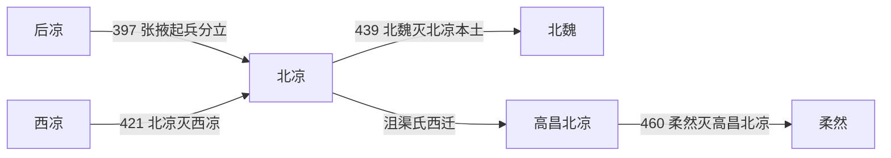

# 北凉

> 导航：[晋](/%E4%BA%BA%E6%96%87%E7%A7%91%E5%AD%A6/%E5%8E%86%E5%8F%B2/%E4%B8%9C%E4%BA%9A/%E4%B8%AD%E5%9B%BD/%E6%99%8B/README.md) / [十六国](/%E4%BA%BA%E6%96%87%E7%A7%91%E5%AD%A6/%E5%8E%86%E5%8F%B2/%E4%B8%9C%E4%BA%9A/%E4%B8%AD%E5%9B%BD/%E6%99%8B/%E5%8D%81%E5%85%AD%E5%9B%BD/README.md) / [政权索引](/%E4%BA%BA%E6%96%87%E7%A7%91%E5%AD%A6/%E5%8E%86%E5%8F%B2/%E4%B8%9C%E4%BA%9A/%E4%B8%AD%E5%9B%BD/%E6%99%8B/%E5%8D%81%E5%85%AD%E5%9B%BD/%E6%94%BF%E6%9D%83/README.md) / [淝水之战前](/%E4%BA%BA%E6%96%87%E7%A7%91%E5%AD%A6/%E5%8E%86%E5%8F%B2/%E4%B8%9C%E4%BA%9A/%E4%B8%AD%E5%9B%BD/%E6%99%8B/%E5%8D%81%E5%85%AD%E5%9B%BD/%E6%B7%9D%E6%B0%B4%E4%B9%8B%E6%88%98%E5%89%8D.md) / [淝水之战后](/%E4%BA%BA%E6%96%87%E7%A7%91%E5%AD%A6/%E5%8E%86%E5%8F%B2/%E4%B8%9C%E4%BA%9A/%E4%B8%AD%E5%9B%BD/%E6%99%8B/%E5%8D%81%E5%85%AD%E5%9B%BD/%E6%B7%9D%E6%B0%B4%E4%B9%8B%E6%88%98%E5%90%8E.md)

## 时间

397年—439年；高昌北凉439年—460年。

## 别称

- 沮渠凉
- 高昌北凉

## 概括

北凉最初由段业建立，后由卢水胡沮渠氏掌权。它是河西诸凉中最后被北魏消灭的政权，439年北魏灭北凉，通常视为十六国时代结束。

## 历史演进图

## 建立、治理与兴衰

397年卢水胡沮渠蒙逊、沮渠男成起兵反后凉，拥立汉人官员段业，以降低其他豪强的戒心。401年蒙逊杀段业、自掌政权。北凉能长期存在，依靠张掖、姑臧等绿洲农业，控制河西中段商路，并在北魏、后秦、南凉、西凉和西域诸国之间灵活结盟。

| 阶段 | 过程与重要事件 |
|---|---|
| 段业名义统治（397年—401年） | 张掖分立，沮渠氏掌军；段业与军事实力者冲突后被杀。 |
| 蒙逊扩张（401年—421年） | 沮渠蒙逊改元，逐步击败后凉、南凉；410年左右取得姑臧，421年灭西凉，统一河西大部。 |
| 守成与文化交流（421年—439年） | 与北魏、刘宋等互遣使节，河西佛教翻译、石窟和商贸发展；牧犍继位后同时接受多方册封。 |
| 本土灭亡与西迁（439年—460年） | 北魏攻姑臧，牧犍出降；无讳、安周率余部经鄯善至高昌续立，460年被柔然消灭。 |

北凉以沮渠氏军权为核心，任用汉人官僚治理郡县和绿洲，也通过婚姻、册封与贸易联结周边。其本土灭亡时间为439年；流亡高昌的延续是否仍算同一北凉，表中分段注明。

- **鼎盛条件**：河西中段人口与交通、蒙逊的军事和外交能力、其他诸凉相互牵制。
- **结构因素**：绿洲国家资源上限明显，宗族军事统治对新兼并地区的整合有限。
- **外部压力**：北魏统一关东、关中后拥有压倒性兵力，并要求北凉接受更深控制。
- **直接触发**：牧犍与北魏关系恶化，439年魏军长驱至姑臧，城中外援断绝而投降；高昌余部则因柔然进攻于460年终结。

## 说明

- 401年，沮渠蒙逊灭段业，仍称凉州牧，改元永安。
- 421年，北凉灭西凉。
- 439年，北魏围攻姑臧，沮渠牧犍出降，北凉本土灭亡，北魏统一华北。
- 北凉亡后，沮渠牧犍弟沮渠无讳西行至高昌，建立高昌北凉。
- 460年，高昌北凉被柔然攻灭。

## 世系表

| 顺序 | 姓名 | 庙号 | 谥号 / 称号 | 年号 | 在位时间 | 生卒时间 | 与前任关系 | 关键事件 / 备注 / 说明 |
|---:|---|---|---|---|---|---|---|---|
| 1 | 段业 | 无 | 无 | 神玺 | 397年—401年 | 不详—401年 | 开国君主 | 原后凉官员，被沮渠氏拥立，后被沮渠蒙逊杀。 |
| 2 | 沮渠蒙逊 | 太祖 | 武宣王 | 永安、玄始、承玄、义和 | 401年—433年 | 368年—433年 | 段业部将 | 掌权后成为北凉实际建立者，421年灭西凉。 |
| 3 | 沮渠牧犍 | 无 | 哀王 | 承和 | 433年—439年 | 不详—447年 | 沮渠蒙逊子 | 439年北魏攻姑臧，出降，北凉本土亡。 |
| 4 | 沮渠无讳 | 无 | 无 | 承平 | 439年—444年 | 不详—444年 | 沮渠蒙逊子，沮渠牧犍弟 | 西走高昌，建立流亡政权，称高昌北凉。 |
| 5 | 沮渠安周 | 无 | 无 | 承平 | 444年—460年 | 不详—460年 | 沮渠无讳弟 | 460年高昌北凉被柔然灭。 |

## 演变关系

- 前一节点：[后凉](/%E4%BA%BA%E6%96%87%E7%A7%91%E5%AD%A6/%E5%8E%86%E5%8F%B2/%E4%B8%9C%E4%BA%9A/%E4%B8%AD%E5%9B%BD/%E6%99%8B/%E5%8D%81%E5%85%AD%E5%9B%BD/%E6%94%BF%E6%9D%83/%E5%90%8E%E5%87%89.md)瓦解。
- 并列政权：[南凉](/%E4%BA%BA%E6%96%87%E7%A7%91%E5%AD%A6/%E5%8E%86%E5%8F%B2/%E4%B8%9C%E4%BA%9A/%E4%B8%AD%E5%9B%BD/%E6%99%8B/%E5%8D%81%E5%85%AD%E5%9B%BD/%E6%94%BF%E6%9D%83/%E5%8D%97%E5%87%89.md)、[西凉](/%E4%BA%BA%E6%96%87%E7%A7%91%E5%AD%A6/%E5%8E%86%E5%8F%B2/%E4%B8%9C%E4%BA%9A/%E4%B8%AD%E5%9B%BD/%E6%99%8B/%E5%8D%81%E5%85%AD%E5%9B%BD/%E6%94%BF%E6%9D%83/%E8%A5%BF%E5%87%89.md)。
- 后一节点：北魏统一华北。

## 相关笔记

- [政权索引](/%E4%BA%BA%E6%96%87%E7%A7%91%E5%AD%A6/%E5%8E%86%E5%8F%B2/%E4%B8%9C%E4%BA%9A/%E4%B8%AD%E5%9B%BD/%E6%99%8B/%E5%8D%81%E5%85%AD%E5%9B%BD/%E6%94%BF%E6%9D%83/README.md)
- [十六国](/%E4%BA%BA%E6%96%87%E7%A7%91%E5%AD%A6/%E5%8E%86%E5%8F%B2/%E4%B8%9C%E4%BA%9A/%E4%B8%AD%E5%9B%BD/%E6%99%8B/%E5%8D%81%E5%85%AD%E5%9B%BD/README.md)
- [十六国时空图](/%E4%BA%BA%E6%96%87%E7%A7%91%E5%AD%A6/%E5%8E%86%E5%8F%B2/%E4%B8%9C%E4%BA%9A/%E4%B8%AD%E5%9B%BD/%E6%99%8B/%E5%8D%81%E5%85%AD%E5%9B%BD/%E5%8D%81%E5%85%AD%E5%9B%BD%E6%97%B6%E7%A9%BA%E5%9B%BE.md)
- [淝水之战前](/%E4%BA%BA%E6%96%87%E7%A7%91%E5%AD%A6/%E5%8E%86%E5%8F%B2/%E4%B8%9C%E4%BA%9A/%E4%B8%AD%E5%9B%BD/%E6%99%8B/%E5%8D%81%E5%85%AD%E5%9B%BD/%E6%B7%9D%E6%B0%B4%E4%B9%8B%E6%88%98%E5%89%8D.md)
- [淝水之战后](/%E4%BA%BA%E6%96%87%E7%A7%91%E5%AD%A6/%E5%8E%86%E5%8F%B2/%E4%B8%9C%E4%BA%9A/%E4%B8%AD%E5%9B%BD/%E6%99%8B/%E5%8D%81%E5%85%AD%E5%9B%BD/%E6%B7%9D%E6%B0%B4%E4%B9%8B%E6%88%98%E5%90%8E.md)
