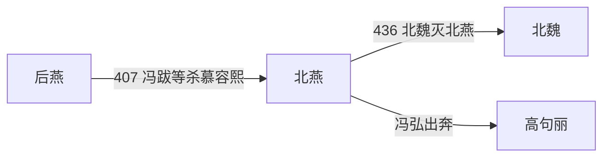

# 北燕

> 导航：[晋](/%E4%BA%BA%E6%96%87%E7%A7%91%E5%AD%A6/%E5%8E%86%E5%8F%B2/%E4%B8%9C%E4%BA%9A/%E4%B8%AD%E5%9B%BD/%E6%99%8B/README.md) / [十六国](/%E4%BA%BA%E6%96%87%E7%A7%91%E5%AD%A6/%E5%8E%86%E5%8F%B2/%E4%B8%9C%E4%BA%9A/%E4%B8%AD%E5%9B%BD/%E6%99%8B/%E5%8D%81%E5%85%AD%E5%9B%BD/README.md) / [政权索引](/%E4%BA%BA%E6%96%87%E7%A7%91%E5%AD%A6/%E5%8E%86%E5%8F%B2/%E4%B8%9C%E4%BA%9A/%E4%B8%AD%E5%9B%BD/%E6%99%8B/%E5%8D%81%E5%85%AD%E5%9B%BD/%E6%94%BF%E6%9D%83/README.md) / [淝水之战前](/%E4%BA%BA%E6%96%87%E7%A7%91%E5%AD%A6/%E5%8E%86%E5%8F%B2/%E4%B8%9C%E4%BA%9A/%E4%B8%AD%E5%9B%BD/%E6%99%8B/%E5%8D%81%E5%85%AD%E5%9B%BD/%E6%B7%9D%E6%B0%B4%E4%B9%8B%E6%88%98%E5%89%8D.md) / [淝水之战后](/%E4%BA%BA%E6%96%87%E7%A7%91%E5%AD%A6/%E5%8E%86%E5%8F%B2/%E4%B8%9C%E4%BA%9A/%E4%B8%AD%E5%9B%BD/%E6%99%8B/%E5%8D%81%E5%85%AD%E5%9B%BD/%E6%B7%9D%E6%B0%B4%E4%B9%8B%E6%88%98%E5%90%8E.md)

## 时间

407年—436年。

## 别称

- 冯燕
- 高燕

## 概括

北燕由后燕将领冯跋拥立高云建立，后由冯氏掌权。它承接后燕辽西旧地，436年被北魏灭。

## 历史演进图

## 建立、治理与兴衰

后燕末年，冯跋、张兴等在龙城发动政变，拥立高云。高云本为高句丽王族后裔、慕容宝养子，因此407年至409年究竟算北燕开端还是后燕最后阶段，史学分期存在差异；本页依常见做法自407年起列北燕，并在世系表保留高云。409年高云被近侍杀死，冯跋平乱即位，冯氏政权正式形成。

| 阶段 | 过程与重要事件 |
|---|---|
| 政变过渡（407年—409年） | 冯跋集团推翻慕容熙，仍用燕号；高云统治依赖政变功臣，最终死于近侍之手。 |
| 冯跋稳定期（409年—430年） | 减轻部分徭役、安抚鲜卑和汉人部众，以龙城为中心维持辽西；在北魏、高句丽和柔然之间遣使结援。 |
| 继承冲突（430年） | 冯跋病重，弟冯弘发动政变夺位，杀冯跋诸子，王室内部支持基础受损。 |
| 北魏征服（430年—436年） | 北魏持续攻取属城、迁走人口；436年大军逼龙城，冯弘弃城奔高句丽，北燕灭亡。 |

北燕沿用中原官制和州郡名号，实际依赖冯氏宗族、后燕旧军与辽西地方豪强。它的财政人口有限，外交均衡比大规模扩张更重要。

- **稳定条件**：龙城旧有行政与军事设施、多族旧部共同维持地方秩序，以及北魏早期尚需兼顾其他战线。
- **结构因素**：疆域狭窄、人口不断被迁走，王位继承又以政变解决，难以形成长期凝聚力。
- **外部压力**：北魏统一河北后持续东进，高句丽和柔然只能提供有限牵制。
- **直接触发**：冯弘拒绝北魏控制并失去外围城镇；436年北魏围逼龙城，冯弘出逃，国家机构随之瓦解。

## 说明

- 407年，冯跋灭后燕，拥立高云为天王，建都龙城，仍沿用燕号。
- 409年，高云被部下杀死，冯跋平定政变后即天王位。
- 北燕主要据有今辽宁西南部和河北东北部。
- 436年，北燕被北魏所灭。

## 世系表

| 顺序 | 姓名 | 庙号 | 谥号 / 称号 | 年号 | 在位时间 | 生卒时间 | 与前任关系 | 关键事件 / 备注 / 说明 |
|---:|---|---|---|---|---|---|---|---|
| 1 | 高云（慕容云） | 无 | 惠懿皇帝 | 正始 | 407年—409年 | 不详—409年 | 后燕慕容宝养子 | 冯跋等杀慕容熙后拥立为天王。 |
| 追尊 | 冯和 | 无 | 元皇帝 | 无 | 未正式在位 | 不详 | 冯跋祖父 | 冯跋追谥。 |
| 追尊 | 冯安 | 无 | 宣皇帝 | 无 | 未正式在位 | 不详 | 冯跋父 | 冯跋追谥。 |
| 2 | 冯跋 | 太祖 | 文成皇帝 | 太平 | 409年—430年 | 不详—430年 | 北燕实际建立者 | 高云被杀后即天王位。 |
| 3 | 冯弘 | 无 | 昭成皇帝 | 太兴 | 430年—436年 | 不详—438年 | 冯跋弟 | 436年北魏攻破龙城，北燕亡；冯弘奔高句丽。 |

## 演变关系

- 前一节点：[后燕](/%E4%BA%BA%E6%96%87%E7%A7%91%E5%AD%A6/%E5%8E%86%E5%8F%B2/%E4%B8%9C%E4%BA%9A/%E4%B8%AD%E5%9B%BD/%E6%99%8B/%E5%8D%81%E5%85%AD%E5%9B%BD/%E6%94%BF%E6%9D%83/%E5%90%8E%E7%87%95.md)。
- 后一节点：北魏灭北燕。

## 相关笔记

- [政权索引](/%E4%BA%BA%E6%96%87%E7%A7%91%E5%AD%A6/%E5%8E%86%E5%8F%B2/%E4%B8%9C%E4%BA%9A/%E4%B8%AD%E5%9B%BD/%E6%99%8B/%E5%8D%81%E5%85%AD%E5%9B%BD/%E6%94%BF%E6%9D%83/README.md)
- [十六国](/%E4%BA%BA%E6%96%87%E7%A7%91%E5%AD%A6/%E5%8E%86%E5%8F%B2/%E4%B8%9C%E4%BA%9A/%E4%B8%AD%E5%9B%BD/%E6%99%8B/%E5%8D%81%E5%85%AD%E5%9B%BD/README.md)
- [十六国时空图](/%E4%BA%BA%E6%96%87%E7%A7%91%E5%AD%A6/%E5%8E%86%E5%8F%B2/%E4%B8%9C%E4%BA%9A/%E4%B8%AD%E5%9B%BD/%E6%99%8B/%E5%8D%81%E5%85%AD%E5%9B%BD/%E5%8D%81%E5%85%AD%E5%9B%BD%E6%97%B6%E7%A9%BA%E5%9B%BE.md)
- [淝水之战前](/%E4%BA%BA%E6%96%87%E7%A7%91%E5%AD%A6/%E5%8E%86%E5%8F%B2/%E4%B8%9C%E4%BA%9A/%E4%B8%AD%E5%9B%BD/%E6%99%8B/%E5%8D%81%E5%85%AD%E5%9B%BD/%E6%B7%9D%E6%B0%B4%E4%B9%8B%E6%88%98%E5%89%8D.md)
- [淝水之战后](/%E4%BA%BA%E6%96%87%E7%A7%91%E5%AD%A6/%E5%8E%86%E5%8F%B2/%E4%B8%9C%E4%BA%9A/%E4%B8%AD%E5%9B%BD/%E6%99%8B/%E5%8D%81%E5%85%AD%E5%9B%BD/%E6%B7%9D%E6%B0%B4%E4%B9%8B%E6%88%98%E5%90%8E.md)
