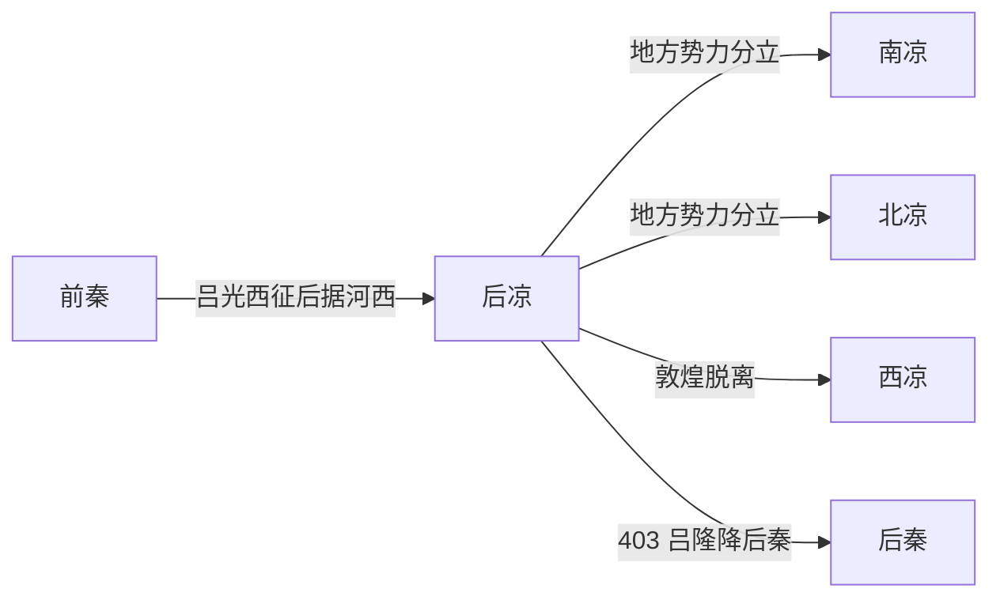

# 后凉

> 导航：[晋](/%E4%BA%BA%E6%96%87%E7%A7%91%E5%AD%A6/%E5%8E%86%E5%8F%B2/%E4%B8%9C%E4%BA%9A/%E4%B8%AD%E5%9B%BD/%E6%99%8B/README.md) / [十六国](/%E4%BA%BA%E6%96%87%E7%A7%91%E5%AD%A6/%E5%8E%86%E5%8F%B2/%E4%B8%9C%E4%BA%9A/%E4%B8%AD%E5%9B%BD/%E6%99%8B/%E5%8D%81%E5%85%AD%E5%9B%BD/README.md) / [政权索引](/%E4%BA%BA%E6%96%87%E7%A7%91%E5%AD%A6/%E5%8E%86%E5%8F%B2/%E4%B8%9C%E4%BA%9A/%E4%B8%AD%E5%9B%BD/%E6%99%8B/%E5%8D%81%E5%85%AD%E5%9B%BD/%E6%94%BF%E6%9D%83/README.md) / [淝水之战前](/%E4%BA%BA%E6%96%87%E7%A7%91%E5%AD%A6/%E5%8E%86%E5%8F%B2/%E4%B8%9C%E4%BA%9A/%E4%B8%AD%E5%9B%BD/%E6%99%8B/%E5%8D%81%E5%85%AD%E5%9B%BD/%E6%B7%9D%E6%B0%B4%E4%B9%8B%E6%88%98%E5%89%8D.md) / [淝水之战后](/%E4%BA%BA%E6%96%87%E7%A7%91%E5%AD%A6/%E5%8E%86%E5%8F%B2/%E4%B8%9C%E4%BA%9A/%E4%B8%AD%E5%9B%BD/%E6%99%8B/%E5%8D%81%E5%85%AD%E5%9B%BD/%E6%B7%9D%E6%B0%B4%E4%B9%8B%E6%88%98%E5%90%8E.md)

## 时间

386年—403年。

## 别称

- 吕凉

## 概括

后凉由氐族吕光建立，控制河西姑臧一带。吕光死后内乱，河西分裂为南凉、北凉、西凉等政权，403年吕隆降后秦。

## 历史演进图

## 建立、治理与兴衰

吕光原为前秦将领，奉命西征龟兹；383年后前秦瓦解，归路中断，他凭西征军和所获声望进入凉州，击败地方势力并占据姑臧。后凉以氐族和西征军将领为核心，沿用州郡、天王和百官制度，但对河西鲜卑、卢水胡、汉族豪强及敦煌地方集团的整合远不及前凉。

| 阶段 | 过程与重要事件 |
|---|---|
| 西征与据凉（382年—389年） | 吕光破龟兹，返河西后控制姑臧；386年自称凉州牧，389年称三河王。 |
| 扩张与称天王（389年—397年） | 吕光压服河西多地并称天王，但刑杀和征发加剧地方反抗。 |
| 多凉分立（397年—399年） | 秃发乌孤建立南凉，段业与沮渠氏建立北凉，敦煌李氏亦逐步脱离；后凉疆域收缩至姑臧周边。 |
| 继承内乱与投降（399年—403年） | 吕光死后吕绍、吕纂、吕隆通过兵变相继继位；南凉、北凉、后秦夹攻，吕隆最终向后秦投降。 |

- **鼎盛条件**：西征军的组织力、前秦崩溃后的权力真空、姑臧和河西交通线。
- **结构因素**：征服集团与本地豪强、各部首领缺乏稳定利益安排；皇位继承依靠军队政变。
- **外部压力**：南凉、北凉、西凉从内部割走人口与绿洲，后秦从关中施压。
- **直接触发**：399年吕光去世导致连续宫变，姑臧粮源和外围城镇尽失；403年吕隆在围困中出降，后凉灭亡。

## 说明

- 386年，吕光称大将军、凉州牧。
- 389年，吕光称三河王，后改称天王，史称后凉。
- 403年，吕隆因后秦、南凉、北凉交相攻逼，降于后秦，后凉灭亡。

## 世系表

| 顺序 | 姓名 | 庙号 | 谥号 / 称号 | 年号 | 在位时间 | 生卒时间 | 与前任关系 | 关键事件 / 备注 / 说明 |
|---:|---|---|---|---|---|---|---|---|
| 追尊 | 吕望 | 始祖 | 无 | 无 | 未正式在位 | 不详 | 吕氏远祖 | 后凉追尊。 |
| 追尊 | 吕婆楼 | 无 | 景昭王 | 无 | 未正式在位 | 不详 | 吕光父 | 后凉追尊。 |
| 1 | 吕光 | 太祖 | 懿武皇帝 | 太安、麟嘉、龙飞 | 386年—399年 | 338年—399年 | 开国君主 | 原前秦将领，西征归来据凉州，建立后凉。 |
| 2 | 吕绍 | 无 | 隐王 | 龙飞 | 399年 | 不详—399年 | 吕光子 | 即位不久被吕纂逼死。 |
| 3 | 吕纂 | 无 | 灵皇帝 | 咸宁 | 399年—401年 | 不详—401年 | 吕光庶长子 | 篡位，后被吕超等杀。 |
| 追尊 | 吕宝 | 无 | 文皇帝 | 无 | 未正式在位 | 不详—392年 | 吕隆父 | 吕隆追尊。 |
| 4 | 吕隆 | 无 | 无 | 神鼎 | 401年—403年 | 不详—416年 | 吕宝子，吕光侄 | 403年降后秦，后凉亡。 |

## 演变关系

- 前一节点：[前秦](/%E4%BA%BA%E6%96%87%E7%A7%91%E5%AD%A6/%E5%8E%86%E5%8F%B2/%E4%B8%9C%E4%BA%9A/%E4%B8%AD%E5%9B%BD/%E6%99%8B/%E5%8D%81%E5%85%AD%E5%9B%BD/%E6%94%BF%E6%9D%83/%E5%89%8D%E7%A7%A6.md)瓦解。
- 分裂后续：[南凉](/%E4%BA%BA%E6%96%87%E7%A7%91%E5%AD%A6/%E5%8E%86%E5%8F%B2/%E4%B8%9C%E4%BA%9A/%E4%B8%AD%E5%9B%BD/%E6%99%8B/%E5%8D%81%E5%85%AD%E5%9B%BD/%E6%94%BF%E6%9D%83/%E5%8D%97%E5%87%89.md)、[西凉](/%E4%BA%BA%E6%96%87%E7%A7%91%E5%AD%A6/%E5%8E%86%E5%8F%B2/%E4%B8%9C%E4%BA%9A/%E4%B8%AD%E5%9B%BD/%E6%99%8B/%E5%8D%81%E5%85%AD%E5%9B%BD/%E6%94%BF%E6%9D%83/%E8%A5%BF%E5%87%89.md)、[北凉](/%E4%BA%BA%E6%96%87%E7%A7%91%E5%AD%A6/%E5%8E%86%E5%8F%B2/%E4%B8%9C%E4%BA%9A/%E4%B8%AD%E5%9B%BD/%E6%99%8B/%E5%8D%81%E5%85%AD%E5%9B%BD/%E6%94%BF%E6%9D%83/%E5%8C%97%E5%87%89.md)。

## 相关笔记

- [政权索引](/%E4%BA%BA%E6%96%87%E7%A7%91%E5%AD%A6/%E5%8E%86%E5%8F%B2/%E4%B8%9C%E4%BA%9A/%E4%B8%AD%E5%9B%BD/%E6%99%8B/%E5%8D%81%E5%85%AD%E5%9B%BD/%E6%94%BF%E6%9D%83/README.md)
- [十六国](/%E4%BA%BA%E6%96%87%E7%A7%91%E5%AD%A6/%E5%8E%86%E5%8F%B2/%E4%B8%9C%E4%BA%9A/%E4%B8%AD%E5%9B%BD/%E6%99%8B/%E5%8D%81%E5%85%AD%E5%9B%BD/README.md)
- [十六国时空图](/%E4%BA%BA%E6%96%87%E7%A7%91%E5%AD%A6/%E5%8E%86%E5%8F%B2/%E4%B8%9C%E4%BA%9A/%E4%B8%AD%E5%9B%BD/%E6%99%8B/%E5%8D%81%E5%85%AD%E5%9B%BD/%E5%8D%81%E5%85%AD%E5%9B%BD%E6%97%B6%E7%A9%BA%E5%9B%BE.md)
- [淝水之战前](/%E4%BA%BA%E6%96%87%E7%A7%91%E5%AD%A6/%E5%8E%86%E5%8F%B2/%E4%B8%9C%E4%BA%9A/%E4%B8%AD%E5%9B%BD/%E6%99%8B/%E5%8D%81%E5%85%AD%E5%9B%BD/%E6%B7%9D%E6%B0%B4%E4%B9%8B%E6%88%98%E5%89%8D.md)
- [淝水之战后](/%E4%BA%BA%E6%96%87%E7%A7%91%E5%AD%A6/%E5%8E%86%E5%8F%B2/%E4%B8%9C%E4%BA%9A/%E4%B8%AD%E5%9B%BD/%E6%99%8B/%E5%8D%81%E5%85%AD%E5%9B%BD/%E6%B7%9D%E6%B0%B4%E4%B9%8B%E6%88%98%E5%90%8E.md)
