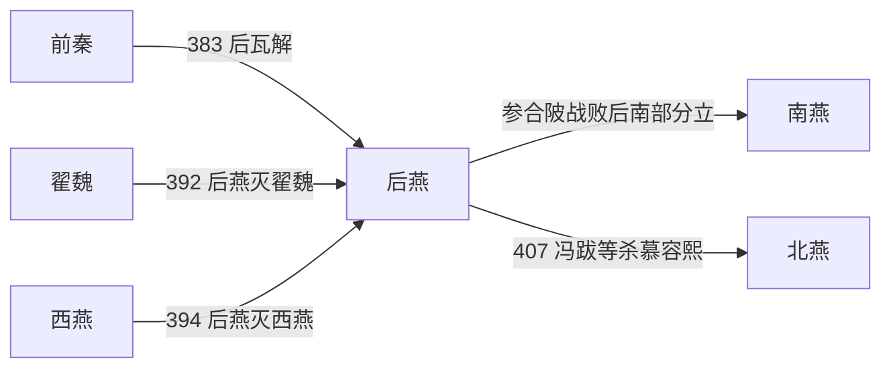

# 后燕

> 导航：[晋](/%E4%BA%BA%E6%96%87%E7%A7%91%E5%AD%A6/%E5%8E%86%E5%8F%B2/%E4%B8%9C%E4%BA%9A/%E4%B8%AD%E5%9B%BD/%E6%99%8B/README.md) / [十六国](/%E4%BA%BA%E6%96%87%E7%A7%91%E5%AD%A6/%E5%8E%86%E5%8F%B2/%E4%B8%9C%E4%BA%9A/%E4%B8%AD%E5%9B%BD/%E6%99%8B/%E5%8D%81%E5%85%AD%E5%9B%BD/README.md) / [政权索引](/%E4%BA%BA%E6%96%87%E7%A7%91%E5%AD%A6/%E5%8E%86%E5%8F%B2/%E4%B8%9C%E4%BA%9A/%E4%B8%AD%E5%9B%BD/%E6%99%8B/%E5%8D%81%E5%85%AD%E5%9B%BD/%E6%94%BF%E6%9D%83/README.md) / [淝水之战前](/%E4%BA%BA%E6%96%87%E7%A7%91%E5%AD%A6/%E5%8E%86%E5%8F%B2/%E4%B8%9C%E4%BA%9A/%E4%B8%AD%E5%9B%BD/%E6%99%8B/%E5%8D%81%E5%85%AD%E5%9B%BD/%E6%B7%9D%E6%B0%B4%E4%B9%8B%E6%88%98%E5%89%8D.md) / [淝水之战后](/%E4%BA%BA%E6%96%87%E7%A7%91%E5%AD%A6/%E5%8E%86%E5%8F%B2/%E4%B8%9C%E4%BA%9A/%E4%B8%AD%E5%9B%BD/%E6%99%8B/%E5%8D%81%E5%85%AD%E5%9B%BD/%E6%B7%9D%E6%B0%B4%E4%B9%8B%E6%88%98%E5%90%8E.md)

## 时间

384年—407年。

## 别称

- 慕容后燕

## 概括

后燕由前燕宗室慕容垂在前秦瓦解后复国建立。它一度恢复燕系势力，但在参合陂之战后受到北魏重创，最终被北燕取代。

## 历史演进图

## 建立、治理与兴衰

慕容垂是前燕宗室和名将，前秦败于淝水后，他利用河北旧部、慕容氏声望和前秦地方控制崩溃恢复燕国。后燕沿用中原官制和州郡治理，以慕容宗室及鲜卑骑兵为军事骨干；灭翟魏、西燕后领土一度接近前燕规模，但国家整合时间短，宗室各自拥兵的问题始终存在。

| 阶段 | 过程与重要事件 |
|---|---|
| 复国（384年—386年） | 慕容垂脱离前秦称燕王，围邺并整合河北，386年称帝、定都中山。 |
| 扩张（386年—394年） | 经略辽东，392年灭翟魏、394年灭西燕，控制河北、山西东部和辽西部分地区。 |
| 北魏战争（395年—397年） | 太子慕容宝率军在参合陂被北魏重创；慕容垂次年亲征病死，北魏越过太行攻占河北。 |
| 分裂与宫廷政变（397年—407年） | 中山、龙城两地政令分裂，慕容详、慕容麟、兰汗相继篡夺；慕容盛复位后遇刺，慕容熙统治最终被冯跋推翻。 |

- **鼎盛条件**：前秦瓦解、河北慕容旧部响应、慕容垂个人威望和骑兵战力。
- **结构因素**：宗室将领拥有私人部众，继承和辅政缺乏稳定规则；河北与辽西相距较远，战败后难以互援。
- **外部压力**：北魏在草原与山西完成整合，能够持续投入主力；高句丽也牵制辽东。
- **直接触发**：参合陂损失精锐，慕容垂随即去世；慕容宝败退引发政变链。407年冯跋拥高云杀慕容熙，后燕政权转为北燕。

## 说明

- 384年，前燕降将慕容垂自称燕王，废除前秦年号。
- 385年，后燕击败高句丽，进入辽东。
- 386年，慕容垂称帝，定都中山，改元建兴。
- 392年，后燕灭翟魏。
- 394年，后燕灭西燕。
- 395年，后燕在参合陂之战中大败于北魏；396年慕容垂亲征北魏途中病故。
- 398年，慕容宝被杀，慕容盛推翻兰汗后即位。
- 401年，慕容盛被暗杀，慕容熙即位。
- 407年，冯跋拥立高云为燕天王，杀慕容熙，后燕灭亡，北燕建立。

## 世系表

| 顺序 | 姓名 | 庙号 | 谥号 / 称号 | 年号 | 在位时间 | 生卒时间 | 与前任关系 | 关键事件 / 备注 / 说明 |
|---:|---|---|---|---|---|---|---|---|
| 1 | 慕容垂 | 世祖 | 成武皇帝 | 燕元、建兴 | 384年—396年 | 326年—396年 | 慕容皝子，前燕宗室 | 前秦瓦解后复燕，386年称帝。 |
| 2 | 慕容宝 | 烈宗 | 惠愍皇帝 | 永康 | 396年—398年 | 355年—398年 | 慕容垂子 | 参合陂战后局势恶化，被兰汗杀。 |
| 政变 | 慕容详 | 无 | 无 | 建始 | 397年 | 不详—397年 | 后燕宗室 | 短暂篡位。 |
| 政变 | 慕容麟 | 无 | 无 | 延平 | 397年 | 不详—398年 | 慕容垂子 | 短暂称帝。 |
| 政变 | 兰汗 | 无 | 无 | 青龙 | 398年 | 不详—398年 | 外戚 | 杀慕容宝，旋被慕容盛杀。 |
| 3 | 慕容盛 | 中宗 | 昭武皇帝 | 建平、长乐 | 398年—401年 | 373年—401年 | 慕容宝子 | 平兰汗后即位，后被暗杀。 |
| 追尊 | 慕容令 | 无 | 献庄太子 / 献庄皇帝 | 无 | 未正式在位 | 不详—370年 | 慕容垂子 | 慕容垂、慕容盛追谥。 |
| 4 | 慕容熙 | 无 | 昭文皇帝 | 光始、建始 | 401年—407年 | 385年—407年 | 慕容垂子 | 407年被冯跋等杀，后燕亡。 |

## 演变关系

- 前一节点：[前秦](/%E4%BA%BA%E6%96%87%E7%A7%91%E5%AD%A6/%E5%8E%86%E5%8F%B2/%E4%B8%9C%E4%BA%9A/%E4%B8%AD%E5%9B%BD/%E6%99%8B/%E5%8D%81%E5%85%AD%E5%9B%BD/%E6%94%BF%E6%9D%83/%E5%89%8D%E7%A7%A6.md)瓦解与[前燕](/%E4%BA%BA%E6%96%87%E7%A7%91%E5%AD%A6/%E5%8E%86%E5%8F%B2/%E4%B8%9C%E4%BA%9A/%E4%B8%AD%E5%9B%BD/%E6%99%8B/%E5%8D%81%E5%85%AD%E5%9B%BD/%E6%94%BF%E6%9D%83/%E5%89%8D%E7%87%95.md)旧部复兴。
- 分支：[南燕](/%E4%BA%BA%E6%96%87%E7%A7%91%E5%AD%A6/%E5%8E%86%E5%8F%B2/%E4%B8%9C%E4%BA%9A/%E4%B8%AD%E5%9B%BD/%E6%99%8B/%E5%8D%81%E5%85%AD%E5%9B%BD/%E6%94%BF%E6%9D%83/%E5%8D%97%E7%87%95.md)、[北燕](/%E4%BA%BA%E6%96%87%E7%A7%91%E5%AD%A6/%E5%8E%86%E5%8F%B2/%E4%B8%9C%E4%BA%9A/%E4%B8%AD%E5%9B%BD/%E6%99%8B/%E5%8D%81%E5%85%AD%E5%9B%BD/%E6%94%BF%E6%9D%83/%E5%8C%97%E7%87%95.md)、[西燕](/%E4%BA%BA%E6%96%87%E7%A7%91%E5%AD%A6/%E5%8E%86%E5%8F%B2/%E4%B8%9C%E4%BA%9A/%E4%B8%AD%E5%9B%BD/%E6%99%8B/%E5%8D%81%E5%85%AD%E5%9B%BD/%E6%94%BF%E6%9D%83/%E8%A5%BF%E7%87%95.md)。
- 主要对手：北魏。

## 相关笔记

- [政权索引](/%E4%BA%BA%E6%96%87%E7%A7%91%E5%AD%A6/%E5%8E%86%E5%8F%B2/%E4%B8%9C%E4%BA%9A/%E4%B8%AD%E5%9B%BD/%E6%99%8B/%E5%8D%81%E5%85%AD%E5%9B%BD/%E6%94%BF%E6%9D%83/README.md)
- [十六国](/%E4%BA%BA%E6%96%87%E7%A7%91%E5%AD%A6/%E5%8E%86%E5%8F%B2/%E4%B8%9C%E4%BA%9A/%E4%B8%AD%E5%9B%BD/%E6%99%8B/%E5%8D%81%E5%85%AD%E5%9B%BD/README.md)
- [十六国时空图](/%E4%BA%BA%E6%96%87%E7%A7%91%E5%AD%A6/%E5%8E%86%E5%8F%B2/%E4%B8%9C%E4%BA%9A/%E4%B8%AD%E5%9B%BD/%E6%99%8B/%E5%8D%81%E5%85%AD%E5%9B%BD/%E5%8D%81%E5%85%AD%E5%9B%BD%E6%97%B6%E7%A9%BA%E5%9B%BE.md)
- [淝水之战前](/%E4%BA%BA%E6%96%87%E7%A7%91%E5%AD%A6/%E5%8E%86%E5%8F%B2/%E4%B8%9C%E4%BA%9A/%E4%B8%AD%E5%9B%BD/%E6%99%8B/%E5%8D%81%E5%85%AD%E5%9B%BD/%E6%B7%9D%E6%B0%B4%E4%B9%8B%E6%88%98%E5%89%8D.md)
- [淝水之战后](/%E4%BA%BA%E6%96%87%E7%A7%91%E5%AD%A6/%E5%8E%86%E5%8F%B2/%E4%B8%9C%E4%BA%9A/%E4%B8%AD%E5%9B%BD/%E6%99%8B/%E5%8D%81%E5%85%AD%E5%9B%BD/%E6%B7%9D%E6%B0%B4%E4%B9%8B%E6%88%98%E5%90%8E.md)
