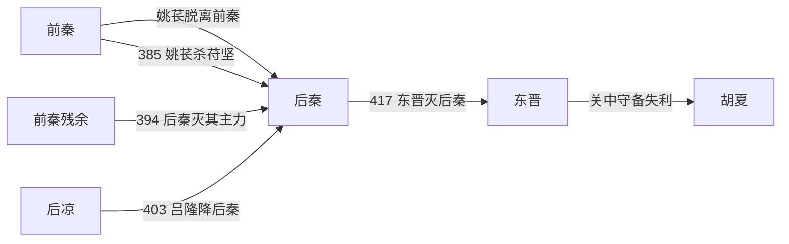

# 后秦

> 导航：[晋](/%E4%BA%BA%E6%96%87%E7%A7%91%E5%AD%A6/%E5%8E%86%E5%8F%B2/%E4%B8%9C%E4%BA%9A/%E4%B8%AD%E5%9B%BD/%E6%99%8B/README.md) / [十六国](/%E4%BA%BA%E6%96%87%E7%A7%91%E5%AD%A6/%E5%8E%86%E5%8F%B2/%E4%B8%9C%E4%BA%9A/%E4%B8%AD%E5%9B%BD/%E6%99%8B/%E5%8D%81%E5%85%AD%E5%9B%BD/README.md) / [政权索引](/%E4%BA%BA%E6%96%87%E7%A7%91%E5%AD%A6/%E5%8E%86%E5%8F%B2/%E4%B8%9C%E4%BA%9A/%E4%B8%AD%E5%9B%BD/%E6%99%8B/%E5%8D%81%E5%85%AD%E5%9B%BD/%E6%94%BF%E6%9D%83/README.md) / [淝水之战前](/%E4%BA%BA%E6%96%87%E7%A7%91%E5%AD%A6/%E5%8E%86%E5%8F%B2/%E4%B8%9C%E4%BA%9A/%E4%B8%AD%E5%9B%BD/%E6%99%8B/%E5%8D%81%E5%85%AD%E5%9B%BD/%E6%B7%9D%E6%B0%B4%E4%B9%8B%E6%88%98%E5%89%8D.md) / [淝水之战后](/%E4%BA%BA%E6%96%87%E7%A7%91%E5%AD%A6/%E5%8E%86%E5%8F%B2/%E4%B8%9C%E4%BA%9A/%E4%B8%AD%E5%9B%BD/%E6%99%8B/%E5%8D%81%E5%85%AD%E5%9B%BD/%E6%B7%9D%E6%B0%B4%E4%B9%8B%E6%88%98%E5%90%8E.md)

## 时间

384年—417年。

## 别称

- 姚秦

## 概括

后秦由羌族姚氏建立，前秦瓦解后占据关中。姚兴时势力较盛，417年被东晋刘裕灭。

## 历史演进图

## 建立、治理与兴衰

淝水之战后前秦统治链断裂，姚苌凭羌族部众和渭北军事网络起兵，夺取长安并建立后秦。姚兴继位后消灭苻登主力，向河洛、陇右和河西扩张；他任用汉人官僚、羌族宗亲与地方将领共同治国，并迎鸠摩罗什到长安组织译经，使长安成为重要佛教文化中心。

| 阶段 | 过程与重要事件 |
|---|---|
| 创业（384年—394年） | 姚苌起兵、占长安、称帝；与前秦残余长期争战。 |
| 扩张与强盛（394年—405年） | 姚兴杀苻登，控制关中；399年取洛阳，400年一度灭西秦，403年受降后凉。 |
| 四面受压（405年—416年） | 胡夏在北边崛起，西秦复国，北魏和东晋牵制河洛；后秦对属国和边将的控制逐渐削弱。 |
| 内争与灭亡（416年—417年） | 姚兴死后诸子、宗室与边将争权；刘裕北伐攻克洛阳、潼关和长安，姚泓投降。 |

- **鼎盛条件**：前秦瓦解留下的关中真空、姚氏军事网络、长安的农业与交通资源，以及姚兴较能调和不同族群和官僚集团。
- **结构因素**：宗室和地方军镇权力过重，属国关系多依靠册封而非直接行政；连续对外战争消耗关中兵粮。
- **外部压力**：北魏、胡夏、西秦和东晋分别从东、北、西、南施压，后秦难以集中主力。
- **直接触发**：416年姚兴死后继承内斗削弱防线；417年晋军水陆并进，长安孤立，姚泓出降，政权被东晋消灭。刘裕旋即南返，关中又被胡夏夺取。

## 说明

- 384年，原降于前秦的羌族贵族姚苌在渭北叛秦。
- 385年，姚苌擒杀苻坚。
- 386年，姚苌在长安称帝，国号“秦”，史称后秦。
- 394年，姚兴杀前秦苻登。
- 399年，后秦乘东晋内乱攻陷洛阳。
- 416年，姚兴去世，姚泓继位，后秦内讧。
- 417年，东晋刘裕攻破长安，姚泓投降，后秦灭亡。

## 世系表

| 顺序 | 姓名 | 庙号 | 谥号 / 称号 | 年号 | 在位时间 | 生卒时间 | 与前任关系 | 关键事件 / 备注 / 说明 |
|---:|---|---|---|---|---|---|---|---|
| 追尊 | 姚弋仲 | 始祖 | 景元皇帝 | 无 | 未正式在位 | 280年—352年 | 姚氏先祖 | 姚苌追尊。 |
| 追尊 | 姚襄 | 无 | 魏武王 | 无 | 未正式在位 | 331年—357年 | 姚弋仲子 | 姚苌追谥。 |
| 1 | 姚苌 | 太祖 | 武昭皇帝 | 白雀、建初 | 384年—394年 | 330年—393年 | 姚弋仲子 | 384年称万年秦王，386年称帝；385年杀苻坚。 |
| 2 | 姚兴 | 高祖 | 文桓皇帝 | 皇初、弘始 | 394年—416年 | 366年—416年 | 姚苌子 | 灭前秦残余，后秦国势强盛，佛教翻译事业发达。 |
| 3 | 姚泓 | 无 | 无 | 永和 | 416年—417年 | 388年—417年 | 姚兴子 | 417年刘裕破长安，姚泓投降，后秦亡。 |

## 演变关系

- 前一节点：[前秦](/%E4%BA%BA%E6%96%87%E7%A7%91%E5%AD%A6/%E5%8E%86%E5%8F%B2/%E4%B8%9C%E4%BA%9A/%E4%B8%AD%E5%9B%BD/%E6%99%8B/%E5%8D%81%E5%85%AD%E5%9B%BD/%E6%94%BF%E6%9D%83/%E5%89%8D%E7%A7%A6.md)瓦解。
- 后一节点：[东晋](/%E4%BA%BA%E6%96%87%E7%A7%91%E5%AD%A6/%E5%8E%86%E5%8F%B2/%E4%B8%9C%E4%BA%9A/%E4%B8%AD%E5%9B%BD/%E6%99%8B/%E4%B8%9C%E6%99%8B.md)刘裕北伐；关中随后被[胡夏](/%E4%BA%BA%E6%96%87%E7%A7%91%E5%AD%A6/%E5%8E%86%E5%8F%B2/%E4%B8%9C%E4%BA%9A/%E4%B8%AD%E5%9B%BD/%E6%99%8B/%E5%8D%81%E5%85%AD%E5%9B%BD/%E6%94%BF%E6%9D%83/%E8%83%A1%E5%A4%8F.md)夺取。

## 相关笔记

- [政权索引](/%E4%BA%BA%E6%96%87%E7%A7%91%E5%AD%A6/%E5%8E%86%E5%8F%B2/%E4%B8%9C%E4%BA%9A/%E4%B8%AD%E5%9B%BD/%E6%99%8B/%E5%8D%81%E5%85%AD%E5%9B%BD/%E6%94%BF%E6%9D%83/README.md)
- [十六国](/%E4%BA%BA%E6%96%87%E7%A7%91%E5%AD%A6/%E5%8E%86%E5%8F%B2/%E4%B8%9C%E4%BA%9A/%E4%B8%AD%E5%9B%BD/%E6%99%8B/%E5%8D%81%E5%85%AD%E5%9B%BD/README.md)
- [十六国时空图](/%E4%BA%BA%E6%96%87%E7%A7%91%E5%AD%A6/%E5%8E%86%E5%8F%B2/%E4%B8%9C%E4%BA%9A/%E4%B8%AD%E5%9B%BD/%E6%99%8B/%E5%8D%81%E5%85%AD%E5%9B%BD/%E5%8D%81%E5%85%AD%E5%9B%BD%E6%97%B6%E7%A9%BA%E5%9B%BE.md)
- [淝水之战前](/%E4%BA%BA%E6%96%87%E7%A7%91%E5%AD%A6/%E5%8E%86%E5%8F%B2/%E4%B8%9C%E4%BA%9A/%E4%B8%AD%E5%9B%BD/%E6%99%8B/%E5%8D%81%E5%85%AD%E5%9B%BD/%E6%B7%9D%E6%B0%B4%E4%B9%8B%E6%88%98%E5%89%8D.md)
- [淝水之战后](/%E4%BA%BA%E6%96%87%E7%A7%91%E5%AD%A6/%E5%8E%86%E5%8F%B2/%E4%B8%9C%E4%BA%9A/%E4%B8%AD%E5%9B%BD/%E6%99%8B/%E5%8D%81%E5%85%AD%E5%9B%BD/%E6%B7%9D%E6%B0%B4%E4%B9%8B%E6%88%98%E5%90%8E.md)
