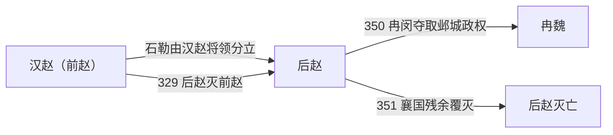

# 后赵

> 导航：[晋](/%E4%BA%BA%E6%96%87%E7%A7%91%E5%AD%A6/%E5%8E%86%E5%8F%B2/%E4%B8%9C%E4%BA%9A/%E4%B8%AD%E5%9B%BD/%E6%99%8B/README.md) / [十六国](/%E4%BA%BA%E6%96%87%E7%A7%91%E5%AD%A6/%E5%8E%86%E5%8F%B2/%E4%B8%9C%E4%BA%9A/%E4%B8%AD%E5%9B%BD/%E6%99%8B/%E5%8D%81%E5%85%AD%E5%9B%BD/README.md) / [政权索引](/%E4%BA%BA%E6%96%87%E7%A7%91%E5%AD%A6/%E5%8E%86%E5%8F%B2/%E4%B8%9C%E4%BA%9A/%E4%B8%AD%E5%9B%BD/%E6%99%8B/%E5%8D%81%E5%85%AD%E5%9B%BD/%E6%94%BF%E6%9D%83/README.md) / [淝水之战前](/%E4%BA%BA%E6%96%87%E7%A7%91%E5%AD%A6/%E5%8E%86%E5%8F%B2/%E4%B8%9C%E4%BA%9A/%E4%B8%AD%E5%9B%BD/%E6%99%8B/%E5%8D%81%E5%85%AD%E5%9B%BD/%E6%B7%9D%E6%B0%B4%E4%B9%8B%E6%88%98%E5%89%8D.md) / [淝水之战后](/%E4%BA%BA%E6%96%87%E7%A7%91%E5%AD%A6/%E5%8E%86%E5%8F%B2/%E4%B8%9C%E4%BA%9A/%E4%B8%AD%E5%9B%BD/%E6%99%8B/%E5%8D%81%E5%85%AD%E5%9B%BD/%E6%B7%9D%E6%B0%B4%E4%B9%8B%E6%88%98%E5%90%8E.md)

## 时间

319年—351年。

## 别称

- 石赵

## 概括

后赵由羯族石勒建立，先与前赵并立，329年灭前赵后控制北方大部。石虎篡位后政权高度军事化，晚年内乱，最终被冉魏取代。

## 历史演进图

## 建立、治理与兴衰

石勒以流民、羯人和降附武装为核心，在河北建立稳定据点；其成功不仅靠骑兵征服，也靠张宾等人组织州郡、招抚坞堡并恢复农业。319年与刘曜决裂后，石勒建立赵国；328年至329年击败刘曜、吞并前赵，形成当时北方最大的政权。

| 阶段 | 过程与重要事件 |
|---|---|
| 割据河北（319年—328年） | 以襄国为中心整合河北，设置百官、学校和选举机构，并与前赵争夺河洛。 |
| 统一北方大部（328年—333年） | 擒刘曜、灭前赵，330年称天王继而称帝；石勒在世时尚能约束宗室和将领。 |
| 石虎统治（334年—349年） | 石虎废石弘，迁都邺；大规模营建、征发和连续战争扩大军事实力，也加重赋役与人口损耗。 |
| 继承战争（349年—351年） | 石世、石遵、石鉴接连被废杀，冉闵控制邺城；石祗据襄国抵抗，351年被部将刘显杀害。 |

统治上，皇帝依靠宗室、羯族及其他部族军将掌握核心军队，同时任用汉人官僚治理州郡和坞堡。石勒时期的招抚与恢复生产提供财政基础；石虎时期权力更集中于宫廷和军队，沉重的徭役、宫室工程与征战削弱了这种基础。

- **鼎盛条件**：河北人口与粮源、石勒的军事联盟、张宾等人的行政整合，以及前赵东西分裂。
- **结构因素**：皇位继承规则不稳，诸子和养孙皆拥兵；政权对个人威望和军事分配高度依赖。
- **外部压力**：前燕在辽西、东晋在黄河南北持续扩张，地方坞堡与降将随中央衰弱而改换阵营。
- **直接触发**：石虎349年死后数月内连续政变；冉闵掌握禁军并杀石鉴建魏，石祗又被杀，后赵失去最后的皇室中心。

## 说明

- 319年，石勒称大单于、赵王，与前赵决裂，史称后赵。
- 329年，石勒灭前赵；330年称帝。
- 351年，后赵被冉魏取代。

## 世系表

| 顺序 | 姓名 | 庙号 | 谥号 / 称号 | 年号 | 在位时间 | 生卒时间 | 与前任关系 | 关键事件 / 备注 / 说明 |
|---:|---|---|---|---|---|---|---|---|
| 追尊 | 石邪 | 无 | 宣皇帝 / 宣王 | 无 | 未正式在位 | 不详 | 石氏先祖 | 后赵追尊。 |
| 追尊 | 石周曷朱 | 世宗 | 元皇帝 | 无 | 未正式在位 | 不详 | 石勒父 | 后赵追尊。 |
| 1 | 石勒 | 高祖 | 明皇帝 | 太和、建平 | 319年—333年 | 274年—333年 | 开国君主 | 319年称赵王，330年称帝，329年灭前赵。 |
| 2 | 石弘 | 无 | 海阳王 | 建平、延熙 | 333年—334年 | 314年—335年 | 石勒子 | 被石虎废。 |
| 3 | 石虎 | 太祖 | 武皇帝 | 延熙、建武、太宁 | 334年—349年 | 295年—349年 | 石勒侄 | 篡位掌权，迁都邺，政权达到强盛也积累巨大矛盾。 |
| 4 | 石世 | 无 | 无 | 太宁 | 349年 | 339年—349年 | 石虎子 | 在位约三十三日，被石遵废杀。 |
| 5 | 石遵 | 无 | 无 | 太宁 | 349年 | 不详—349年 | 石虎子 | 在位约半年，被石鉴杀。 |
| 6 | 石鉴 | 无 | 无 | 太宁、青龙 | 349年—350年 | 不详—350年 | 石虎子 | 依靠冉闵，后与冉闵冲突被杀。 |
| 7 | 石祗 | 无 | 无 | 永宁 | 350年—351年 | 不详—351年 | 石虎子 | 在襄国称帝，351年被杀，后赵亡。 |

## 演变关系

- 前一节点：[汉赵（前赵）](/%E4%BA%BA%E6%96%87%E7%A7%91%E5%AD%A6/%E5%8E%86%E5%8F%B2/%E4%B8%9C%E4%BA%9A/%E4%B8%AD%E5%9B%BD/%E6%99%8B/%E5%8D%81%E5%85%AD%E5%9B%BD/%E6%94%BF%E6%9D%83/%E6%B1%89%E8%B5%B5%EF%BC%88%E5%89%8D%E8%B5%B5%EF%BC%89.md)。
- 后一节点：[冉魏](/%E4%BA%BA%E6%96%87%E7%A7%91%E5%AD%A6/%E5%8E%86%E5%8F%B2/%E4%B8%9C%E4%BA%9A/%E4%B8%AD%E5%9B%BD/%E6%99%8B/%E5%8D%81%E5%85%AD%E5%9B%BD/%E6%94%BF%E6%9D%83/%E5%86%89%E9%AD%8F.md)与[前燕](/%E4%BA%BA%E6%96%87%E7%A7%91%E5%AD%A6/%E5%8E%86%E5%8F%B2/%E4%B8%9C%E4%BA%9A/%E4%B8%AD%E5%9B%BD/%E6%99%8B/%E5%8D%81%E5%85%AD%E5%9B%BD/%E6%94%BF%E6%9D%83/%E5%89%8D%E7%87%95.md)。

## 相关笔记

- [政权索引](/%E4%BA%BA%E6%96%87%E7%A7%91%E5%AD%A6/%E5%8E%86%E5%8F%B2/%E4%B8%9C%E4%BA%9A/%E4%B8%AD%E5%9B%BD/%E6%99%8B/%E5%8D%81%E5%85%AD%E5%9B%BD/%E6%94%BF%E6%9D%83/README.md)
- [十六国](/%E4%BA%BA%E6%96%87%E7%A7%91%E5%AD%A6/%E5%8E%86%E5%8F%B2/%E4%B8%9C%E4%BA%9A/%E4%B8%AD%E5%9B%BD/%E6%99%8B/%E5%8D%81%E5%85%AD%E5%9B%BD/README.md)
- [十六国时空图](/%E4%BA%BA%E6%96%87%E7%A7%91%E5%AD%A6/%E5%8E%86%E5%8F%B2/%E4%B8%9C%E4%BA%9A/%E4%B8%AD%E5%9B%BD/%E6%99%8B/%E5%8D%81%E5%85%AD%E5%9B%BD/%E5%8D%81%E5%85%AD%E5%9B%BD%E6%97%B6%E7%A9%BA%E5%9B%BE.md)
- [淝水之战前](/%E4%BA%BA%E6%96%87%E7%A7%91%E5%AD%A6/%E5%8E%86%E5%8F%B2/%E4%B8%9C%E4%BA%9A/%E4%B8%AD%E5%9B%BD/%E6%99%8B/%E5%8D%81%E5%85%AD%E5%9B%BD/%E6%B7%9D%E6%B0%B4%E4%B9%8B%E6%88%98%E5%89%8D.md)
- [淝水之战后](/%E4%BA%BA%E6%96%87%E7%A7%91%E5%AD%A6/%E5%8E%86%E5%8F%B2/%E4%B8%9C%E4%BA%9A/%E4%B8%AD%E5%9B%BD/%E6%99%8B/%E5%8D%81%E5%85%AD%E5%9B%BD/%E6%B7%9D%E6%B0%B4%E4%B9%8B%E6%88%98%E5%90%8E.md)
