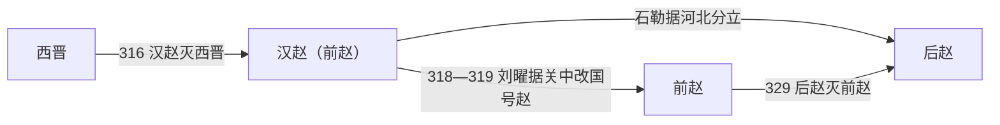

# 汉赵（前赵）

> 导航：[晋](/%E4%BA%BA%E6%96%87%E7%A7%91%E5%AD%A6/%E5%8E%86%E5%8F%B2/%E4%B8%9C%E4%BA%9A/%E4%B8%AD%E5%9B%BD/%E6%99%8B/README.md) / [十六国](/%E4%BA%BA%E6%96%87%E7%A7%91%E5%AD%A6/%E5%8E%86%E5%8F%B2/%E4%B8%9C%E4%BA%9A/%E4%B8%AD%E5%9B%BD/%E6%99%8B/%E5%8D%81%E5%85%AD%E5%9B%BD/README.md) / [政权索引](/%E4%BA%BA%E6%96%87%E7%A7%91%E5%AD%A6/%E5%8E%86%E5%8F%B2/%E4%B8%9C%E4%BA%9A/%E4%B8%AD%E5%9B%BD/%E6%99%8B/%E5%8D%81%E5%85%AD%E5%9B%BD/%E6%94%BF%E6%9D%83/README.md) / [淝水之战前](/%E4%BA%BA%E6%96%87%E7%A7%91%E5%AD%A6/%E5%8E%86%E5%8F%B2/%E4%B8%9C%E4%BA%9A/%E4%B8%AD%E5%9B%BD/%E6%99%8B/%E5%8D%81%E5%85%AD%E5%9B%BD/%E6%B7%9D%E6%B0%B4%E4%B9%8B%E6%88%98%E5%89%8D.md) / [淝水之战后](/%E4%BA%BA%E6%96%87%E7%A7%91%E5%AD%A6/%E5%8E%86%E5%8F%B2/%E4%B8%9C%E4%BA%9A/%E4%B8%AD%E5%9B%BD/%E6%99%8B/%E5%8D%81%E5%85%AD%E5%9B%BD/%E6%B7%9D%E6%B0%B4%E4%B9%8B%E6%88%98%E5%90%8E.md)

## 时间

304年—329年。

## 别称

- 汉
- 前赵
- 刘赵
- 北汉（部分资料称）

## 概括

汉赵由匈奴刘氏建立，是十六国中最早兴起的主要政权之一。刘渊以汉室外甥身份起兵，国号“汉”；刘曜即位后改国号为“赵”，史称前赵。汉赵攻灭西晋，是西晋灭亡和十六国格局形成的直接推动者。

## 历史演进图

## 建立、治理与兴衰

刘渊的起兵建立在并州匈奴五部已经内迁、拥有部落兵源，而西晋又因八王之乱失去地方控制的背景上。他以汉室姻亲和“继汉”名义争取汉人官僚、流民与反晋力量，既保留大单于体系，也设置皇帝、丞相和州郡官职，形成部族军事领导与中原官僚制度并用的统治。

| 阶段 | 过程与重要事件 |
|---|---|
| 建立（304年—310年） | 刘渊在离石称汉王，308年称帝；吸纳王弥、石勒等军事集团，势力由并州伸向河洛。 |
| 攻灭西晋（310年—318年） | 刘聪即位后，311年攻陷洛阳、俘晋怀帝；316年刘曜攻破长安、俘晋愍帝。刘氏宫廷同时发生储位、外戚和宗室冲突。 |
| 政变与东西分裂（318年—319年） | 刘粲即位后被靳准杀害；刘曜平定靳氏并在长安继位，石勒则控制河北，双方先后改称“赵”。 |
| 赵国相争（319年—329年） | 刘曜经营关陇，石勒经营河北；328年刘曜在洛阳附近战败被俘，329年后赵攻破上邽，刘熙及残余势力覆灭。 |

- **鼎盛条件**：八王之乱造成的军事真空、内迁匈奴的组织基础、石勒等将领的扩张能力，以及西晋都城与地方互不相救。
- **结构因素**：刘氏宗室和外戚反复政变，政权依赖不同军事集团，东部石勒与关中刘曜难以形成稳定的上下关系。
- **外部压力**：东晋和西晋残余仍据南方、并州与凉州部分据点，后赵又控制河北人口和粮源。
- **直接灭亡过程**：刘曜败俘后，前赵失去主力与最高统帅；刘熙退守上邽，329年被石虎攻破，前赵领土并入后赵。

## 说明

- 304年，刘渊起兵称汉王。
- 308年，刘渊称帝，国号“汉”。
- 316年，刘聪灭西晋。
- 318年，刘曜即位，杀靳准；次年改国号为“赵”。
- 329年，汉赵 / 前赵被后赵所灭。

## 世系表

| 顺序 | 姓名 | 庙号 | 谥号 / 称号 | 年号 | 在位时间 | 生卒时间 | 与前任关系 | 关键事件 / 备注 / 说明 |
|---:|---|---|---|---|---|---|---|---|
| 1 | 刘渊 | 高祖 | 光文皇帝 | 元熙、永凤、河瑞 | 304年—310年 | 不详—310年 | 开国君主 | 304年称汉王，后称帝，建立汉赵政权。 |
| 2 | 刘和 | 无 | 无 | 河瑞 | 310年 | 不详—310年 | 刘渊子 | 即位不久被刘聪杀。 |
| 3 | 刘聪 | 烈宗 | 昭武皇帝 | 光兴、嘉平、建元、麟嘉 | 310年—318年 | 不详—318年 | 刘渊子，刘和弟 | 311年攻陷洛阳，俘晋怀帝；316年灭西晋。 |
| 4 | 刘粲 | 无 | 隐皇帝 | 汉昌 | 318年 | 不详—318年 | 刘聪子 | 即位后被靳准杀。 |
| 政变 | 靳准 | 无 | 无 | 无 | 318年掌权 | 生年不详—318年 | 外戚、政变者 | 杀刘粲并屠刘氏宗室，史称靳准之乱；未建立获普遍承认的皇位，通常不列刘氏正统。 |
| 5 | 刘曜 | 无 | 无 | 光初 | 318年—329年 | 生年不详—329年 | 刘渊族子 | 平定靳准后即位；319年改国号为赵；328年被后赵俘获，次年残部覆灭。 |
| 6 | 刘熙 | 无 | 无 | 光初 | 329年 | 生年不详—329年 | 刘曜子 | 刘曜被俘后在上邽承继政权，不久被后赵灭。 |

## 演变关系

- 前一阶段：[西晋](/%E4%BA%BA%E6%96%87%E7%A7%91%E5%AD%A6/%E5%8E%86%E5%8F%B2/%E4%B8%9C%E4%BA%9A/%E4%B8%AD%E5%9B%BD/%E6%99%8B/%E8%A5%BF%E6%99%8B.md)崩溃。
- 后一节点：[后赵](/%E4%BA%BA%E6%96%87%E7%A7%91%E5%AD%A6/%E5%8E%86%E5%8F%B2/%E4%B8%9C%E4%BA%9A/%E4%B8%AD%E5%9B%BD/%E6%99%8B/%E5%8D%81%E5%85%AD%E5%9B%BD/%E6%94%BF%E6%9D%83/%E5%90%8E%E8%B5%B5.md)。

## 相关笔记

- [政权索引](/%E4%BA%BA%E6%96%87%E7%A7%91%E5%AD%A6/%E5%8E%86%E5%8F%B2/%E4%B8%9C%E4%BA%9A/%E4%B8%AD%E5%9B%BD/%E6%99%8B/%E5%8D%81%E5%85%AD%E5%9B%BD/%E6%94%BF%E6%9D%83/README.md)
- [十六国](/%E4%BA%BA%E6%96%87%E7%A7%91%E5%AD%A6/%E5%8E%86%E5%8F%B2/%E4%B8%9C%E4%BA%9A/%E4%B8%AD%E5%9B%BD/%E6%99%8B/%E5%8D%81%E5%85%AD%E5%9B%BD/README.md)
- [十六国时空图](/%E4%BA%BA%E6%96%87%E7%A7%91%E5%AD%A6/%E5%8E%86%E5%8F%B2/%E4%B8%9C%E4%BA%9A/%E4%B8%AD%E5%9B%BD/%E6%99%8B/%E5%8D%81%E5%85%AD%E5%9B%BD/%E5%8D%81%E5%85%AD%E5%9B%BD%E6%97%B6%E7%A9%BA%E5%9B%BE.md)
- [淝水之战前](/%E4%BA%BA%E6%96%87%E7%A7%91%E5%AD%A6/%E5%8E%86%E5%8F%B2/%E4%B8%9C%E4%BA%9A/%E4%B8%AD%E5%9B%BD/%E6%99%8B/%E5%8D%81%E5%85%AD%E5%9B%BD/%E6%B7%9D%E6%B0%B4%E4%B9%8B%E6%88%98%E5%89%8D.md)
- [淝水之战后](/%E4%BA%BA%E6%96%87%E7%A7%91%E5%AD%A6/%E5%8E%86%E5%8F%B2/%E4%B8%9C%E4%BA%9A/%E4%B8%AD%E5%9B%BD/%E6%99%8B/%E5%8D%81%E5%85%AD%E5%9B%BD/%E6%B7%9D%E6%B0%B4%E4%B9%8B%E6%88%98%E5%90%8E.md)
