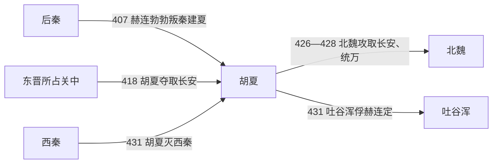

# 胡夏

> 导航：[晋](/%E4%BA%BA%E6%96%87%E7%A7%91%E5%AD%A6/%E5%8E%86%E5%8F%B2/%E4%B8%9C%E4%BA%9A/%E4%B8%AD%E5%9B%BD/%E6%99%8B/README.md) / [十六国](/%E4%BA%BA%E6%96%87%E7%A7%91%E5%AD%A6/%E5%8E%86%E5%8F%B2/%E4%B8%9C%E4%BA%9A/%E4%B8%AD%E5%9B%BD/%E6%99%8B/%E5%8D%81%E5%85%AD%E5%9B%BD/README.md) / [政权索引](/%E4%BA%BA%E6%96%87%E7%A7%91%E5%AD%A6/%E5%8E%86%E5%8F%B2/%E4%B8%9C%E4%BA%9A/%E4%B8%AD%E5%9B%BD/%E6%99%8B/%E5%8D%81%E5%85%AD%E5%9B%BD/%E6%94%BF%E6%9D%83/README.md) / [淝水之战前](/%E4%BA%BA%E6%96%87%E7%A7%91%E5%AD%A6/%E5%8E%86%E5%8F%B2/%E4%B8%9C%E4%BA%9A/%E4%B8%AD%E5%9B%BD/%E6%99%8B/%E5%8D%81%E5%85%AD%E5%9B%BD/%E6%B7%9D%E6%B0%B4%E4%B9%8B%E6%88%98%E5%89%8D.md) / [淝水之战后](/%E4%BA%BA%E6%96%87%E7%A7%91%E5%AD%A6/%E5%8E%86%E5%8F%B2/%E4%B8%9C%E4%BA%9A/%E4%B8%AD%E5%9B%BD/%E6%99%8B/%E5%8D%81%E5%85%AD%E5%9B%BD/%E6%B7%9D%E6%B0%B4%E4%B9%8B%E6%88%98%E5%90%8E.md)

## 时间

407年—431年。

## 别称

- 夏
- 大夏
- 赫连夏
- 北夏

## 概括

胡夏由匈奴铁弗部赫连勃勃建立，以统万城为中心。它乘后秦灭亡之机夺取长安，后在北魏、吐谷浑压力下灭亡。

## 历史演进图

## 建立、治理与兴衰

铁弗部首领刘卫辰391年被北魏击败后，其子赫连勃勃辗转依附后秦。后秦在河套防务和对北魏政策上出现裂缝时，赫连勃勃于407年杀没弈干、脱离姚氏，自称大夏天王，并改姓赫连。其早期不急于固守城市，而以骑兵反复袭击后秦北边、俘获人口和物资，待实力扩大后才修筑统万城作为都城。

| 阶段 | 过程与重要事件 |
|---|---|
| 游击扩张（407年—413年） | 依托河套、朔方草原袭扰后秦，吸收铁弗旧部和降兵，逐步控制鄂尔多斯地区。 |
| 统万建都（413年—418年） | 营建统万城并设置百官；工程与军役严酷，却提供了坚固的政治、仓储中心。 |
| 夺取关中（418年—425年） | 刘裕灭后秦后南返，胡夏伏击晋军、占长安；赫连勃勃在霸上称帝，国势达峰。 |
| 北魏打击与西迁（425年—431年） | 继承斗争中太子赫连璝被杀，赫连昌即位；北魏426年取长安、427年破统万，428年俘昌。赫连定在平凉续立，431年灭西秦后被吐谷浑俘获。 |

胡夏沿用皇帝、尚书和州郡名号，核心仍是赫连宗族、铁弗骑兵和通过战争迁入的人口。统万城与河套牧地构成军事优势，但政权对关中郡县的长期治理较浅。

- **鼎盛条件**：后秦衰弱、河套骑兵机动性、刘裕撤离关中的权力真空，以及统万城的防御。
- **结构因素**：国家财政依赖战争与强制迁徙，继承争斗损失宗室和主力，定居行政未能稳定覆盖新占关中。
- **外部压力**：北魏完成山西、河北整合后可连续西征；吐谷浑控制西行通道。
- **直接触发**：赫连勃勃死后内争，北魏迅速夺取两都和人口；赫连定失去根据地，灭西秦后试图西渡又遭吐谷浑截击，胡夏随其被俘而终结。

## 说明

- 407年，赫连勃勃自称大夏天王、大单于，改姓赫连，建立大夏政权。
- 胡夏长期侵扰后秦北边。
- 418年，赫连勃勃乘东晋灭后秦后的关中空虚，轻取长安，并在霸上称帝。
- 426年，北魏攻取长安。
- 428年，北魏攻陷安定，俘赫连昌；赫连定在平凉称帝。
- 431年，赫连定灭西秦后欲渡黄河攻北凉，被吐谷浑袭击俘获，胡夏灭亡。

## 世系表

| 顺序 | 姓名 | 庙号 | 谥号 / 称号 | 年号 | 在位时间 | 生卒时间 | 与前任关系 | 关键事件 / 备注 / 说明 |
|---:|---|---|---|---|---|---|---|---|
| 前身 | 刘诰升爰（刘训兜） | 无 | 元皇帝 | 无 | 272年—309年 | 不详—309年 | 铁弗部首领 | 赫连氏追尊。 |
| 前身 | 刘乌路孤（刘虎） | 无 | 景皇帝 | 无 | 309年—341年 | 不详—341年 | 刘诰升爰后继者 | 铁弗部首领。 |
| 前身 | 刘务桓（刘豹子） | 无 | 宣皇帝 | 无 | 341年—356年 | 不详—356年 | 刘虎子 | 铁弗部首领。 |
| 前身 | 刘阏陋头（刘阏头） | 无 | 无 | 无 | 356年—358年 | 不详 | 铁弗部首领 | 铁弗部首领。 |
| 前身 | 刘悉勿祈 | 无 | 无 | 无 | 358年—359年 | 不详 | 铁弗部首领 | 铁弗部首领。 |
| 前身 | 刘卫辰 | 太祖 | 桓皇帝 | 无 | 359年—391年 | 不详—391年 | 赫连勃勃父 | 铁弗部强大，后被北魏击败。 |
| 1 | 赫连勃勃 | 世祖 | 武烈皇帝 | 龙升、凤翔、昌武、真兴 | 407年—425年 | 381年—425年 | 开国君主 | 改姓赫连，建大夏，修统万城，418年夺长安。 |
| 2 | 赫连昌 | 无 | 无 | 承光 | 425年—428年 | 不详—434年 | 赫连勃勃子 | 428年被北魏俘。 |
| 3 | 赫连定 | 无 | 无 | 胜光 | 428年—431年 | 不详—432年 | 赫连勃勃子，赫连昌弟 | 431年灭西秦后被吐谷浑俘，胡夏亡。 |

## 演变关系

- 前一节点：[后秦](/%E4%BA%BA%E6%96%87%E7%A7%91%E5%AD%A6/%E5%8E%86%E5%8F%B2/%E4%B8%9C%E4%BA%9A/%E4%B8%AD%E5%9B%BD/%E6%99%8B/%E5%8D%81%E5%85%AD%E5%9B%BD/%E6%94%BF%E6%9D%83/%E5%90%8E%E7%A7%A6.md)衰亡与关中真空。
- 灭亡相关：北魏、吐谷浑。

## 相关笔记

- [政权索引](/%E4%BA%BA%E6%96%87%E7%A7%91%E5%AD%A6/%E5%8E%86%E5%8F%B2/%E4%B8%9C%E4%BA%9A/%E4%B8%AD%E5%9B%BD/%E6%99%8B/%E5%8D%81%E5%85%AD%E5%9B%BD/%E6%94%BF%E6%9D%83/README.md)
- [十六国](/%E4%BA%BA%E6%96%87%E7%A7%91%E5%AD%A6/%E5%8E%86%E5%8F%B2/%E4%B8%9C%E4%BA%9A/%E4%B8%AD%E5%9B%BD/%E6%99%8B/%E5%8D%81%E5%85%AD%E5%9B%BD/README.md)
- [十六国时空图](/%E4%BA%BA%E6%96%87%E7%A7%91%E5%AD%A6/%E5%8E%86%E5%8F%B2/%E4%B8%9C%E4%BA%9A/%E4%B8%AD%E5%9B%BD/%E6%99%8B/%E5%8D%81%E5%85%AD%E5%9B%BD/%E5%8D%81%E5%85%AD%E5%9B%BD%E6%97%B6%E7%A9%BA%E5%9B%BE.md)
- [淝水之战前](/%E4%BA%BA%E6%96%87%E7%A7%91%E5%AD%A6/%E5%8E%86%E5%8F%B2/%E4%B8%9C%E4%BA%9A/%E4%B8%AD%E5%9B%BD/%E6%99%8B/%E5%8D%81%E5%85%AD%E5%9B%BD/%E6%B7%9D%E6%B0%B4%E4%B9%8B%E6%88%98%E5%89%8D.md)
- [淝水之战后](/%E4%BA%BA%E6%96%87%E7%A7%91%E5%AD%A6/%E5%8E%86%E5%8F%B2/%E4%B8%9C%E4%BA%9A/%E4%B8%AD%E5%9B%BD/%E6%99%8B/%E5%8D%81%E5%85%AD%E5%9B%BD/%E6%B7%9D%E6%B0%B4%E4%B9%8B%E6%88%98%E5%90%8E.md)
