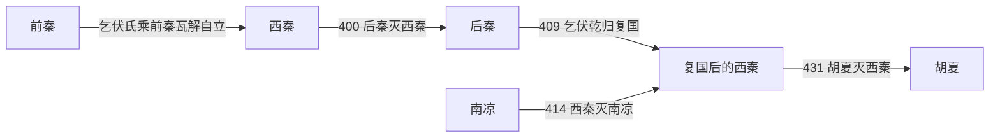

# 西秦

> 导航：[晋](/%E4%BA%BA%E6%96%87%E7%A7%91%E5%AD%A6/%E5%8E%86%E5%8F%B2/%E4%B8%9C%E4%BA%9A/%E4%B8%AD%E5%9B%BD/%E6%99%8B/README.md) / [十六国](/%E4%BA%BA%E6%96%87%E7%A7%91%E5%AD%A6/%E5%8E%86%E5%8F%B2/%E4%B8%9C%E4%BA%9A/%E4%B8%AD%E5%9B%BD/%E6%99%8B/%E5%8D%81%E5%85%AD%E5%9B%BD/README.md) / [政权索引](/%E4%BA%BA%E6%96%87%E7%A7%91%E5%AD%A6/%E5%8E%86%E5%8F%B2/%E4%B8%9C%E4%BA%9A/%E4%B8%AD%E5%9B%BD/%E6%99%8B/%E5%8D%81%E5%85%AD%E5%9B%BD/%E6%94%BF%E6%9D%83/README.md) / [淝水之战前](/%E4%BA%BA%E6%96%87%E7%A7%91%E5%AD%A6/%E5%8E%86%E5%8F%B2/%E4%B8%9C%E4%BA%9A/%E4%B8%AD%E5%9B%BD/%E6%99%8B/%E5%8D%81%E5%85%AD%E5%9B%BD/%E6%B7%9D%E6%B0%B4%E4%B9%8B%E6%88%98%E5%89%8D.md) / [淝水之战后](/%E4%BA%BA%E6%96%87%E7%A7%91%E5%AD%A6/%E5%8E%86%E5%8F%B2/%E4%B8%9C%E4%BA%9A/%E4%B8%AD%E5%9B%BD/%E6%99%8B/%E5%8D%81%E5%85%AD%E5%9B%BD/%E6%B7%9D%E6%B0%B4%E4%B9%8B%E6%88%98%E5%90%8E.md)

## 时间

385年—400年；409年—431年。

## 别称

- 乞伏秦

## 概括

西秦由鲜卑乞伏氏建立，活动于陇西、河湟一带。它曾被后秦吞并，后复国，431年被胡夏灭。

## 历史演进图

## 建立、治理与兴衰

乞伏氏原是陇西鲜卑部落联盟首领，前秦瓦解后以苑川、金城和枹罕为核心建立西秦。其统治以王族和部落军队为骨干，同时设置中原式官职、经营河湟农业和交通；首都多次迁移，反映它必须在后秦、南凉、吐谷浑和羌胡诸部之间寻找安全支点。

| 阶段 | 过程与重要事件 |
|---|---|
| 初建（385年—400年） | 乞伏国仁称苑川王，乾归继位后迁都金城；在陇右扩张，但遭后秦优势兵力压迫。 |
| 亡国与臣属（400年—409年） | 乾归败降姚兴，乞伏部众被纳入后秦体系；其宗族仍保存一定兵力和地方联系。 |
| 复国与扩张（409年—428年） | 乾归返苑川复国；炽磐迁枹罕，414年乘南凉主力外出攻取乐都，兼并其领土。 |
| 收缩与灭亡（428年—431年） | 乞伏暮末面对内乱、灾荒和胡夏进攻，被迫东迁；431年在南安降于赫连定，旋被杀。 |

- **鼎盛条件**：河湟谷地的农业牧业资源、乞伏氏部落凝聚力、后秦衰弱及南凉战略失误。
- **结构因素**：人口和财政规模有限，王族与部落首领的忠诚常随军功和资源分配变化；首都迁徙加剧行政不稳。
- **外部压力**：后秦、南凉、胡夏、北凉和吐谷浑环绕，西秦难以建立纵深防线。
- **直接触发**：炽磐晚年战争和灾荒削弱国力，暮末继位后叛乱频发；胡夏持续追击，最终迫其投降并消灭王室。

早期乞伏首领的年代多出自后出谱系和纪传记载，部分次序、在位起讫存在争议，表中以“不详”标示无法确证者。

## 说明

- 385年，乞伏国仁在陇西称大单于，又被前秦封为苑川王，定都勇士川。
- 388年，乞伏乾归继立，称大单于、河南王，迁都金城。
- 400年，西秦为后秦所灭，乞伏乾归降于后秦姚兴。
- 409年，乞伏乾归自后秦返回苑川复国。
- 412年，乞伏炽磐迁都枹罕。
- 431年，西秦被胡夏所灭。

## 世系表

| 顺序 | 姓名 | 庙号 | 谥号 / 称号 | 年号 | 在位时间 | 生卒时间 | 与前任关系 | 关键事件 / 备注 / 说明 |
|---:|---|---|---|---|---|---|---|---|
| 前身 | 乞伏祐邻 | 无 | 无 | 无 | 约265年以后，卒年不详 | 不详 | 陇西部首领 | 乞伏氏早期首领；年代出自后世追述。 |
| 前身 | 乞伏结权 | 无 | 无 | 无 | 不详 | 不详 | 乞伏氏首领 | 陇西部首领。 |
| 前身 | 乞伏利那 | 无 | 无 | 无 | 不详 | 不详 | 乞伏氏首领 | 陇西部首领。 |
| 前身 | 乞伏祁埿 | 无 | 无 | 无 | 不详 | 不详 | 乞伏氏首领 | 陇西部首领。 |
| 前身 | 乞伏述延 | 无 | 无 | 无 | 不详 | 不详 | 乞伏氏首领 | 陇西部首领。 |
| 前身 | 乞伏傉大寒 | 无 | 无 | 无 | 不详 | 不详 | 乞伏氏首领 | 陇西部首领。 |
| 前身 | 乞伏司繁 | 无 | 无 | 无 | 不详—385年 | 不详—385年 | 乞伏国仁父 | 陇西部首领。 |
| 1 | 乞伏国仁 | 烈祖 | 宣烈王 | 建义 | 385年—388年 | 不详—388年 | 乞伏司繁子 | 建立西秦。 |
| 2 | 乞伏乾归 | 高祖 | 武元王 | 太初、更始 | 388年—400年；409年—412年 | 不详—412年 | 乞伏国仁弟 | 400年降后秦；409年复国。 |
| 3 | 乞伏炽磐 | 太祖 | 文昭王 | 永康、建弘 | 412年—428年 | 不详—428年 | 乞伏乾归子 | 西秦较强时期，灭南凉。 |
| 4 | 乞伏暮末 | 无 | 无 | 永弘 | 428年—431年 | 不详—431年 | 乞伏炽磐子 | 431年被胡夏灭。 |

## 演变关系

- 前一节点：[前秦](/%E4%BA%BA%E6%96%87%E7%A7%91%E5%AD%A6/%E5%8E%86%E5%8F%B2/%E4%B8%9C%E4%BA%9A/%E4%B8%AD%E5%9B%BD/%E6%99%8B/%E5%8D%81%E5%85%AD%E5%9B%BD/%E6%94%BF%E6%9D%83/%E5%89%8D%E7%A7%A6.md)瓦解。
- 后一节点：[胡夏](/%E4%BA%BA%E6%96%87%E7%A7%91%E5%AD%A6/%E5%8E%86%E5%8F%B2/%E4%B8%9C%E4%BA%9A/%E4%B8%AD%E5%9B%BD/%E6%99%8B/%E5%8D%81%E5%85%AD%E5%9B%BD/%E6%94%BF%E6%9D%83/%E8%83%A1%E5%A4%8F.md)灭西秦。

## 相关笔记

- [政权索引](/%E4%BA%BA%E6%96%87%E7%A7%91%E5%AD%A6/%E5%8E%86%E5%8F%B2/%E4%B8%9C%E4%BA%9A/%E4%B8%AD%E5%9B%BD/%E6%99%8B/%E5%8D%81%E5%85%AD%E5%9B%BD/%E6%94%BF%E6%9D%83/README.md)
- [十六国](/%E4%BA%BA%E6%96%87%E7%A7%91%E5%AD%A6/%E5%8E%86%E5%8F%B2/%E4%B8%9C%E4%BA%9A/%E4%B8%AD%E5%9B%BD/%E6%99%8B/%E5%8D%81%E5%85%AD%E5%9B%BD/README.md)
- [十六国时空图](/%E4%BA%BA%E6%96%87%E7%A7%91%E5%AD%A6/%E5%8E%86%E5%8F%B2/%E4%B8%9C%E4%BA%9A/%E4%B8%AD%E5%9B%BD/%E6%99%8B/%E5%8D%81%E5%85%AD%E5%9B%BD/%E5%8D%81%E5%85%AD%E5%9B%BD%E6%97%B6%E7%A9%BA%E5%9B%BE.md)
- [淝水之战前](/%E4%BA%BA%E6%96%87%E7%A7%91%E5%AD%A6/%E5%8E%86%E5%8F%B2/%E4%B8%9C%E4%BA%9A/%E4%B8%AD%E5%9B%BD/%E6%99%8B/%E5%8D%81%E5%85%AD%E5%9B%BD/%E6%B7%9D%E6%B0%B4%E4%B9%8B%E6%88%98%E5%89%8D.md)
- [淝水之战后](/%E4%BA%BA%E6%96%87%E7%A7%91%E5%AD%A6/%E5%8E%86%E5%8F%B2/%E4%B8%9C%E4%BA%9A/%E4%B8%AD%E5%9B%BD/%E6%99%8B/%E5%8D%81%E5%85%AD%E5%9B%BD/%E6%B7%9D%E6%B0%B4%E4%B9%8B%E6%88%98%E5%90%8E.md)
