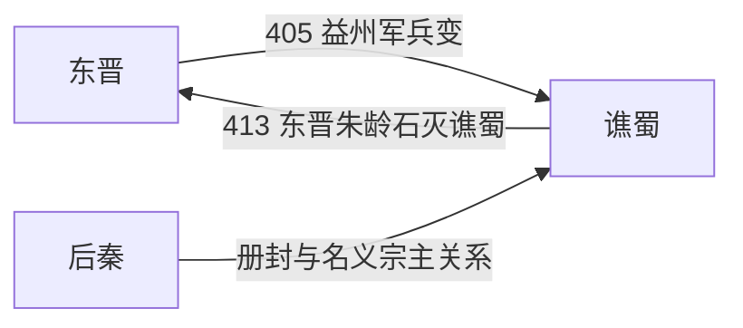

# 谯蜀

> 导航：[晋](/%E4%BA%BA%E6%96%87%E7%A7%91%E5%AD%A6/%E5%8E%86%E5%8F%B2/%E4%B8%9C%E4%BA%9A/%E4%B8%AD%E5%9B%BD/%E6%99%8B/README.md) / [十六国](/%E4%BA%BA%E6%96%87%E7%A7%91%E5%AD%A6/%E5%8E%86%E5%8F%B2/%E4%B8%9C%E4%BA%9A/%E4%B8%AD%E5%9B%BD/%E6%99%8B/%E5%8D%81%E5%85%AD%E5%9B%BD/README.md) / [政权索引](/%E4%BA%BA%E6%96%87%E7%A7%91%E5%AD%A6/%E5%8E%86%E5%8F%B2/%E4%B8%9C%E4%BA%9A/%E4%B8%AD%E5%9B%BD/%E6%99%8B/%E5%8D%81%E5%85%AD%E5%9B%BD/%E6%94%BF%E6%9D%83/README.md) / [淝水之战前](/%E4%BA%BA%E6%96%87%E7%A7%91%E5%AD%A6/%E5%8E%86%E5%8F%B2/%E4%B8%9C%E4%BA%9A/%E4%B8%AD%E5%9B%BD/%E6%99%8B/%E5%8D%81%E5%85%AD%E5%9B%BD/%E6%B7%9D%E6%B0%B4%E4%B9%8B%E6%88%98%E5%89%8D.md) / [淝水之战后](/%E4%BA%BA%E6%96%87%E7%A7%91%E5%AD%A6/%E5%8E%86%E5%8F%B2/%E4%B8%9C%E4%BA%9A/%E4%B8%AD%E5%9B%BD/%E6%99%8B/%E5%8D%81%E5%85%AD%E5%9B%BD/%E6%B7%9D%E6%B0%B4%E4%B9%8B%E6%88%98%E5%90%8E.md)

## 时间

405年—413年。

## 别称

- 西蜀
- 后蜀（非五代后蜀）

## 概括

谯蜀是东晋末年谯纵在巴蜀建立的短命地方政权，不属于传统十六国，但常在五胡十六国时空图中作为巴蜀割据势力出现。

## 历史演进图

## 建立、治理与兴衰

405年，东晋益州军奉命东下讨伐桓振，士卒因不愿远征发动兵变，杀害刺史毛璩等人，并推谯纵为首领。史籍将谯纵描写为被迫接受拥立，但其本人在建政后的实际选择仍需与传统“胁迫”叙事区分。谯蜀占据成都平原，沿用东晋州郡和官号；谯氏、兵变将领与巴蜀地方豪强分享权力，对后秦称臣以换取蜀王名号和北方支援。

| 阶段 | 过程与重要事件 |
|---|---|
| 兵变建政（405年） | 益州军杀毛氏官员，谯纵在成都称王，东晋失去巴蜀。 |
| 寻求外援（406年—408年） | 向后秦通好并受姚兴册封，以名义臣属换取政治承认；同时巩固成都和长江上游要道。 |
| 抵御东晋（408年—410年） | 刘敬宣率晋军入蜀，但因峡路补给和谯蜀防御受阻而撤退，地方政权得以续存。 |
| 朱龄石灭蜀（412年—413年） | 刘裕秘密部署两路进军，朱龄石采用出其不意的外水路线突破防线；成都守军崩溃，谯纵出逃后自杀。 |

- **维持条件**：成都平原的粮源、峡江和山道防御、东晋内战，以及后秦的外交支持。
- **结构因素**：政权由军队兵变建立，政治合法性和跨郡动员有限；对后秦的册封不能转化为可靠援军。
- **外部压力**：刘裕平定东晋内乱后必须恢复上游控制，荆州水军与益州反谯力量形成夹击。
- **直接触发**：朱龄石改变进军路线，使谯蜀误判主攻方向；主力战败、成都失守，谯纵无法组织第二根据地，413年政权灭亡。

## 说明

- 405年，谯纵在巴蜀建立地方割据政权。
- 谯蜀依托成都，与东晋中央对抗，并曾受后秦册封。
- 413年，东晋朱龄石入蜀，谯纵败亡，巴蜀重新归入东晋。

## 世系表

| 顺序 | 姓名 | 庙号 | 谥号 / 称号 | 年号 | 在位时间 | 生卒时间 | 与前任关系 | 关键事件 / 备注 / 说明 |
|---:|---|---|---|---|---|---|---|---|
| 1 | 谯纵 | 无 | 无 | 无 | 405年—413年 | 不详—413年 | 开国君主 | 据成都称成都王，受后秦封蜀王；413年被东晋朱龄石讨灭。 |

## 演变关系

- 前一节点：[东晋](/%E4%BA%BA%E6%96%87%E7%A7%91%E5%AD%A6/%E5%8E%86%E5%8F%B2/%E4%B8%9C%E4%BA%9A/%E4%B8%AD%E5%9B%BD/%E6%99%8B/%E4%B8%9C%E6%99%8B.md)末年巴蜀动荡。
- 后一节点：东晋收复巴蜀。

## 相关笔记

- [政权索引](/%E4%BA%BA%E6%96%87%E7%A7%91%E5%AD%A6/%E5%8E%86%E5%8F%B2/%E4%B8%9C%E4%BA%9A/%E4%B8%AD%E5%9B%BD/%E6%99%8B/%E5%8D%81%E5%85%AD%E5%9B%BD/%E6%94%BF%E6%9D%83/README.md)
- [十六国](/%E4%BA%BA%E6%96%87%E7%A7%91%E5%AD%A6/%E5%8E%86%E5%8F%B2/%E4%B8%9C%E4%BA%9A/%E4%B8%AD%E5%9B%BD/%E6%99%8B/%E5%8D%81%E5%85%AD%E5%9B%BD/README.md)
- [十六国时空图](/%E4%BA%BA%E6%96%87%E7%A7%91%E5%AD%A6/%E5%8E%86%E5%8F%B2/%E4%B8%9C%E4%BA%9A/%E4%B8%AD%E5%9B%BD/%E6%99%8B/%E5%8D%81%E5%85%AD%E5%9B%BD/%E5%8D%81%E5%85%AD%E5%9B%BD%E6%97%B6%E7%A9%BA%E5%9B%BE.md)
- [淝水之战前](/%E4%BA%BA%E6%96%87%E7%A7%91%E5%AD%A6/%E5%8E%86%E5%8F%B2/%E4%B8%9C%E4%BA%9A/%E4%B8%AD%E5%9B%BD/%E6%99%8B/%E5%8D%81%E5%85%AD%E5%9B%BD/%E6%B7%9D%E6%B0%B4%E4%B9%8B%E6%88%98%E5%89%8D.md)
- [淝水之战后](/%E4%BA%BA%E6%96%87%E7%A7%91%E5%AD%A6/%E5%8E%86%E5%8F%B2/%E4%B8%9C%E4%BA%9A/%E4%B8%AD%E5%9B%BD/%E6%99%8B/%E5%8D%81%E5%85%AD%E5%9B%BD/%E6%B7%9D%E6%B0%B4%E4%B9%8B%E6%88%98%E5%90%8E.md)
