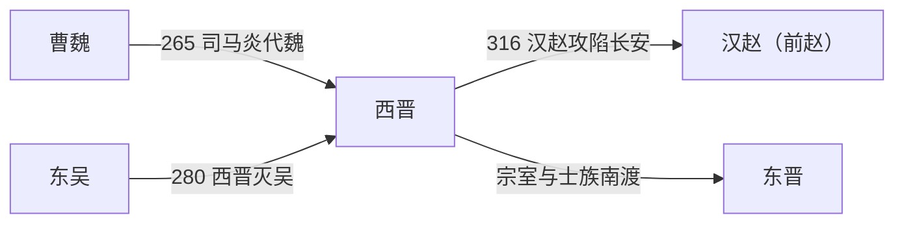

# 西晋

> 导航：[晋](/%E4%BA%BA%E6%96%87%E7%A7%91%E5%AD%A6/%E5%8E%86%E5%8F%B2/%E4%B8%9C%E4%BA%9A/%E4%B8%AD%E5%9B%BD/%E6%99%8B/README.md) / [西晋](/%E4%BA%BA%E6%96%87%E7%A7%91%E5%AD%A6/%E5%8E%86%E5%8F%B2/%E4%B8%9C%E4%BA%9A/%E4%B8%AD%E5%9B%BD/%E6%99%8B/%E8%A5%BF%E6%99%8B.md) / [东晋](/%E4%BA%BA%E6%96%87%E7%A7%91%E5%AD%A6/%E5%8E%86%E5%8F%B2/%E4%B8%9C%E4%BA%9A/%E4%B8%AD%E5%9B%BD/%E6%99%8B/%E4%B8%9C%E6%99%8B.md) / [八王之乱](/%E4%BA%BA%E6%96%87%E7%A7%91%E5%AD%A6/%E5%8E%86%E5%8F%B2/%E4%B8%9C%E4%BA%9A/%E4%B8%AD%E5%9B%BD/%E6%99%8B/%E5%85%AB%E7%8E%8B%E4%B9%8B%E4%B9%B1.md) / [晋君主世系](/%E4%BA%BA%E6%96%87%E7%A7%91%E5%AD%A6/%E5%8E%86%E5%8F%B2/%E4%B8%9C%E4%BA%9A/%E4%B8%AD%E5%9B%BD/%E6%99%8B/%E4%B8%96%E7%B3%BB.md) / [十六国](/%E4%BA%BA%E6%96%87%E7%A7%91%E5%AD%A6/%E5%8E%86%E5%8F%B2/%E4%B8%9C%E4%BA%9A/%E4%B8%AD%E5%9B%BD/%E6%99%8B/%E5%8D%81%E5%85%AD%E5%9B%BD/README.md)

## 时间

265年—316年。

## 别称

- 晋
- 司马晋
- 两晋前期

## 概括

西晋由司马炎代魏建立，定都洛阳。280年西晋灭东吴，结束三国鼎立，短暂恢复全国统一。但西晋制度上同时存在宗室分封、门阀士族、外戚干政和地方军镇等矛盾，晋惠帝时期爆发[八王之乱](/%E4%BA%BA%E6%96%87%E7%A7%91%E5%AD%A6/%E5%8E%86%E5%8F%B2/%E4%B8%9C%E4%BA%9A/%E4%B8%AD%E5%9B%BD/%E6%99%8B/%E5%85%AB%E7%8E%8B%E4%B9%8B%E4%B9%B1.md)，国力被严重削弱。随后汉赵等北方政权南下，311年洛阳陷落，316年长安陷落，西晋灭亡。

## 历史演进图

## 建立背景与崛起机制

司马氏的崛起不是一次突然政变，而是从高平陵之变以后逐步控制曹魏中枢、军队与官僚任命的结果。司马昭灭蜀后，司马氏既掌握军事声望，也取得改朝换代所需的政治资源；司马炎受禅后大体承接曹魏行政体系，并以安抚功臣、整合士族和准备伐吴巩固新朝。280年灭吴成功，一方面依靠益州水军、长江上游与多路并进的战略，另一方面也利用了孙吴晚期政治失序和防线分散。

## 分阶段发展

| 阶段 | 过程 | 关键转折 |
|---|---|---|
| 建国与整合（265年—279年） | 司马炎代魏，整顿官制、分封宗室，并准备南征。 | 益州造船与羊祜经营荆州，为伐吴创造条件。 |
| 统一与太康局面（280年—290年） | 灭吴后实现短暂统一，户口、赋役和交通网络重新纳入中央。 | 统一扩大了财政基础，但宗室拥兵与豪强兼并并未解决。 |
| 宫廷政变与八王之乱（291年—306年） | 外戚、贾后和宗室诸王围绕皇帝控制权反复政变，战事由宫廷扩展到洛阳、关中与河北。 | 司马伦篡位把辅政冲突升级为诸王全面内战。 |
| 永嘉崩溃（307年—316年） | 中央兵力耗竭，地方军镇、流民武装与汉赵等势力并起；洛阳、长安先后失守。 | 311年洛阳陷落后，西晋只剩关中残余政权；316年长安失守。 |

## 鼎盛条件与衰亡原因

- **鼎盛条件**：继承曹魏较成熟的官僚与军事体系；消灭蜀汉后占据长江上游；孙吴内部衰弱；统一后短期内恢复跨区域交通和征税。
- **结构因素**：同姓诸王掌握兵权，中央又依赖外戚与门阀；占田、荫客等制度和豪强兼并削弱国家直接控制的人口与税源；继承安排未能形成稳定的辅政机制。
- **外部压力**：北方长期战乱、灾荒和人口迁徙推动流民与各族军事集团扩张，汉赵等政权得以利用西晋内战造成的权力真空。
- **直接触发**：晋惠帝时期皇权失能，贾后废杀太子后引发司马伦政变，八王之乱摧毁中央军政体系；311年汉赵破洛阳、316年破长安，完成对西晋残余政权的军事消灭。

完整皇帝顺序见[晋君主世系](/%E4%BA%BA%E6%96%87%E7%A7%91%E5%AD%A6/%E5%8E%86%E5%8F%B2/%E4%B8%9C%E4%BA%9A/%E4%B8%AD%E5%9B%BD/%E6%99%8B/%E4%B8%96%E7%B3%BB.md#%E8%A5%BF%E6%99%8B%E7%9A%87%E5%B8%9D)。

## 说明

- **建国**：265年，司马炎迫魏元帝曹奂禅位，建立晋朝，定都洛阳。
- **统一**：280年，西晋灭东吴，三国时代结束。
- **分封宗室**：西晋重用并分封司马氏诸王，希望以宗室屏藩皇室；但诸王掌握地方军政，后来成为内战基础。
- **政治危机**：晋武帝死后，晋惠帝即位，皇权薄弱，贾后、杨氏外戚和宗室诸王相互争权。
- **八王之乱**：291年—306年，宗室诸王长期混战，中央权威瓦解，北方防御和社会秩序受重创。
- **永嘉之乱**：311年，汉赵攻破洛阳，俘晋怀帝，宗室、官员和百姓大量被杀，西晋政权名存实亡。
- **灭亡**：313年晋愍帝在长安继位；316年汉赵攻破长安，俘晋愍帝，西晋灭亡。
- **历史影响**：北方陷入十六国割据，晋室宗族和北方士族大量南迁，为东晋建立和江南开发奠定基础。

## 统治结构

| 层面 | 主要特征 | 影响 |
|---|---|---|
| 皇帝 | 形式上为最高统治者 | 晋惠帝时期皇权失控，皇帝成为各派争夺的政治符号。 |
| 宗室诸王 | 同姓王分封并握有军政力量 | 本意为拱卫皇室，实际导致八王之乱。 |
| 外戚与后族 | 杨氏、贾氏等参与辅政和宫廷权力斗争 | 激化中央权力争夺。 |
| 士族门阀 | 大族掌握仕途和地方社会资源 | 两晋门阀政治的重要基础。 |
| 地方州镇 | 地方军政力量增强 | 中央衰弱后，地方割据和民族政权兴起。 |

## 演变关系

- 前一节点：[曹魏后期司马氏掌权](/%E4%BA%BA%E6%96%87%E7%A7%91%E5%AD%A6/%E5%8E%86%E5%8F%B2/%E4%B8%9C%E4%BA%9A/%E4%B8%AD%E5%9B%BD/%E6%99%8B/%E4%B8%96%E7%B3%BB.md#%E8%BF%BD%E5%B0%8A%E5%B8%9D%E4%B8%8E%E5%A5%A0%E5%9F%BA%E8%80%85)。
- 核心事件：[八王之乱](/%E4%BA%BA%E6%96%87%E7%A7%91%E5%AD%A6/%E5%8E%86%E5%8F%B2/%E4%B8%9C%E4%BA%9A/%E4%B8%AD%E5%9B%BD/%E6%99%8B/%E5%85%AB%E7%8E%8B%E4%B9%8B%E4%B9%B1.md)。
- 后一节点：[东晋](/%E4%BA%BA%E6%96%87%E7%A7%91%E5%AD%A6/%E5%8E%86%E5%8F%B2/%E4%B8%9C%E4%BA%9A/%E4%B8%AD%E5%9B%BD/%E6%99%8B/%E4%B8%9C%E6%99%8B.md)。
- 并行与后续北方格局：[十六国](/%E4%BA%BA%E6%96%87%E7%A7%91%E5%AD%A6/%E5%8E%86%E5%8F%B2/%E4%B8%9C%E4%BA%9A/%E4%B8%AD%E5%9B%BD/%E6%99%8B/%E5%8D%81%E5%85%AD%E5%9B%BD/README.md)。
