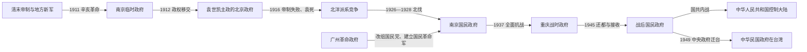

# 民国

## 时间与范围

1912年1月1日—1949年。这里的“民国”专指中华民国政府在中国大陆建立、竞争并逐步失去大陆实际控制的阶段；1949年以后中华民国政府迁台延续，另见[台湾](/%E4%BA%BA%E6%96%87%E7%A7%91%E5%AD%A6/%E5%8E%86%E5%8F%B2/%E4%B8%9C%E4%BA%9A/%E4%B8%AD%E5%9B%BD/%E5%8F%B0%E6%B9%BE/README.md)。因此，1949年是大陆政权结构的转折，不等于中华民国法统或机构在该年简单消失。

## 概括

辛亥革命瓦解清朝帝制，却没有同时解决军队国家化、中央财政、地方权力和列强在华权益问题。南京临时政府以共和制度开启新国家，南北议和又使掌握北洋军的袁世凯接任临时大总统。此后十六年，北京政府保有中央政府名义及多数国际承认，但总统、内阁、国会和各派军队之间不断重组；南方也先后出现护法军政府与国民政府。

1925年以后，中国国民党在广东重建党政军体系并发动北伐。南京国民政府在1928年取得名义统一，继而经历国家建设、地方实力派竞争、对日战争和战后国共内战。1949年，中国共产党建立中华人民共和国并控制中国大陆大部，中华民国中央政府迁往台湾。

## 全史主线

## 阶段导航

| 顺序 | 阶段 | 时间 | 主线 |
|---:|---|---|---|
| 1 | 南京临时政府 | 1912年1—4月 | 孙中山就任临时大总统，临时参议院与《临时约法》建立共和框架；为促成清帝退位，孙中山辞职，袁世凯在北京接任。 |
| 2 | [北洋时期](/%E4%BA%BA%E6%96%87%E7%A7%91%E5%AD%A6/%E5%8E%86%E5%8F%B2/%E4%B8%9C%E4%BA%9A/%E4%B8%AD%E5%9B%BD/%E6%B0%91%E5%9B%BD/%E5%8C%97%E6%B4%8B%E6%97%B6%E6%9C%9F.md) | 1912—1928年 | 北京政府继承中央机构和国际席位；袁世凯死后，皖、直、奉等军事派系先后控制中枢。 |
| 3 | [国民政府时期](/%E4%BA%BA%E6%96%87%E7%A7%91%E5%AD%A6/%E5%8E%86%E5%8F%B2/%E4%B8%9C%E4%BA%9A/%E4%B8%AD%E5%9B%BD/%E6%B0%91%E5%9B%BD/%E5%9B%BD%E6%B0%91%E6%94%BF%E5%BA%9C%E6%97%B6%E6%9C%9F.md) | 1925/1927—1949年 | 广州国民政府发动北伐，南京政府取得名义统一，后经历抗战、行宪和国共内战。 |
| 专题 | [北洋军阀](/%E4%BA%BA%E6%96%87%E7%A7%91%E5%AD%A6/%E5%8E%86%E5%8F%B2/%E4%B8%9C%E4%BA%9A/%E4%B8%AD%E5%9B%BD/%E6%B0%91%E5%9B%BD/%E5%8C%97%E6%B4%8B%E5%86%9B%E9%98%80.md) | 约1895—1928年 | 解释北洋新军怎样转化为跨省军事政治网络，以及派系崛起与衰落。 |
| 专表 | [民国大陆时期国家元首与政府首脑表](/%E4%BA%BA%E6%96%87%E7%A7%91%E5%AD%A6/%E5%8E%86%E5%8F%B2/%E4%B8%9C%E4%BA%9A/%E4%B8%AD%E5%9B%BD/%E6%B0%91%E5%9B%BD/%E6%B0%91%E5%9B%BD%E5%A4%A7%E9%99%86%E6%97%B6%E6%9C%9F%E5%9B%BD%E5%AE%B6%E5%85%83%E9%A6%96%E4%B8%8E%E6%94%BF%E5%BA%9C%E9%A6%96%E8%84%91%E8%A1%A8.md) | 1912—1949年 | 按任职顺序列出正式、代理、复位、集体代行和职位中断，并另辨实际权力。 |

## 重要转折

| 时间 | 转折 | 影响 |
|---|---|---|
| 1911—1912年 | 辛亥革命、南北议和与清帝退位 | 共和政体建立；中央军权与财政却主要落入袁世凯集团。 |
| 1913—1916年 | 宋教仁遇刺、二次革命、袁世凯称帝与护国战争 | 议会政治受挫；帝制复辟失败，北洋集团失去共同首领。 |
| 1917年 | 张勋复辟、府院冲突与护法运动 | 北京政局反复，南北政治中心长期并立。 |
| 1920—1924年 | 直皖战争、两次直奉战争、北京政变 | 控制中央的派系连续更替，宪政合法性进一步削弱。 |
| 1926—1928年 | 北伐、南京政府成立与东北易帜 | 北京政府终结，南京政府取得名义统一。 |
| 1931—1937年 | 九一八事变、内战与西安事变 | 东北失守，对日战争压力迫使国内政治联盟改变。 |
| 1937—1945年 | 全面抗日战争 | 政府迁重庆并进入总体战；国家财政、人口和基础设施承受巨大损耗。 |
| 1945—1949年 | 接收、经济危机、行宪与国共内战 | 军事失败、通货膨胀、治理能力和社会支持危机叠加，国民政府失去大陆控制。 |

## 政权与权力结构

| 维度 | 北洋时期 | 国民政府时期 |
|---|---|---|
| 名义国家元首 | 临时大总统、大总统、临时执政、陆海军大元帅等先后出现，且有复辟和集体代行。 | 国民政府委员会或主席；1948年行宪后为总统，李宗仁曾代行总统职权。 |
| 政府首脑 | 国务总理与内阁，任期频繁中断，代理者很多。 | 行政院院长；五院制下负责行政，但重大军事政治决策常在党和军事委员会。 |
| 立法与法统 | 临时参议院、国会、约法和宪法多次建立、解散或恢复。 | 国民党训政框架下设国民政府与五院；1946年制宪，1948年行宪。 |
| 实际最高权力 | 袁世凯及其后控制北京的皖、直、奉军政首领；名义元首与实权者常不一致。 | 中国国民党中央、国民政府军事委员会和蒋介石长期构成中枢；地方实力派保有军政资源。 |
| 实际控制 | 随战争变动，北京政府从未持续直接控制所有省份。 | “统一”多为层级不一的政治服从；日占区、中共根据地和地方军政区均限制中央控制。 |

## 建立、维系与大陆统治终结

- **建立背景：**清末新政培养新军、商绅和省级政治力量；铁路国有化争议、财政危机与革命组织活动促成1911年各省独立。
- **维系机制：**中央政府依靠关税、盐税、外债、官僚机构和国际承认维持运转；地方集团则依靠军队、地盘税收与人身网络。
- **国家建设：**南京政府尝试统一币制、关税自主、交通、教育、法律和行政制度，但实际下达能力因地方权力和战争而不均。
- **结构因素：**军队未完全国家化，城乡财政基础薄弱，土地与社会改革有限，中央—地方关系不稳定。
- **外部压力：**列强特权、日本扩张和世界经济波动长期挤压财政与主权；全面抗战耗尽大量人力物力。
- **直接触发：**1946年后全面内战、恶性通货膨胀、军队士气与后勤问题，以及中国共产党在土地、组织和军事动员上的优势，共同导致南京政府于1949年失去大陆统治。

## 前后关系

- 前一节点：[清](/%E4%BA%BA%E6%96%87%E7%A7%91%E5%AD%A6/%E5%8E%86%E5%8F%B2/%E4%B8%9C%E4%BA%9A/%E4%B8%AD%E5%9B%BD/%E6%B8%85/README.md)
- 大陆后一节点：[中华人民共和国](/%E4%BA%BA%E6%96%87%E7%A7%91%E5%AD%A6/%E5%8E%86%E5%8F%B2/%E4%B8%9C%E4%BA%9A/%E4%B8%AD%E5%9B%BD/%E4%B8%AD%E5%8D%8E%E4%BA%BA%E6%B0%91%E5%85%B1%E5%92%8C%E5%9B%BD/README.md)
- 政府迁台后的历史：[台湾](/%E4%BA%BA%E6%96%87%E7%A7%91%E5%AD%A6/%E5%8E%86%E5%8F%B2/%E4%B8%9C%E4%BA%9A/%E4%B8%AD%E5%9B%BD/%E5%8F%B0%E6%B9%BE/README.md)
- 直接上级：[中国](/%E4%BA%BA%E6%96%87%E7%A7%91%E5%AD%A6/%E5%8E%86%E5%8F%B2/%E4%B8%9C%E4%BA%9A/%E4%B8%AD%E5%9B%BD/README.md)
