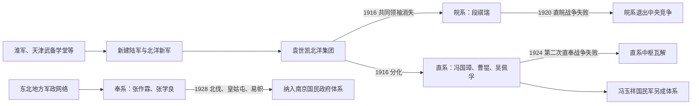

# 北洋军阀

## 时间与范围

北洋军事系统形成于1895年前后，作为控制北京中央政府的主要政治力量活跃于1912—1928年。1928年以后，其人员与军队分别被消灭、改编或纳入国民政府，“北洋军阀”作为中央派系体系终结，但地方军事政治并未立即消失。

## 概括

北洋军阀不是一个固定组织，也不是所有民国地方军人统称。它首先指由袁世凯训练的北洋新军及其军官、幕僚、同乡和政治关系网；袁死后，这套网络按领袖、驻防地、军队编制和利益联盟分化为皖系、直系、奉系等。阎锡山的晋系、冯玉祥的国民军及西南军阀与北洋政局密切互动，但来源和组织基础不同，应区别说明。

## 来源、分化与归宿

## 形成机制

- **军事专业化：**甲午战争后清廷扩练新军。小站练兵、武备学堂、编制和军官教育使北洋军较旧式军队更集中、更职业化。
- **人身网络：**军官忠诚主要系于统帅、师长和同僚关系，中央法定统帅制度尚未成熟；职位、军饷与升迁构成派系黏合剂。
- **地盘财政：**省级驻军控制税收、兵工、铁路和城市，督军与省长可将地方资源转化为军事实力。
- **中央名义：**取得北京政府任命、印信、借款和外交承认能强化地方统治，因此军阀既与中央对抗，也竞相控制中央。
- **外部援助：**日本及西方列强向不同集团提供贷款、军火或政治支持，但各派并非外力的简单代理，其选择仍受国内利益驱动。

## 主要派系与内部世系

| 派系 | 主要领袖顺序 | 核心力量与地盘 | 崛起与衰落 |
|---|---|---|---|
| 袁系共同中枢 | **袁世凯** | 北洋军主要各镇、北京政府、旧官僚网络 | 借南北议和成为国家元首；洪宪帝制引发护国战争，1916年袁死后失去统一继承人。 |
| 皖系 | **段祺瑞**、徐树铮；与靳云鹏、倪嗣冲等关系密切 | 国务院、参战军及安徽籍或亲段军政人员 | 借对德参战和借款扩军；1920年直皖战争败北后，直属军力和中央地位崩溃。 |
| 直系 | 冯国璋 → **曹锟、吴佩孚**；孙传芳后据东南 | 直隶、河南、湖北及长江中下游若干省份 | 直皖战争后控制北京；曹锟贿选削弱合法性，1924年冯玉祥倒戈导致战败，1926—1927年再受北伐重创。 |
| 奉系 | **张作霖** → **张学良** | 东三省军队、兵工与财政，后组成安国军入关 | 依托东北较完整的区域政权发展；1928年张作霖撤离北京并遇害，张学良易帜后转为南京政府下的东北实力派。 |
| 国民军 | **冯玉祥**；鹿钟麟、宋哲元等 | 西北、察绥及一度控制北京 | 源自直系部队但在1924年北京政变后独立；与苏联、国民党合作参加北伐，后在中原大战中受挫并分化。 |
| 晋系 | **阎锡山** | 山西及一度扩展至华北 | 并非北洋嫡系，以山西财政军政体系长期自立；在北洋、国民政府与其他集团间调整联盟。 |

## 重要事件

| 时间 | 事件 | 派系变化 |
|---|---|---|
| 1895—1901年 | 小站练兵、武卫右军与北洋常备军形成 | 袁世凯建立军官和编制基础。 |
| 1905—1907年 | 北洋六镇大体成形 | 北洋军成为清末最强的新式军事集团之一。 |
| 1911—1912年 | 辛亥革命与南北议和 | 袁凭北洋军迫使清廷议和，又取得临时大总统职位。 |
| 1915—1916年 | 洪宪帝制与护国战争 | 多地军人反袁，北洋内部也缺乏全力支持；袁死后派系公开化。 |
| 1917年 | 府院之争、张勋复辟 | 段祺瑞以讨逆军重掌中枢，皖系权势上升。 |
| 1918年 | 参战军与安福国会 | 皖系利用借款和政治组织扩权，激化直、奉反弹。 |
| 1920年 | 直皖战争 | 皖系主力迅速战败，直奉联盟接管北京。 |
| 1922年 | 第一次直奉战争 | 直系获胜，奉系退守东北并整军。 |
| 1924年 | 第二次直奉战争与北京政变 | 冯玉祥倒戈使直系失败，奉系入关，国民军兴起。 |
| 1925—1926年 | 浙奉战争、反奉战争及郭松龄兵变 | 奉系内部与外围冲突不断，华北政治更加碎片化。 |
| 1926—1928年 | 北伐 | 北伐军与地方倒戈共同击败吴佩孚、孙传芳和张作霖在关内的军队。 |
| 1928年 | 皇姑屯事件与东北易帜 | 张学良继位后接受南京政府名义，北洋派系争夺中央的时代结束。 |

## 军阀政治怎样运作

| 资源 | 运作方式 | 长期后果 |
|---|---|---|
| 军队 | 个人效忠、层层提拔与部队番号绑定；战败常导致整支军队倒戈或重编。 | 国家军令难以统一，政治更替常通过战争完成。 |
| 财政 | 田赋、厘金、盐税截留、铁路收益、借款和临时摊派供军。 | 军费挤压民政，地方征收加重，中央预算失去稳定性。 |
| 政治职位 | 总统、总理、督军和省长任命被用于联盟交换。 | 法定机构仍存在，却可能成为军事均势的结果。 |
| 舆论与合法性 | 各派使用“护法”“统一”“自治”“反赤”等口号组织联盟。 | 政治语言并非全无意义，但往往不能约束军事行动。 |
| 外交 | 贷款、军火和国际承认影响实力平衡。 | 主权议题与国内派系竞争相互缠绕。 |

## 兴衰原因

- **崛起的结构条件：**清廷以地方新军处理革命危机，反而使掌军者拥有决定中央更替的能力；共和国初期又缺乏统一税源和非个人化军令体系。
- **派系持续分裂：**北洋各镇没有被共同制度整合，袁世凯也没有建立可被接受的接班机制。领袖死亡、战败和财政断裂都会引发重组。
- **社会与政治压力：**军费、战争和外交退让引发商人、学生、工人及地方社会反对；新文化运动、五四运动与民族主义扩大了军阀政治的合法性危机。
- **外部和南方挑战：**苏联援助下改组的国民党建立党军与动员组织，能够把民族革命、政治组织和军事行动结合起来。
- **直接终结：**北伐军事推进、派系内部倒戈和奉系撤出北京叠加，使北洋集团失去争夺全国中枢的能力；其成员此后以地方实力派身份延续，而非整体传承。

## 图像

## 相关

- [北洋时期](/%E4%BA%BA%E6%96%87%E7%A7%91%E5%AD%A6/%E5%8E%86%E5%8F%B2/%E4%B8%9C%E4%BA%9A/%E4%B8%AD%E5%9B%BD/%E6%B0%91%E5%9B%BD/%E5%8C%97%E6%B4%8B%E6%97%B6%E6%9C%9F.md)
- [民国大陆时期国家元首与政府首脑表](/%E4%BA%BA%E6%96%87%E7%A7%91%E5%AD%A6/%E5%8E%86%E5%8F%B2/%E4%B8%9C%E4%BA%9A/%E4%B8%AD%E5%9B%BD/%E6%B0%91%E5%9B%BD/%E6%B0%91%E5%9B%BD%E5%A4%A7%E9%99%86%E6%97%B6%E6%9C%9F%E5%9B%BD%E5%AE%B6%E5%85%83%E9%A6%96%E4%B8%8E%E6%94%BF%E5%BA%9C%E9%A6%96%E8%84%91%E8%A1%A8.md)
- [淮军](/%E4%BA%BA%E6%96%87%E7%A7%91%E5%AD%A6/%E5%8E%86%E5%8F%B2/%E4%B8%9C%E4%BA%9A/%E4%B8%AD%E5%9B%BD/%E6%B8%85/%E6%B7%AE%E5%86%9B.md)
- [国民政府时期](/%E4%BA%BA%E6%96%87%E7%A7%91%E5%AD%A6/%E5%8E%86%E5%8F%B2/%E4%B8%9C%E4%BA%9A/%E4%B8%AD%E5%9B%BD/%E6%B0%91%E5%9B%BD/%E5%9B%BD%E6%B0%91%E6%94%BF%E5%BA%9C%E6%97%B6%E6%9C%9F.md)
- [民国](/%E4%BA%BA%E6%96%87%E7%A7%91%E5%AD%A6/%E5%8E%86%E5%8F%B2/%E4%B8%9C%E4%BA%9A/%E4%B8%AD%E5%9B%BD/%E6%B0%91%E5%9B%BD/README.md)
