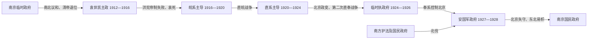

# 北洋时期

## 时间

1912年3月—1928年6月；若从南京临时政府建立共和政体算起，则民国起点为1912年1月。1928年6月北京政府中枢瓦解，12月东北易帜完成政治收束。

## 概括

北洋时期不是“没有政府的军阀混战”，而是北京中央政府、各省军政长官、国会政党、外部列强与南方竞争政府共同作用的复合秩序。北京政府继承清末各部院、外交体系、海关与外债安排，在多数时间获得主要国家承认；但掌握军队与地盘的军阀能废立元首、组织内阁，国家职位的法定顺序与实际权力经常脱节。

## 建立背景与发展阶段

| 阶段 | 政治过程 | 实际权力 |
|---|---|---|
| 袁世凯主政 | 袁以北洋军、总统府和官僚机构集中权力；解散国民党和国会，改造约法，最终建立洪宪帝制。 | 袁世凯兼具法定元首与北洋军最高权威。 |
| 皖系主导 | 黎元洪与段祺瑞发生府院之争；参战问题、张勋复辟和南方护法运动加剧分裂。 | 段祺瑞依靠国务总理职务、参战军和皖系网络，实际影响常超过总统。 |
| 直系主导 | 直皖战争后曹锟、吴佩孚控制中枢；第一次直奉战争逐奉系出关，曹锟贿选又损害政府合法性。 | 曹锟掌政治名位，吴佩孚掌主要军力。 |
| 临时执政府 | 冯玉祥北京政变推翻曹锟；段祺瑞以“临时执政”调和各派，但无稳固直属军队。 | 国民军、奉系和直系残部竞逐，段祺瑞权力受制。 |
| 奉系与终局 | 张作霖以安国军大元帅建立军政府；北伐推进后撤出北京，皇姑屯事件后身亡。 | 张作霖控制中央军政，张学良继承东北但选择易帜。 |

## 统治结构

| 层级 | 制度角色 | 运作现实 |
|---|---|---|
| 国家元首 | 临时大总统、大总统、临时执政、大元帅等 | 黎元洪复位、国家元首缺位和国务会议集体代行都曾发生。 |
| 政府首脑 | 国务总理、国务卿及内阁 | 内阁既受总统与国会制约，也常由控制北京的军事派系安排；正式、代理任期频繁。 |
| 国会与宪法 | 1912年临时约法、1913年国会、1914年约法、1923年宪法等 | 国会多次被解散、恢复或另组；曹锟贿选使1923年宪法的合法性受质疑。 |
| 军政地方 | 督军、省长、军务督办等 | 掌握军队、税源和任命，和中央之间既有名义隶属，也有战争与联盟。 |
| 财政外交 | 财政部、外交部、海关、盐务与借款机关 | 关税受条约限制，盐税和外债常用于担保；中央对列强承认与金融信用高度依赖。 |

完整任职序列见[民国大陆时期国家元首与政府首脑表](/%E4%BA%BA%E6%96%87%E7%A7%91%E5%AD%A6/%E5%8E%86%E5%8F%B2/%E4%B8%9C%E4%BA%9A/%E4%B8%AD%E5%9B%BD/%E6%B0%91%E5%9B%BD/%E6%B0%91%E5%9B%BD%E5%A4%A7%E9%99%86%E6%97%B6%E6%9C%9F%E5%9B%BD%E5%AE%B6%E5%85%83%E9%A6%96%E4%B8%8E%E6%94%BF%E5%BA%9C%E9%A6%96%E8%84%91%E8%A1%A8.md)；派系来源与继承见[北洋军阀](/%E4%BA%BA%E6%96%87%E7%A7%91%E5%AD%A6/%E5%8E%86%E5%8F%B2/%E4%B8%9C%E4%BA%9A/%E4%B8%AD%E5%9B%BD/%E6%B0%91%E5%9B%BD/%E5%8C%97%E6%B4%8B%E5%86%9B%E9%98%80.md)。

## 重要事件与转折

| 时间 | 事件 | 过程与影响 |
|---|---|---|
| 1912年 | 清帝退位、袁世凯接任临时大总统 | 共和国取得形式统一，中央迁北京；军权与革命派政治理想之间的矛盾随即显现。 |
| 1913年 | 宋教仁遇刺与二次革命 | 国民党军事反抗失败，袁解散国民党并强化总统权力。 |
| 1915—1916年 | 二十一条交涉、洪宪帝制与护国战争 | 袁称帝激起地方军事反抗和国际疑虑，被迫撤销帝制，死后北洋集团分裂。 |
| 1917年 | 府院之争、张勋复辟、再造共和 | 黎元洪与段祺瑞冲突；张勋短暂拥溥仪复辟，段借讨逆重返中枢。 |
| 1917—1918年 | 护法运动与对德宣战 | 孙中山在广州组织军政府；北京政府参加第一次世界大战并扩大参战军。 |
| 1919年 | 巴黎和会与五四运动 | 山东权益交涉失败引发学生和社会运动，政府威信及亲日官僚受到冲击。 |
| 1920年 | 直皖战争 | 直、奉联合击败皖系，段祺瑞失势，直系逐步主导北京。 |
| 1922年 | 第一次直奉战争与黎元洪复位 | 奉系退回东北，直系以“法统重光”恢复旧国会，但政治整合未成。 |
| 1923年 | 曹锟贿选 | 曹锟当选总统并公布宪法，收买议员的方式使其政权合法性受损。 |
| 1924年 | 第二次直奉战争与北京政变 | 冯玉祥倒戈软禁曹锟，直系中枢崩溃，段祺瑞出任临时执政。 |
| 1925—1926年 | 五卅运动、首都革命与三一八惨案 | 民族主义和社会动员扩大；执政府镇压请愿造成政治危机，段祺瑞下台。 |
| 1926—1928年 | 北伐与北京政府终结 | 国民革命军联合、分化地方军队北进；张作霖撤出北京，奉军回东北。 |
| 1928年 | 皇姑屯事件与东北易帜 | 张作霖被日本关东军炸死；张学良接受南京政府旗帜，北洋体系的中央竞争结束。 |

## 兴起、维持与衰落

- **崛起机制：**北洋新军拥有较统一的训练、军官网络和近代装备；袁世凯借清末督抚与中央职务，将军权转化为共和初年的政治支配。
- **维持条件：**北京政府占据首都、中央部会、条约关系和主要国际承认，能够使用关税、盐税与外债信用；军阀也需要中央名义授予职位和借款资格。
- **结构性弱点：**财政收入分散、军队个人化、总统—内阁—国会权责反复变化，各派缺乏可接受的稳定继承规则。
- **外部压力：**日本及西方列强以贷款、军火、租界和条约权益影响派系选择；山东问题等外交危机又激化国内民族主义。
- **直接终结：**直、皖、奉战争耗损北洋主力，广东国民政府完成党军整合并发动北伐；奉系撤离北京后，已无另一北洋集团能重建中央。
- **历史延续：**北洋政府终结不等于军事地方主义消失。冯玉祥、阎锡山、桂系和东北军等随后被纳入国民政府体系，仍保持程度不同的自主性。

## 演变关系

- 前一节点：[清](/%E4%BA%BA%E6%96%87%E7%A7%91%E5%AD%A6/%E5%8E%86%E5%8F%B2/%E4%B8%9C%E4%BA%9A/%E4%B8%AD%E5%9B%BD/%E6%B8%85/README.md)、南京临时政府
- 南方并立：广州护法军政府、中华民国军政府、广州国民政府
- 后一节点：[国民政府时期](/%E4%BA%BA%E6%96%87%E7%A7%91%E5%AD%A6/%E5%8E%86%E5%8F%B2/%E4%B8%9C%E4%BA%9A/%E4%B8%AD%E5%9B%BD/%E6%B0%91%E5%9B%BD/%E5%9B%BD%E6%B0%91%E6%94%BF%E5%BA%9C%E6%97%B6%E6%9C%9F.md)
- 上级：[民国](/%E4%BA%BA%E6%96%87%E7%A7%91%E5%AD%A6/%E5%8E%86%E5%8F%B2/%E4%B8%9C%E4%BA%9A/%E4%B8%AD%E5%9B%BD/%E6%B0%91%E5%9B%BD/README.md)
